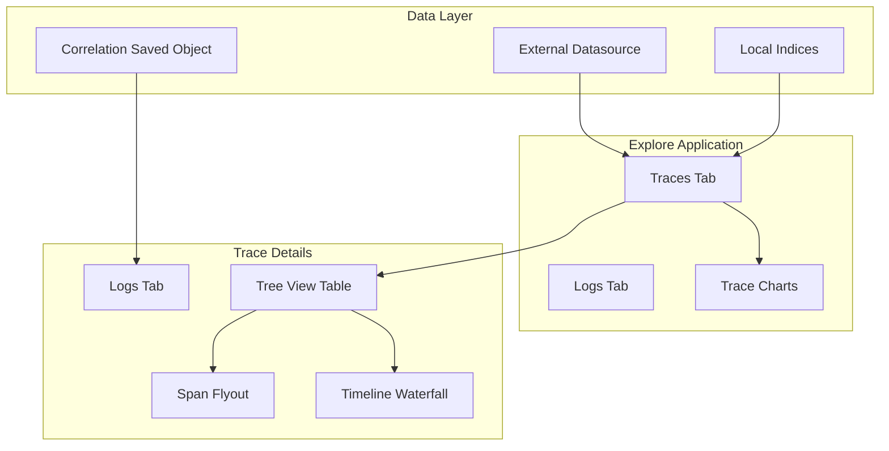

---
tags:
  - domain/core
  - component/dashboards
  - dashboards
  - observability
  - search
---
# OpenSearch Dashboards Traces

## Summary

OpenSearch Dashboards v3.3.0 introduces comprehensive trace visualization capabilities within the Explore application. This release adds trace charts, log correlation, timeline waterfall visualization, external datasource support, and configurable default columns, providing a unified experience for analyzing distributed traces alongside logs.

## Details

### What's New in v3.3.0

This release brings 7 PRs that significantly enhance trace analysis capabilities in OpenSearch Dashboards:

1. **Correlation Saved Object** - Foundation for trace-to-log correlation
2. **Traces Chart** - Request count, error count, and latency visualizations
3. **Log Correlation** - Tabs and redirect functionality for trace-log correlation
4. **Default Columns Setting** - Configurable default trace columns in Explore
5. **External Datasource Support** - Query traces from external data sources
6. **Schema Switch** - Primary schema change for trace details with service map disabled
7. **Timeline Waterfall** - Inline waterfall bars in span table tree view

### Technical Changes

#### Architecture Changes



#### New Components

| Component | Description |
|-----------|-------------|
| Correlation Saved Object | Stores trace-to-log correlation configuration between datasets |
| Traces Chart Processor | Constructs request count, error count, and latency chart data |
| TimelineWaterfallBar | Renders waterfall bars for span time ranges with color-coded services |
| TimelineRuler | Displays ruler with millisecond measurements for visual comparison |
| TimelineHeader | Combines "Timeline" text with the ruler component |
| useTimelineBarRange | Hook calculating relative bar offset and width based on span time |
| useTimelineBarColor | Hook determining bar color based on service name |
| useTimelineTicks | Hook calculating optimal tick marks for timeline ruler |

#### New Configuration

| Setting | Description | Default |
|---------|-------------|---------|
| `explore:defaultTraceColumns` | Default columns displayed in Explore traces tab | Experimental |
| Correlation Saved Object Type | `correlations` type for storing trace-log relationships | N/A |

#### Correlation Saved Object Schema

```json
{
  "id": "trace-to-logs-correlation-5678",
  "type": "correlations",
  "attributes": {
    "type": "APM-Correlation",
    "entities": [
      {
        "tracesDataset": {
          "id": "references[0].id"
        }
      },
      {
        "logsDataset": {
          "id": "references[1].id",
          "meta": {
            "logServiceNameField": "service.name",
            "logSpanIdField": "span_id",
            "logTraceIdField": "trace_id",
            "timestamp": "@timestamp"
          }
        }
      }
    ]
  },
  "references": [
    {
      "name": "entities[0].index",
      "type": "index-pattern",
      "id": "trace-index-pattern-id"
    },
    {
      "name": "entities[1].index",
      "type": "index-pattern",
      "id": "logs-index-pattern-id"
    }
  ]
}
```

### Usage Example

#### Viewing Traces with Timeline Waterfall

```
1. Navigate to Explore → Traces tab
2. Select a trace dataset
3. Click on a trace to view details
4. Go to "Tree view" tab
5. View inline waterfall bars in the "Timeline" column
6. Hover over bars to see Duration, Start, and End milliseconds
7. Drag column to resize and observe responsive scaling
```

#### Configuring Log Correlation

```
1. Create a correlation saved object linking trace and log datasets
2. Navigate to Trace Details page
3. Click "Logs" tab to view correlated logs
4. Click "View in Discover" to redirect with context
```

### Migration Notes

- The primary schema for trace details has been switched; existing custom configurations may need adjustment
- Service map tab is temporarily disabled in this release
- Duration calculation now checks `endTime-startTime` first, falling back to `durationNano` field for better precision

## Limitations

- Service map tab is disabled in this release
- Nanosecond precision may be lost when querying via PPL; duration fallback logic is implemented
- Start time rounding may occur if data lacks expected precision
- Timeline waterfall requires proper span time range data

## References

### Documentation
- [Trace Analytics Documentation](https://docs.opensearch.org/3.0/observing-your-data/trace/ta-dashboards/): Official trace analytics guide
- [Simple Schema for Observability](https://docs.opensearch.org/3.0/observing-your-data/ss4o/): SS4O schema definitions
- [Observability Overview](https://docs.opensearch.org/3.0/observing-your-data/): OpenSearch observability features

### Pull Requests
| PR | Description |
|----|-------------|
| [#10386](https://github.com/opensearch-project/OpenSearch-Dashboards/pull/10386) | Add Correlations Saved Object Type Registration |
| [#10392](https://github.com/opensearch-project/OpenSearch-Dashboards/pull/10392) | Add traces chart (request count, error count, latency) |
| [#10393](https://github.com/opensearch-project/OpenSearch-Dashboards/pull/10393) | Trace Details: Log correlation (tabs + redirect) |
| [#10406](https://github.com/opensearch-project/OpenSearch-Dashboards/pull/10406) | Add experimental default trace columns UI setting |
| [#10418](https://github.com/opensearch-project/OpenSearch-Dashboards/pull/10418) | Trace Details: Support external datasets |
| [#10431](https://github.com/opensearch-project/OpenSearch-Dashboards/pull/10431) | Switch primary schema for trace details, disable service map |
| [#10642](https://github.com/opensearch-project/OpenSearch-Dashboards/pull/10642) | Add Timeline waterfall bars column to SpanDetailTableHierarchy |

## Related Feature Report

- [Full feature documentation](../../../../features/opensearch-dashboards/opensearch-dashboards-explore-traces.md)
