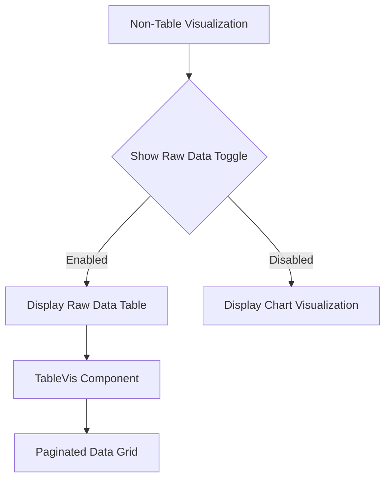

# OpenSearch Dashboards UI Enhancements

## Summary

OpenSearch Dashboards v3.3.0 introduces several UI enhancements focused on improving user experience in the Explore interface and workspace management. Key additions include a "Show Raw Data" toggle for non-table visualizations, improved error handling for the Patterns tab, and batch delete functionality for workspaces with better error reporting.

## Details

### What's New in v3.3.0

#### Show Raw Data Toggle

A new toggle switch has been added to the action bar for non-table chart visualizations (bar, line, etc.) in the Explore interface. When enabled, users can view the underlying raw data table for their visualization.



#### Patterns Tab Error Handling

The Patterns tab now has improved error handling that prevents invalid queries from crashing the entire page. Instead of showing a generic error, users see a custom error page displaying the attempted pattern query.

#### Workspace Batch Delete

Workspace deletion has been enhanced with a new `batchDelete` method that:
- Deletes multiple workspaces in a single operation
- Processes deletions serially to avoid data source conflicts
- Provides detailed success/failure notifications
- Shows a "View Delete Details" modal with per-workspace status

### Technical Changes

#### New Components

| Component | Description |
|-----------|-------------|
| `PatternsErrorGuard` | Custom error guard for Patterns tab showing query details |
| `showDeleteDetailsModal` | Modal displaying batch delete results with success/failure badges |

#### New API Methods

| Method | Description |
|--------|-------------|
| `IWorkspaceClient.batchDelete(ids: string[])` | Deletes multiple workspaces, returns `{success, fail, failedIds}` |

#### Configuration

| Setting | Description | Default |
|---------|-------------|---------|
| `showRawTable$` | Observable controlling raw data table visibility | `false` |

### Usage Example

#### Show Raw Data Toggle

The toggle appears automatically in the action bar when viewing non-table visualizations:

1. Create a bar or line chart visualization in Explore
2. Locate the "Show Raw Data" toggle in the action bar
3. Enable the toggle to view the underlying data table
4. Toggle off to return to the chart view

#### Batch Delete Workspaces

```typescript
// Delete multiple workspaces
const result = await workspaceClient.batchDelete(['workspace-id-1', 'workspace-id-2']);
// result: { success: 2, fail: 0, failedIds: [] }
```

### Migration Notes

No migration required. These are additive UI enhancements.

## Limitations

- Show Raw Data toggle only appears for non-table chart types
- Batch delete processes workspaces serially to avoid conflicts, which may be slower for large batches
- Patterns error page requires a valid query to display the attempted pattern

## References

### Documentation
- [OpenSearch Dashboards Documentation](https://docs.opensearch.org/3.0/dashboards/): Official documentation
- [Workspace Documentation](https://docs.opensearch.org/3.0/dashboards/workspace/workspace/): Workspace feature documentation
- [Manage Workspaces](https://docs.opensearch.org/3.0/dashboards/workspace/manage-workspace/): Workspace management guide

### Pull Requests
| PR | Description |
|----|-------------|
| [#10516](https://github.com/opensearch-project/OpenSearch-Dashboards/pull/10516) | Add "Show Raw Data" toggle for non-table visualizations |
| [#10540](https://github.com/opensearch-project/OpenSearch-Dashboards/pull/10540) | Custom patterns error page and query error handling |
| [#9781](https://github.com/opensearch-project/OpenSearch-Dashboards/pull/9781) | Add batch delete method for workspaces, fix deletion error |
