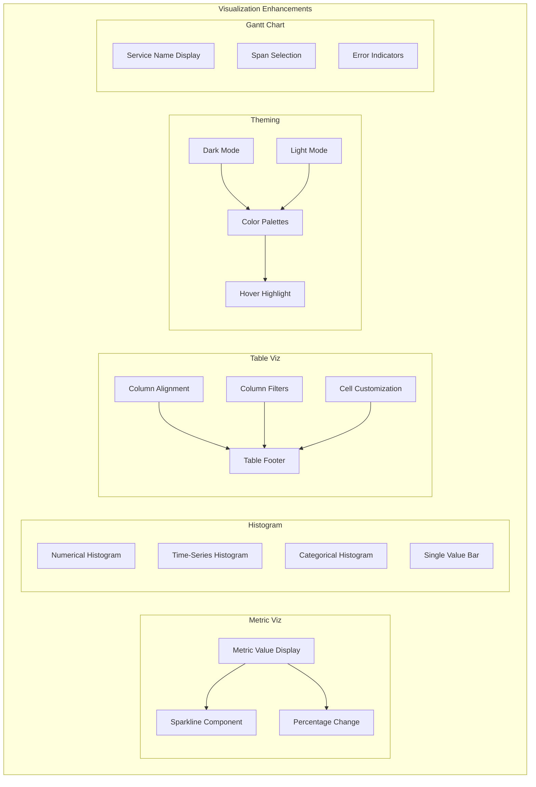

---
tags:
  - dashboards
  - observability
---

# OpenSearch Dashboards Visualization Enhancements

## Summary

OpenSearch Dashboards v3.3.0 introduces significant visualization enhancements in the Explore plugin, including sparkline support for metric visualizations, histogram charts for various data types, improved table visualizations with column filters and statistical footers, enhanced theming with dark/light mode support, and Gantt chart improvements for trace analysis.

## Details

### What's New in v3.3.0

#### Metric Visualization with Sparkline
The metric visualization now supports sparklines, providing trend context alongside the primary metric value. This allows users to see historical patterns directly within the metric display.

#### Histogram Visualization
A new histogram visualization type has been added with support for:
- **Numerical histograms**: Distribution of numeric values
- **Time-series histograms**: Temporal data distribution
- **Categorical histograms**: Category-based distributions
- **Single value bars**: Simple bar representation for single values

#### Table Visualization Enhancement
The table visualization has been significantly enhanced with:
- **Column alignment**: Configure cell content alignment (Auto, Left, Center, Right) per column
- **Column filters**: Optional Excel-like filters for each column with toggle setting
- **Table footers**: Statistical calculations (Last, Average, Min, Max, Total) on selected fields
- **Cell customization**: Colored text and colored background options

#### Theme and Default Settings Updates
Visualization theming has been improved with:
- Dark/light theme support for discover visualizations
- New color palettes for categorical data
- Updated default chart styles (opacity, font size, grid lines)
- Mouse hover highlighting for bar and pie charts

#### Gantt Chart Improvements
The Gantt chart for trace visualization has been enhanced:
- Fixed left padding with more space for service names
- Middle-truncation for long service names
- Opacity and highlighting for selected spans
- Selectable spans in expanded rows
- Relocated error/fault indicators (now next to service name)

### Technical Changes

#### Architecture Changes



#### New Components

| Component | Description |
|-----------|-------------|
| Sparkline | Inline trend visualization for metric displays |
| Histogram | Multi-type histogram visualization component |
| ColumnFilter | Excel-like filter UI for table columns |
| TableFooter | Statistical summary row for tables |
| CellCustomization | Colored text/background cell styling |

#### New Configuration

| Setting | Description | Default |
|---------|-------------|---------|
| Column alignment | Cell content alignment per column | Auto |
| Column filters enabled | Toggle Excel-like column filters | false |
| Footer calculation | Statistical function for footer | None |
| Cell color type | Colored text or background | None |

### Usage Example

```json
// Table visualization with footer statistics
{
  "type": "table",
  "columns": [
    {
      "field": "product",
      "alignment": "left"
    },
    {
      "field": "sales",
      "alignment": "right",
      "footer": "total"
    },
    {
      "field": "price",
      "alignment": "right",
      "footer": "average"
    }
  ],
  "enableFilters": true
}
```

## Limitations

- Sparkline data requires time-series aggregation in the query
- Column filters may impact performance with large datasets
- Footer calculations are performed client-side
- Cell color customization options are limited to text and background

## References

### Documentation
- [OpenSearch Dashboards Repository](https://github.com/opensearch-project/OpenSearch-Dashboards)

### Pull Requests
| PR | Description |
|----|-------------|
| [#10449](https://github.com/opensearch-project/OpenSearch-Dashboards/pull/10449) | Metric viz with sparkline support |
| [#10452](https://github.com/opensearch-project/OpenSearch-Dashboards/pull/10452) | Gantt chart improvements |
| [#10465](https://github.com/opensearch-project/OpenSearch-Dashboards/pull/10465) | Histogram visualization |
| [#10469](https://github.com/opensearch-project/OpenSearch-Dashboards/pull/10469) | Discover viz theme and defaults |
| [#10470](https://github.com/opensearch-project/OpenSearch-Dashboards/pull/10470) | Table visualization enhancement |
| [#10482](https://github.com/opensearch-project/OpenSearch-Dashboards/pull/10482) | Metric viz style update with percentage change |

## Related Feature Report

- [Full feature documentation](../../../features/opensearch-dashboards/explore.md)
