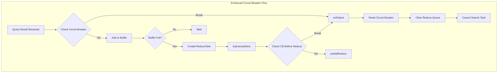

---
tags:
  - domain/core
  - component/server
  - search
---
# Circuit Breaker Hardening in Query Result Consumer

## Summary

This release hardens the circuit breaker and failure handling logic in `QueryPhaseResultConsumer`, improving memory protection during distributed search operations. The changes ensure circuit breaker checks occur before consuming query results and provide more robust failure handling with proper cleanup of pending reduce tasks.

## Details

### What's New in v3.3.0

The main enhancement is adding `addEstimateAndMaybeBreak(aggsSize)` in `consumeResult` before performing any actual consume logic. This ensures memory limits are checked proactively rather than reactively.

### Technical Changes

#### Architecture Changes



#### Key Changes

| Change | Before | After |
|--------|--------|-------|
| Circuit breaker check timing | After buffering | Before consuming result |
| Failure handling | Scattered logic | Centralized `onFailure` method |
| Class naming | `PendingMerges`, `MergeTask`, `MergeResult` | `PendingReduces`, `ReduceTask`, `ReduceResult` |
| Memory estimation | `1.5d * size - size` | `0.5d * size` |

#### Refactored Components

| Component | Description |
|-----------|-------------|
| `PendingReduces` | Renamed from `PendingMerges`; manages buffered results and reduce task coordination |
| `ReduceTask` | Renamed from `MergeTask`; encapsulates batch of results with callback |
| `ReduceResult` | Renamed from `MergeResult`; now a Java record for immutability |
| `onFailure` | New centralized failure handler with idempotent, thread-safe cleanup |

#### Circuit Breaker Usage Points

1. **Before consume**: Query result received at coordinator transport layer; estimate heap size and check REQUEST circuit breaker
2. **During tryExecuteNext**: Before partial reduce on buffered results; estimate extra heap for reduction and check circuit breaker

### Code Changes

The `consumeResult` method now checks circuit breaker before processing:

```java
private synchronized boolean consumeResult(QuerySearchResult result, Runnable callback) {
    if (hasFailure()) {
        result.consumeAll(); // release memory
        return true;
    }
    // Check circuit breaker before consuming
    if (hasAggs) {
        long aggsSize = ramBytesUsedQueryResult(result);
        try {
            addEstimateAndMaybeBreak(aggsSize);
            aggsCurrentBufferSize += aggsSize;
        } catch (CircuitBreakingException e) {
            onFailure(e);
            return true;
        }
    }
    // Process result...
}
```

The new `onFailure` method provides centralized, idempotent failure handling:

```java
private synchronized void onFailure(Exception exc) {
    if (hasFailure()) {
        assert circuitBreakerBytes == 0;
        return;
    }
    resetCircuitBreaker();
    failure.compareAndSet(null, exc);
    clearReduceTaskQueue();
    cancelTaskOnFailure.accept(exc);
}
```

### Performance Implication

TermsReduceBenchmark shows no regression from these changes.

## Limitations

- Circuit breaker estimation remains approximate
- The hardened checks add minimal overhead to each result consumption

## References

### Documentation
- [Circuit Breaker Settings](https://docs.opensearch.org/3.0/install-and-configure/configuring-opensearch/circuit-breaker/): OpenSearch circuit breaker configuration
- [Search Settings](https://docs.opensearch.org/3.0/install-and-configure/configuring-opensearch/search-settings/): Search configuration options

### Pull Requests
| PR | Description |
|----|-------------|
| [#19396](https://github.com/opensearch-project/OpenSearch/pull/19396) | Harden the circuit breaker and failure handle logic in query result consumer |

## Related Feature Report

- [Full feature documentation](../../../features/opensearch/opensearch-query-phase-result-consumer.md)
