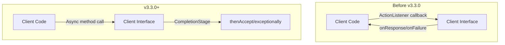

---
tags:
  - indexing
  - search
---

# Client API Enhancements

## Summary

OpenSearch v3.3.0 introduces `CompletionStage` variants to the `Client` and `IndicesAdminClient` interfaces, providing a modern alternative to the callback-based `ActionListener` pattern. This enhancement simplifies asynchronous code by enabling fluent, functional-style programming with Java's `CompletableFuture` API.

## Details

### What's New in v3.3.0

The release adds `*Async` methods that return `CompletionStage<T>` instead of requiring an `ActionListener<T>` callback. This allows developers to write cleaner, more readable asynchronous code using method chaining.

### Technical Changes

#### Architecture Changes



#### New Components

| Component | Description |
|-----------|-------------|
| `Client.*Async()` | CompletionStage variants for document operations (index, get, delete, search, etc.) |
| `IndicesAdminClient.*Async()` | CompletionStage variants for index administration operations |

#### New Methods in Client Interface

| Method | Description |
|--------|-------------|
| `indexAsync(IndexRequest)` | Index a document asynchronously |
| `updateAsync(UpdateRequest)` | Update a document asynchronously |
| `deleteAsync(DeleteRequest)` | Delete a document asynchronously |
| `bulkAsync(BulkRequest)` | Bulk operations asynchronously |
| `getAsync(GetRequest)` | Get a document asynchronously |
| `multiGetAsync(MultiGetRequest)` | Multi-get asynchronously |
| `searchAsync(SearchRequest)` | Search asynchronously |
| `searchScrollAsync(SearchScrollRequest)` | Search scroll asynchronously |
| `multiSearchAsync(MultiSearchRequest)` | Multi-search asynchronously |
| `termVectorsAsync(TermVectorsRequest)` | Term vectors asynchronously |
| `multiTermVectorsAsync(MultiTermVectorsRequest)` | Multi term vectors asynchronously |
| `explainAsync(ExplainRequest)` | Explain asynchronously |
| `clearScrollAsync(ClearScrollRequest)` | Clear scroll asynchronously |
| `fieldCapsAsync(FieldCapabilitiesRequest)` | Field capabilities asynchronously |
| `searchViewAsync(SearchViewAction.Request)` | Search view asynchronously |
| `listViewNamesAsync(ListViewNamesAction.Request)` | List view names asynchronously |

#### New Methods in IndicesAdminClient Interface

| Method | Description |
|--------|-------------|
| `existsAsync(IndicesExistsRequest)` | Check index existence asynchronously |
| `statsAsync(IndicesStatsRequest)` | Get index stats asynchronously |
| `createAsync(CreateIndexRequest)` | Create index asynchronously |
| `deleteAsync(DeleteIndexRequest)` | Delete index asynchronously |
| `openAsync(OpenIndexRequest)` | Open index asynchronously |
| `closeAsync(CloseIndexRequest)` | Close index asynchronously |
| `refreshAsync(RefreshRequest)` | Refresh index asynchronously |
| `flushAsync(FlushRequest)` | Flush index asynchronously |
| `forceMergeAsync(ForceMergeRequest)` | Force merge asynchronously |
| `getMappingsAsync(GetMappingsRequest)` | Get mappings asynchronously |
| `putMappingAsync(PutMappingRequest)` | Put mapping asynchronously |
| `getSettingsAsync(GetSettingsRequest)` | Get settings asynchronously |
| `updateSettingsAsync(UpdateSettingsRequest)` | Update settings asynchronously |
| `aliasesAsync(IndicesAliasesRequest)` | Manage aliases asynchronously |
| `getAliasesAsync(GetAliasesRequest)` | Get aliases asynchronously |
| `putTemplateAsync(PutIndexTemplateRequest)` | Put template asynchronously |
| `deleteTemplateAsync(DeleteIndexTemplateRequest)` | Delete template asynchronously |
| `getTemplatesAsync(GetIndexTemplatesRequest)` | Get templates asynchronously |
| `rolloverIndexAsync(RolloverRequest)` | Rollover index asynchronously |
| `resizeIndexAsync(ResizeRequest)` | Resize index asynchronously |
| `createDataStreamAsync(...)` | Create data stream asynchronously |
| `deleteDataStreamAsync(...)` | Delete data stream asynchronously |
| `getDataStreamsAsync(...)` | Get data streams asynchronously |
| `createViewAsync(...)` | Create view asynchronously |
| `getViewAsync(...)` | Get view asynchronously |
| `deleteViewAsync(...)` | Delete view asynchronously |
| `updateViewAsync(...)` | Update view asynchronously |
| `pauseIngestionAsync(...)` | Pause ingestion asynchronously |
| `resumeIngestionAsync(...)` | Resume ingestion asynchronously |
| `getIngestionStateAsync(...)` | Get ingestion state asynchronously |

### Usage Example

**Before (ActionListener pattern):**
```java
client.index(indexRequest, new ActionListener<IndexResponse>() {
    @Override
    public void onResponse(IndexResponse response) {
        System.out.println("Got: " + response);
    }
    
    @Override
    public void onFailure(Exception e) {
        logger.error("Failed", e);
    }
});
```

**After (CompletionStage pattern):**
```java
client.indexAsync(indexRequest)
    .thenAccept(response -> {
        System.out.println("Got: " + response);
    })
    .exceptionally(error -> {
        System.out.println("Received error: " + error);
        return null;
    });
```

**Chaining multiple operations:**
```java
client.admin().indices().existsAsync(new IndicesExistsRequest(indexName))
    .thenCompose(resp -> {
        if (resp.isExists()) {
            return client.admin().indices().deleteAsync(new DeleteIndexRequest(indexName));
        }
        return CompletableFuture.completedFuture(null);
    })
    .thenAccept(result -> System.out.println("Operation complete"));
```

### Migration Notes

- The new `*Async` methods are additive; existing `ActionListener`-based methods remain unchanged
- Default implementations wrap the existing `ActionListener` methods, ensuring backward compatibility
- No changes required for existing code; adopt the new pattern incrementally as needed

## Limitations

- The `CompletionStage` methods use default implementations that wrap `ActionListener`, so there's no performance difference
- Error handling requires using `exceptionally()` or `handle()` methods instead of `onFailure()`

## References

### Documentation
- [Java CompletionStage Documentation](https://docs.oracle.com/javase/8/docs/api/java/util/concurrent/CompletionStage.html): Java API reference
- [PR #18998](https://github.com/opensearch-project/OpenSearch/pull/18998): Main implementation for Client interface
- [PR #19161](https://github.com/opensearch-project/OpenSearch/pull/19161): Follow-up for IndicesAdminClient

### Pull Requests
| PR | Description |
|----|-------------|
| [#18998](https://github.com/opensearch-project/OpenSearch/pull/18998) | Add CompletionStage variants to Client interface |
| [#19161](https://github.com/opensearch-project/OpenSearch/pull/19161) | Add CompletionStage variants to IndicesAdminClient |

## Related Feature Report

- [Full feature documentation](../../../../features/opensearch/client-api-enhancements.md)
