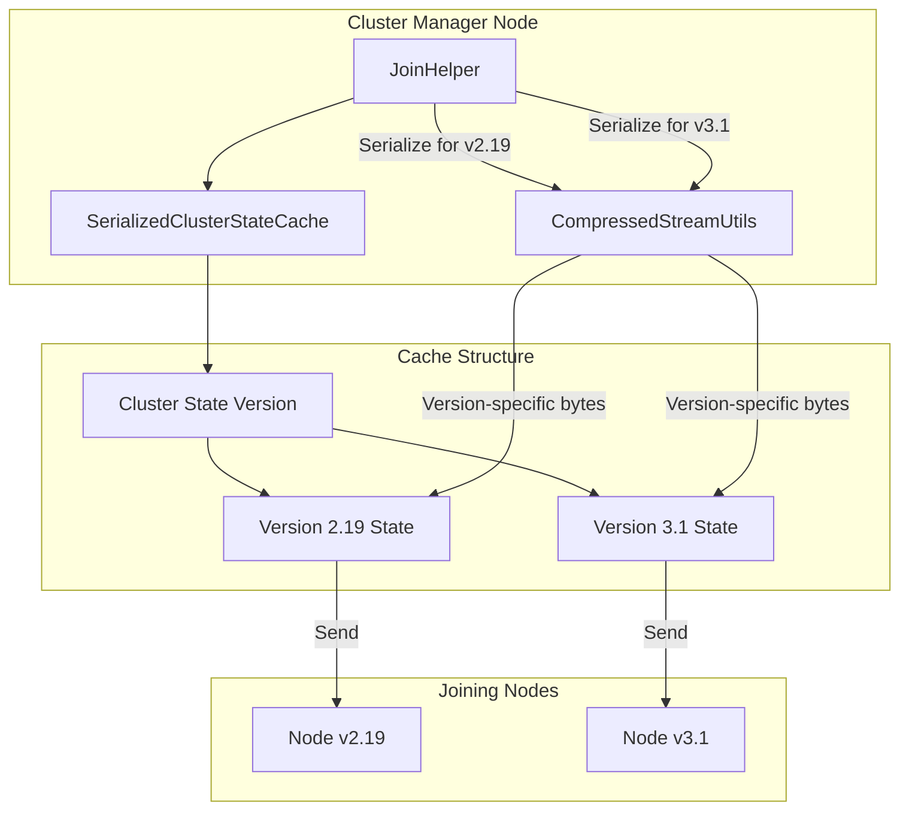
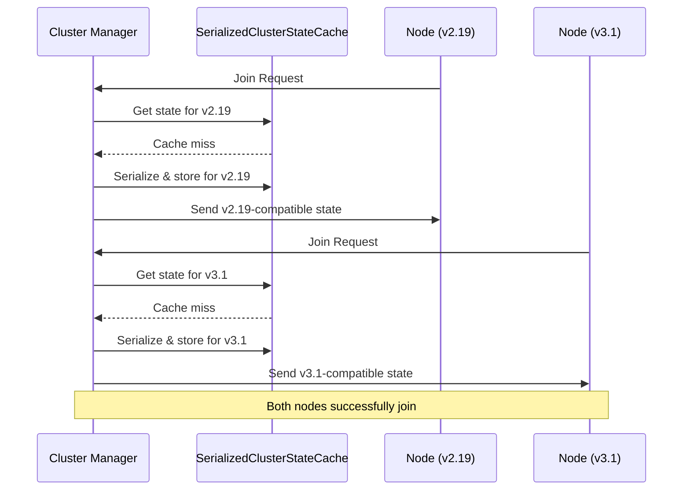

---
tags:
  - performance
---

# Cluster State Caching

## Summary

This release fixes a critical bug in cluster state caching during node join validation that caused join failures in mixed-version clusters. The fix introduces version-aware caching that maintains separate serialized cluster states for different OpenSearch versions, ensuring nodes can properly deserialize the cluster state during the join process.

## Details

### What's New in v3.3.0

The cluster manager node caches serialized cluster state to optimize the join validation process when multiple nodes join simultaneously. Previously, this cache only considered the cluster state version, which caused issues when nodes of different OpenSearch versions (e.g., 2.19 and 3.1) attempted to join the same cluster.

Version-specific attributes introduced in OpenSearch 2.17 and 3.1 made the cached serialized state incompatible across different versions. When a node tried to deserialize a cached state serialized for a different version, it would fail, causing join failures.

### Technical Changes

#### Architecture Changes



#### New Components

| Component | Description |
|-----------|-------------|
| `SerializedClusterStateCache` | New inner class in `JoinHelper` that caches serialized cluster state keyed by both cluster state version and OpenSearch software version |

#### Cache Design

The new `SerializedClusterStateCache` class maintains:

- `clusterStateVersion`: The cluster state version this cache is for
- `serialisedClusterStateBySoftwareVersion`: A map from OpenSearch `Version` to serialized `BytesReference`
- `MAX_VERSIONS_SIZE`: Limits cache to 2 versions to prevent unbounded memory growth

```java
public static final class SerializedClusterStateCache {
    private final Long clusterStateVersion;
    private final Map<Version, BytesReference> serialisedClusterStateBySoftwareVersion;
    private static final int MAX_VERSIONS_SIZE = 2;
    // ...
}
```

#### Cache Behavior

1. When cluster state version changes, the entire cache is invalidated
2. For each joining node, the cache checks if a serialized state exists for that node's version
3. If not found, a new serialized state is created using `CompressedStreamUtils.createCompressedStream()` with the target node's version
4. The cache evicts the oldest entry when `MAX_VERSIONS_SIZE` is reached

### Usage Example

No configuration changes are required. The fix is automatically applied during node join operations:



### Migration Notes

No migration required. This is a bug fix that improves cluster stability during rolling upgrades and mixed-version operations.

## Limitations

- Cache is limited to 2 OpenSearch versions (`MAX_VERSIONS_SIZE = 2`) to prevent memory issues
- In clusters with more than 2 different OpenSearch versions joining simultaneously, some cache misses may occur (causing re-serialization)

## References

### Documentation
- [JoinHelper.java](https://github.com/opensearch-project/OpenSearch/blob/main/server/src/main/java/org/opensearch/cluster/coordination/JoinHelper.java): Implementation

### Pull Requests
| PR | Description |
|----|-------------|
| [#19307](https://github.com/opensearch-project/OpenSearch/pull/19307) | Cache serialised cluster state based on cluster state version and node version |

### Issues (Design / RFC)
- [Issue #19272](https://github.com/opensearch-project/OpenSearch/issues/19272): [BUG] Join Failure - Mixed Version cluster

## Related Feature Report

- [Full feature documentation](../../../features/opensearch/opensearch-cluster-state-caching.md)
