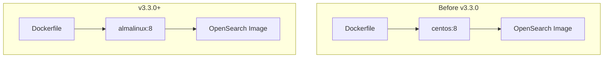

---
tags:
  - domain/core
  - component/server
  - security
---
# Docker Image Updates

## Summary

OpenSearch v3.3.0 replaces the deprecated CentOS 8 base image with AlmaLinux 8 for Docker builds. This change ensures continued support and security updates for the Docker distribution, as CentOS 8 reached end-of-life and its Docker images are no longer maintained.

## Details

### What's New in v3.3.0

The Docker build infrastructure has been updated to use AlmaLinux 8 as the base image instead of CentOS 8. This migration was necessary because CentOS Docker images are deprecated and no longer receiving updates.

### Technical Changes

#### Architecture Changes



#### Changed Components

| Component | Before | After |
|-----------|--------|-------|
| Base Image | `centos:8` | `almalinux:8` |
| Package Manager | `yum` with mirror workarounds | `dnf` |
| Network Tools | `nc` | `nmap-ncat` |

#### Build System Changes

| File | Change |
|------|--------|
| `DockerBase.java` | Renamed `CENTOS` enum to `ALMALINUX` |
| `distribution/docker/build.gradle` | Updated references from `DockerBase.CENTOS` to `DockerBase.ALMALINUX` |
| `Dockerfile` | Simplified package installation using `dnf` |

### Dockerfile Changes

The Dockerfile was simplified by removing CentOS-specific mirror workarounds:

**Before (CentOS 8):**
```dockerfile
RUN sed -i 's/mirrorlist/#mirrorlist/g' /etc/yum.repos.d/CentOS-Linux-* && \
    sed -i 's|#baseurl=http://mirror.centos.org|baseurl=http://vault.epel.cloud|g' /etc/yum.repos.d/CentOS-Linux-* && \
    for iter in {1..10}; do \
      ${package_manager} update --setopt=tsflags=nodocs -y && \
      ${package_manager} install --setopt=tsflags=nodocs -y nc shadow-utils zip unzip && \
      ${package_manager} clean all && exit_code=0 && break || ...
    done
```

**After (AlmaLinux 8):**
```dockerfile
RUN set -e \
    && dnf -y update \
    && dnf -y install --setopt=tsflags=nodocs nmap-ncat shadow-utils zip unzip \
    && dnf clean all \
    && rm -rf /var/cache/dnf
```

### Migration Notes

This change is transparent to users. The OpenSearch Docker images will continue to work the same way, but are now built on a supported base image.

- No changes required for existing Docker deployments
- No changes to exposed ports, volumes, or environment variables
- AlmaLinux 8 is binary-compatible with RHEL 8 and CentOS 8

## Limitations

- This change only affects the official OpenSearch Docker images
- Custom Docker builds using CentOS 8 should migrate to AlmaLinux 8 or another supported base

## References

### Documentation
- [OpenSearch Compatible Operating Systems](https://docs.opensearch.org/3.3/install-and-configure/os-comp/)
- [CentOS Docker Hub Deprecation Notice](https://hub.docker.com/_/centos)
- [AlmaLinux Official Site](https://almalinux.org/)

### Pull Requests
| PR | Description |
|----|-------------|
| [#19154](https://github.com/opensearch-project/OpenSearch/pull/19154) | Replace centos:8 with almalinux:8 since centos docker images are deprecated |

### Issues (Design / RFC)
- [opensearch-build Issue #4573](https://github.com/opensearch-project/opensearch-build/issues/4573): Remove CentOS8, add Almalinux8/Rockylinux8

## Related Feature Report

- Full feature documentation
