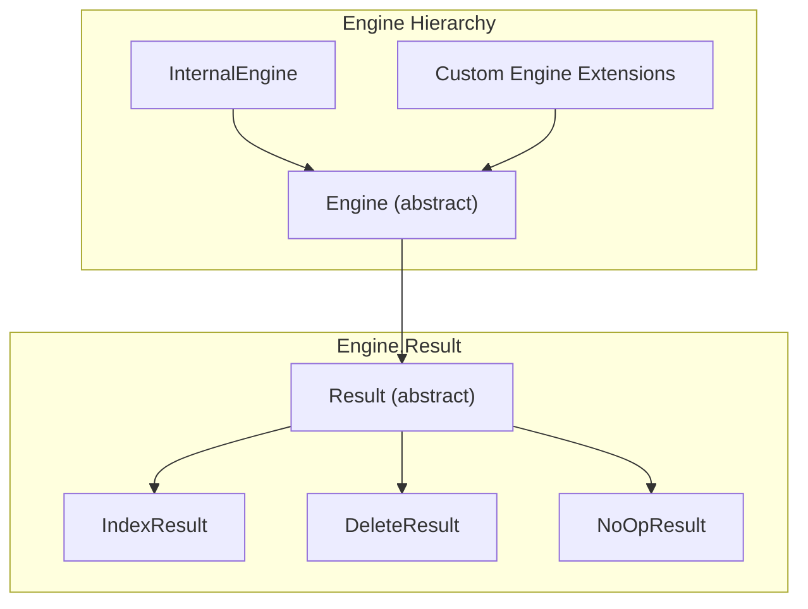

---
tags:
  - domain/core
  - component/server
  - indexing
---
# Engine API

## Summary

This release makes all methods in `Engine.Result` public, enabling custom Engine implementations to properly set translog location, timing information, and freeze results. This change improves extensibility for developers building custom storage engines.

## Details

### What's New in v3.3.0

The `Engine.Result` class methods have been changed from package-private to public visibility:

- `setTranslogLocation(Translog.Location)` - Sets the translog location after an operation
- `setTook(long)` - Sets the time taken for the operation in nanoseconds
- `freeze()` - Freezes the result to prevent further modifications

### Technical Changes

#### API Visibility Changes

| Method | Previous Visibility | New Visibility |
|--------|---------------------|----------------|
| `setTranslogLocation()` | package-private | `public` |
| `setTook()` | package-private | `public` |
| `freeze()` | package-private | `public` |

#### Architecture Context



### Usage Example

Custom Engine implementations can now properly manage result state:

```java
public class CustomEngine extends Engine {
    
    @Override
    public IndexResult index(Index index) throws IOException {
        long startTime = System.nanoTime();
        
        // Perform indexing operation
        IndexResult result = new IndexResult(version, term, seqNo, created);
        
        // Now accessible from custom Engine implementations
        result.setTranslogLocation(translogLocation);
        result.setTook(System.nanoTime() - startTime);
        result.freeze();
        
        return result;
    }
}
```

### Migration Notes

No migration required. This is a backward-compatible change that only increases API visibility.

## Limitations

- The `freeze()` method can only be called once per result; subsequent calls to `setTranslogLocation()` or `setTook()` after freezing will throw `IllegalStateException`

## References

### Documentation
- [Engine.java](https://github.com/opensearch-project/OpenSearch/blob/main/server/src/main/java/org/opensearch/index/engine/Engine.java): Source code

### Pull Requests
| PR | Description |
|----|-------------|
| [#19275](https://github.com/opensearch-project/OpenSearch/pull/19275) | Make all methods in Engine.Result public |

### Issues (Design / RFC)
- [Issue #19276](https://github.com/opensearch-project/OpenSearch/issues/19276): Feature request to make Engine.Result methods public

## Related Feature Report

- [Full feature documentation](../../../../features/opensearch/opensearch-engine-api.md)
