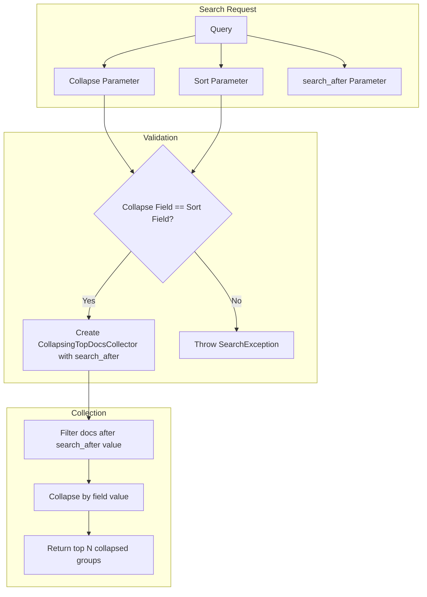

---
tags:
  - performance
  - search
---

# Field Collapsing with search_after Support

## Summary

OpenSearch v3.3.0 adds `search_after` pagination support for field collapsing queries. This enables efficient deep pagination through collapsed search results, which was previously not possible. The feature requires that the collapse field and sort field be the same, ensuring consistent pagination behavior.

## Details

### What's New in v3.3.0

Field collapsing now supports the `search_after` parameter for pagination, allowing users to efficiently page through large collapsed result sets without the performance overhead of offset-based pagination.

### Technical Changes

#### Architecture Changes



#### New Components

| Component | Description |
|-----------|-------------|
| `CollapsingTopDocsCollector` (updated) | Extended to accept `FieldDoc after` parameter for search_after support |
| `CollapseContext.createTopDocs()` (overloaded) | New method signature accepting `searchAfter` parameter |
| `CollapsingTopDocsCollectorContext` (updated) | Passes search_after to collector creation |

#### Validation Rules

| Condition | Behavior |
|-----------|----------|
| Collapse field ≠ Sort field | Throws `SearchException` with message: "collapse field and sort field must be the same when use `collapse` in conjunction with `search_after`" |
| Multiple sort fields | Not supported with search_after |
| Single sort field = collapse field | Allowed |

### Usage Example

```json
// First page - get initial collapsed results
GET /my-index/_search
{
  "query": { "match_all": {} },
  "collapse": { "field": "category" },
  "sort": [{ "category": "asc" }],
  "size": 10
}

// Subsequent pages - use search_after with last sort value
GET /my-index/_search
{
  "query": { "match_all": {} },
  "collapse": { "field": "category" },
  "sort": [{ "category": "asc" }],
  "search_after": ["electronics"],
  "size": 10
}
```

### Migration Notes

- Existing collapse queries without `search_after` continue to work unchanged
- To use `search_after` with collapse, ensure the sort field matches the collapse field
- Remove any secondary sort fields when using collapse with `search_after`

## Limitations

- Collapse field and sort field must be identical when using `search_after`
- Secondary sort fields are not supported with collapse + `search_after`
- Only `keyword` and `numeric` field types are supported for collapsing (unchanged from previous behavior)
- Cannot be used with scroll context (unchanged)
- Cannot be used with rescore (unchanged)

## References

### Documentation
- [Collapse search results documentation](https://docs.opensearch.org/3.0/search-plugins/searching-data/collapse-search/): Official docs

### Pull Requests
| PR | Description |
|----|-------------|
| [#19261](https://github.com/opensearch-project/OpenSearch/pull/19261) | Field collapsing supports search_after |

### Issues (Design / RFC)
- [Issue #3725](https://github.com/opensearch-project/OpenSearch/issues/3725): Original feature request

## Related Feature Report

- [Full feature documentation](../../../../features/opensearch/opensearch-field-collapsing.md)
