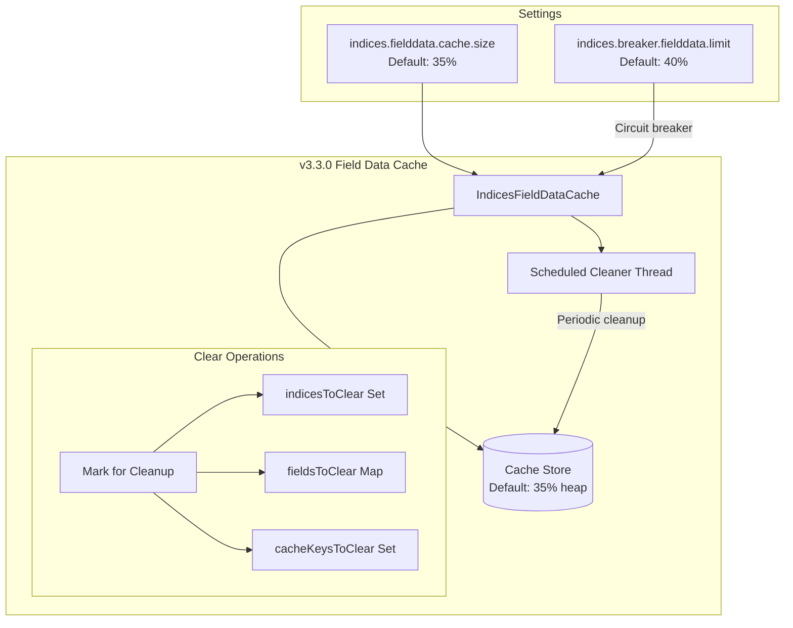

---
tags:
  - domain/core
  - component/server
  - indexing
  - performance
---
# Field Data Cache

## Summary

OpenSearch v3.3.0 introduces significant improvements to the Field Data Cache, including a new default size limit of 35% of heap, dynamic cache size configuration, and optimized cache clearing performance. These changes prevent unexpected CircuitBreakingExceptions and improve cluster stability during index operations.

## Details

### What's New in v3.3.0

1. **Default Cache Size Limit**: The `indices.fielddata.cache.size` setting now defaults to 35% of heap instead of unbounded (-1)
2. **Dynamic Setting**: Cache size can now be changed at runtime without node restart
3. **Optimized Cache Clearing**: Removed O(FN) looping during cache clear, reducing clear time from minutes to milliseconds for large caches
4. **Asynchronous Cleanup**: Cache clearing now uses a scheduled cleaner thread instead of blocking the cluster applier thread

### Technical Changes

#### Architecture Changes



#### New Configuration

| Setting | Description | Default | Dynamic |
|---------|-------------|---------|---------|
| `indices.fielddata.cache.size` | Maximum cache size | 35% of heap | Yes (v3.3.0+) |
| `indices.breaker.fielddata.limit` | Circuit breaker limit | 40% of heap | Yes |

#### Behavior Changes

**Before v3.3.0:**
- Cache size unlimited by default, only controlled by circuit breaker
- Queries exceeding breaker limit caused `CircuitBreakingException`
- Cache clearing iterated through all N keys once per field (O(FN) complexity)
- Clearing could take minutes for large caches, causing node drops

**After v3.3.0:**
- Cache evicts LRU entries when exceeding 35% limit
- Circuit breaker only triggers for extremely large single entries (>5% heap)
- Cache clearing uses O(N) iteration with scheduled cleanup thread
- Clearing completes in milliseconds even for large caches

### Usage Example

Update cache size dynamically:
```bash
PUT _cluster/settings
{
  "persistent": {
    "indices.fielddata.cache.size": "30%"
  }
}
```

### Migration Notes

- **Breaking Change**: Default cache behavior changed from unbounded to 35% limit
- Existing clusters upgrading to v3.3.0 will see automatic LRU eviction when cache exceeds 35%
- To restore previous behavior: `indices.fielddata.cache.size: -1` (not recommended)
- Cache clearing is now asynchronous; use `assertBusy()` in tests that verify cache state

## Limitations

- Cache size changes trigger eviction asynchronously (not immediate)
- No tiered caching support (heap + disk) for field data cache yet

## References

### Documentation
- [CAT Field Data API](https://docs.opensearch.org/3.0/api-reference/cat/cat-field-data/): View field data cache memory usage
- [Clear Cache API](https://docs.opensearch.org/3.0/api-reference/index-apis/clear-index-cache/): Clear index caches

### Pull Requests
| PR | Description |
|----|-------------|
| [#19152](https://github.com/opensearch-project/OpenSearch/pull/19152) | Make field data cache size setting dynamic and add default limit |
| [#19116](https://github.com/opensearch-project/OpenSearch/pull/19116) | Remove unnecessary looping in field data cache clear |

### Issues (Design / RFC)
- [Issue #19104](https://github.com/opensearch-project/OpenSearch/issues/19104): Change default settings for field data cache size
- [Issue #13862](https://github.com/opensearch-project/OpenSearch/issues/13862): Optimize FieldDataCache removal flow

## Related Feature Report

- Full feature documentation
