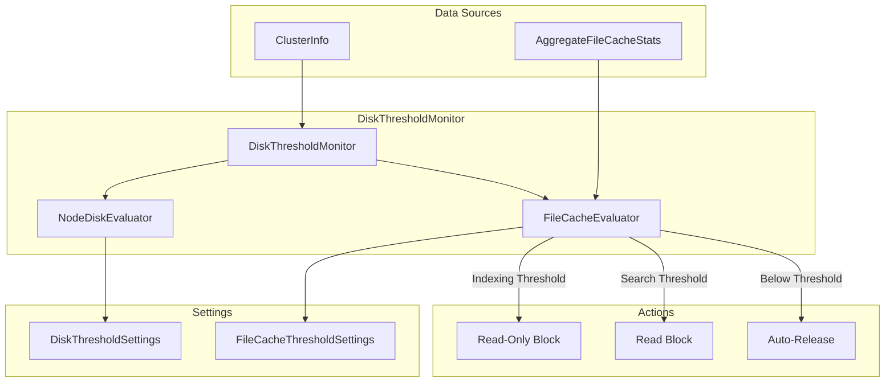

---
tags:
  - domain/core
  - component/server
  - indexing
  - performance
  - search
---
# File Cache Active Usage Guard Rails

## Summary

This release adds file cache active usage threshold monitoring to the DiskThresholdMonitor for warm nodes. When file cache active usage exceeds configurable thresholds, OpenSearch automatically applies index blocks to prevent resource exhaustion. This provides guard rails for warm nodes using searchable snapshots, ensuring cluster stability under high cache pressure.

## Details

### What's New in v3.3.0

OpenSearch v3.3.0 introduces a new `FileCacheEvaluator` component that monitors file cache active usage on warm nodes and triggers protective actions when thresholds are exceeded:

- **Indexing Threshold (90% default)**: When active usage reaches this level, indices on the affected warm node are marked read-only (INDEX_READ_ONLY_ALLOW_DELETE_BLOCK)
- **Search Threshold (100% default)**: When active usage reaches this level, indices also receive a read block (INDEX_READ_BLOCK), preventing both reads and writes

### Technical Changes

#### Architecture Changes



#### New Components

| Component | Description |
|-----------|-------------|
| `FileCacheEvaluator` | Evaluates file cache active usage against configured thresholds |
| `FileCacheThresholdSettings` | Manages cluster settings for file cache thresholds |

#### New Configuration

| Setting | Description | Default |
|---------|-------------|---------|
| `cluster.filecache.activeusage.threshold.enabled` | Enable/disable file cache threshold monitoring | `true` |
| `cluster.filecache.activeusage.indexing.threshold` | Threshold for applying read-only block (percentage or bytes) | `90%` |
| `cluster.filecache.activeusage.search.threshold` | Threshold for applying read block (percentage or bytes) | `100%` |

#### API Changes

New method added to `AggregateFileCacheStats`:
- `getOverallActivePercent()`: Returns active usage as a percentage of total cache size (with decimal precision)

### Usage Example

**Configure file cache thresholds:**

```yaml
# opensearch.yml or via cluster settings API
cluster.filecache.activeusage.threshold.enabled: true
cluster.filecache.activeusage.indexing.threshold: 90%
cluster.filecache.activeusage.search.threshold: 100%
```

**Using absolute byte values:**

```bash
PUT _cluster/settings
{
  "persistent": {
    "cluster.filecache.activeusage.indexing.threshold": "900mb",
    "cluster.filecache.activeusage.search.threshold": "1000mb"
  }
}
```

**Disable threshold monitoring:**

```bash
PUT _cluster/settings
{
  "persistent": {
    "cluster.filecache.activeusage.threshold.enabled": false
  }
}
```

### Migration Notes

- This feature is enabled by default; no action required for new deployments
- Existing warm node deployments will automatically benefit from the new guard rails
- If you experience unexpected index blocks, check file cache usage via `GET _nodes/stats/file_cache`
- Adjust thresholds if default values are too aggressive for your workload

## Limitations

- Only applies to warm nodes with file cache enabled
- Thresholds are evaluated per-node, not cluster-wide
- Index blocks are applied at the index level, affecting all shards on the node
- Auto-release of blocks requires cache pressure to drop below the threshold

## References

### Documentation
- [Searchable Snapshots Documentation](https://docs.opensearch.org/3.0/tuning-your-cluster/availability-and-recovery/snapshots/searchable_snapshot/)
- [Clear Cache API](https://docs.opensearch.org/3.0/api-reference/index-apis/clear-index-cache/)
- [Nodes Stats API](https://docs.opensearch.org/3.0/api-reference/nodes-apis/nodes-stats/)

### Pull Requests
| PR | Description |
|----|-------------|
| [#19071](https://github.com/opensearch-project/OpenSearch/pull/19071) | Addition of fileCache activeUsage guard rails to DiskThresholdMonitor |

## Related Feature Report

- [Full feature documentation](../../../features/opensearch/opensearch-file-cache.md)
