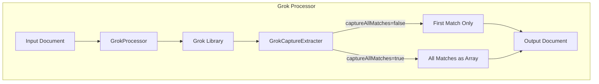

---
tags:
  - search
---

# Grok Processor - Capture All Matches

## Summary

The Grok processor in OpenSearch v3.3.0 adds a new `capture_all_matches` option that allows capturing multiple values for the same field name into an array. Previously, when a grok pattern contained repeated field names (e.g., multiple IP addresses), only the first matched value was captured. This enhancement aligns behavior with Logstash's grok filter, which captures all matched values by default.

## Details

### What's New in v3.3.0

The `capture_all_matches` parameter enables collecting all matched values for repeated field names into an array instead of only keeping the first match.

### Technical Changes

#### Architecture Changes



#### New Configuration

| Setting | Description | Default |
|---------|-------------|---------|
| `capture_all_matches` | When `true`, all matched values for the same field name are collected into an array. When `false`, only the first matched value is captured. | `false` |

#### Modified Components

| Component | Description |
|-----------|-------------|
| `GrokProcessor` | Added `captureAllMatches` parameter to constructor and factory |
| `Grok` | New constructor accepting `captureAllMatches` flag |
| `GrokCaptureExtracter` | Modified `extract()` method to support array collection |
| `GrokCaptureType` | Modified to continue capturing when `captureAllMatches` is true |

### Usage Example

**Pipeline with `capture_all_matches` enabled:**

```json
PUT _ingest/pipeline/log_pipeline
{
  "description": "Extract multiple IP addresses",
  "processors": [
    {
      "grok": {
        "field": "message",
        "patterns": ["%{IP:x_forwarded_for}, %{IP:x_forwarded_for}, %{IP:x_forwarded_for}"],
        "capture_all_matches": true
      }
    }
  ]
}
```

**Input document:**

```json
{
  "message": "Request from 198.51.100.1, 203.0.113.5, 10.0.0.2"
}
```

**Output with `capture_all_matches: true`:**

```json
{
  "message": "Request from 198.51.100.1, 203.0.113.5, 10.0.0.2",
  "x_forwarded_for": ["198.51.100.1", "203.0.113.5", "10.0.0.2"]
}
```

**Output with `capture_all_matches: false` (default):**

```json
{
  "message": "Request from 198.51.100.1, 203.0.113.5, 10.0.0.2",
  "x_forwarded_for": "198.51.100.1"
}
```

### Migration Notes

- Existing pipelines are unaffected as `capture_all_matches` defaults to `false`
- To enable multi-value capture, add `"capture_all_matches": true` to grok processor configuration
- When enabled, fields with multiple matches become arrays; update downstream processing accordingly

## Limitations

- The `capture_all_matches` option applies to all fields in the pattern; selective per-field control is not supported
- Type coercion (e.g., `:int`, `:long`) is applied to each captured value individually

## References

### Documentation
- [Grok Processor Documentation](https://docs.opensearch.org/3.0/ingest-pipelines/processors/grok/): Official documentation

### Pull Requests
| PR | Description |
|----|-------------|
| [#18799](https://github.com/opensearch-project/OpenSearch/pull/18799) | Grok processor supports capturing multiple values for same field name |

### Issues (Design / RFC)
- [Issue #18790](https://github.com/opensearch-project/OpenSearch/issues/18790): Bug report - Grok processor only extracts the first matched value for repeated field name

## Related Feature Report

- [Full feature documentation](../../../features/opensearch/opensearch-grok-processor.md)
