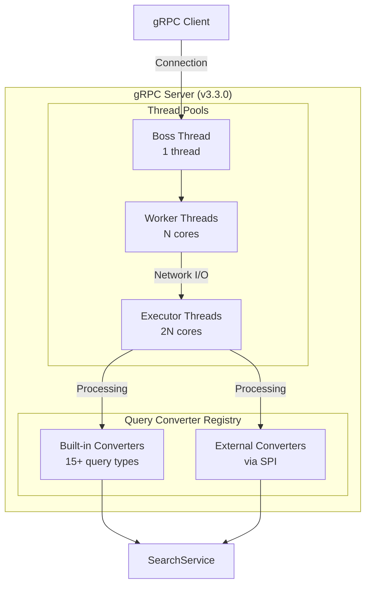

# gRPC Transport

## Summary

OpenSearch v3.3.0 significantly expands gRPC Transport capabilities with extensive query support, performance optimizations, and plugin extensibility improvements. This release adds support for 15+ query types across full-text, term-level, compound, geographic, joining, and specialized query categories, along with thread management optimizations and zero-copy serialization for improved throughput.

## Details

### What's New in v3.3.0

This release focuses on three major areas:

1. **Expanded Query Support**: Added converters for Boolean, Match Phrase, MultiMatch, Exists, Regexp, Wildcard, Ids, Range, Terms Set, GeoBoundingBox, GeoDistance, Nested, and Script queries
2. **Performance Optimizations**: Dedicated thread pools for gRPC transport and zero-copy BytesRef optimization for search hit serialization
3. **Plugin Extensibility**: Published `transport-grpc-spi` module enabling external plugins to register custom query converters

### Technical Changes

#### Architecture Changes



#### New Query Converters

| Category | Query Types | PR |
|----------|-------------|-----|
| Compound | Boolean | [#19391](https://github.com/opensearch-project/OpenSearch/pull/19391) |
| Full-text | Match Phrase, MultiMatch | [#19449](https://github.com/opensearch-project/OpenSearch/pull/19449) |
| Term-level | Exists, Regexp, Wildcard | [#19392](https://github.com/opensearch-project/OpenSearch/pull/19392) |
| Term-level | Ids, Range, Terms Set | [#19448](https://github.com/opensearch-project/OpenSearch/pull/19448) |
| Geographic | GeoBoundingBox, GeoDistance | [#19451](https://github.com/opensearch-project/OpenSearch/pull/19451) |
| Joining | Nested | [#19453](https://github.com/opensearch-project/OpenSearch/pull/19453) |
| Specialized | Script | [#19455](https://github.com/opensearch-project/OpenSearch/pull/19455) |

#### New Configuration

| Setting | Description | Default |
|---------|-------------|---------|
| `grpc.netty.boss_count` | Number of boss threads for connection acceptance | `1` |
| `grpc.netty.worker_count` | Number of worker threads for network I/O | `availableProcessors()` |
| `grpc.netty.executor_threads` | Number of executor threads for request processing | `availableProcessors() * 2` |

### Usage Example

**Boolean Query with Nested Queries:**

```json
{
  "index": ["my-index"],
  "request_body": {
    "query": {
      "bool": {
        "must": [
          {
            "term": {
              "field": "category",
              "value": { "string": "books" }
            }
          },
          {
            "range": {
              "field": "price",
              "gte": { "double": 10.0 },
              "lte": { "double": 50.0 }
            }
          }
        ],
        "should": [
          {
            "match_phrase": {
              "field": "title",
              "query": "search engine"
            }
          }
        ]
      }
    }
  }
}
```

**Geographic Query:**

```json
{
  "index": ["locations"],
  "request_body": {
    "query": {
      "geo_distance": {
        "field": "location",
        "distance": "10km",
        "location": {
          "lat": 40.7128,
          "lon": -74.0060
        }
      }
    }
  }
}
```

**Plugin Extension for Custom Query Converter:**

```java
// External plugins can now register custom query converters via SPI
public class KNNQueryBuilderProtoConverter implements QueryBuilderProtoConverter<KNNQueryBuilder> {
    
    @Override
    public String getQueryName() {
        return "KNN";
    }
    
    @Override
    public KNNQueryBuilder fromProto(QueryContainer proto) {
        // Convert protobuf to KNNQueryBuilder
    }
}
```

### Migration Notes

- **Protobuf Version**: Updated to opensearch-protobufs 0.19.0 - clients should update their protobuf dependencies
- **Thread Configuration**: New thread pool settings available for tuning gRPC server performance
- **SPI Module**: External plugins should depend on `transport-grpc-spi` instead of full `transport-grpc` module

## Limitations

- Sort-related protobufs temporarily removed (to be fixed in future release)
- Some advanced query options may not be fully supported in gRPC format

## References

### Documentation
- [gRPC APIs Documentation](https://docs.opensearch.org/3.0/api-reference/grpc-apis/index/): Official documentation
- [Search (gRPC) API](https://docs.opensearch.org/3.0/api-reference/grpc-apis/search/): Search endpoint reference

### Pull Requests
| PR | Description |
|----|-------------|
| [#18949](https://github.com/opensearch-project/OpenSearch/pull/18949) | Publish transport-grpc-spi for QueryBuilderProtoConverter |
| [#19007](https://github.com/opensearch-project/OpenSearch/pull/19007) | Upgrade opensearch-protobufs to 0.13.0 |
| [#19278](https://github.com/opensearch-project/OpenSearch/pull/19278) | Optimize gRPC transport thread management |
| [#19280](https://github.com/opensearch-project/OpenSearch/pull/19280) | Zero-copy BytesRef optimization for search hits |
| [#19339](https://github.com/opensearch-project/OpenSearch/pull/19339) | Add failureaccess runtime dependency |
| [#19391](https://github.com/opensearch-project/OpenSearch/pull/19391) | Implement Boolean query and registry injection |
| [#19392](https://github.com/opensearch-project/OpenSearch/pull/19392) | Implement Exists, Regexp, Wildcard queries |
| [#19447](https://github.com/opensearch-project/OpenSearch/pull/19447) | Bump protobufs to 0.18.0, fix Inner Hits |
| [#19448](https://github.com/opensearch-project/OpenSearch/pull/19448) | Implement Ids, Range, Terms Set queries |
| [#19449](https://github.com/opensearch-project/OpenSearch/pull/19449) | Implement Match Phrase, MultiMatch queries |
| [#19451](https://github.com/opensearch-project/OpenSearch/pull/19451) | Implement GeoBoundingBox, GeoDistance queries |
| [#19453](https://github.com/opensearch-project/OpenSearch/pull/19453) | Implement Nested query, bump to protobufs 0.19.0 |
| [#19455](https://github.com/opensearch-project/OpenSearch/pull/19455) | Implement Script query |

### Issues (Design / RFC)
- [Issue #18513](https://github.com/opensearch-project/OpenSearch/issues/18513): GRPC Plugin Extensibility for Query Conversion
- [Issue #19277](https://github.com/opensearch-project/OpenSearch/issues/19277): Optimize gRPC server for higher throughput
- [Issue #19310](https://github.com/opensearch-project/OpenSearch/issues/19310): Zero-copy optimization for search hits

## Related Feature Report

- [Full feature documentation](../../../features/opensearch/grpc-transport--services.md)
