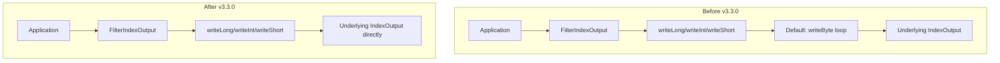

---
tags:
  - indexing
  - performance
---

# Index Output Primitive Write Delegation

## Summary

This release improves indexing performance by delegating primitive write methods (`writeInt`, `writeShort`, `writeLong`) in `ByteSizeCachingDirectory`'s wrapped `IndexOutput`. Previously, these methods fell back to byte-by-byte writing, which was inefficient. This optimization speeds up BKD tree merges and other index operations that use primitive writes.

## Details

### What's New in v3.3.0

The `ByteSizeCachingDirectory` class wraps the underlying directory to cache byte size calculations. When creating `IndexOutput` instances, it wraps them with `FilterIndexOutput` to track modifications. However, the wrapper did not delegate primitive write methods, causing them to use the default `DataOutput` implementation that writes byte-by-byte.

This change adds direct delegation for:
- `writeInt(int i)`
- `writeShort(short i)`
- `writeLong(long i)`

### Technical Changes

#### Architecture Changes



#### Modified Components

| Component | Description |
|-----------|-------------|
| `ByteSizeCachingDirectory` | Added delegation for `writeInt`, `writeShort`, `writeLong` in the wrapped `IndexOutput` |

#### Code Changes

The following methods were added to the anonymous `FilterIndexOutput` class in `ByteSizeCachingDirectory.wrapIndexOutput()`:

```java
@Override
public void writeInt(int i) throws IOException {
    out.writeInt(i);
}

@Override
public void writeShort(short i) throws IOException {
    out.writeShort(i);
}

@Override
public void writeLong(long i) throws IOException {
    out.writeLong(i);
}
```

### Performance Impact

This optimization benefits operations that write primitive types frequently, particularly:
- **BKD tree merges**: BKD trees (used for numeric and geo fields) write many primitive values during merge operations
- **Segment merges**: General segment merge operations that write structured data
- **Index creation**: Initial indexing of documents with numeric fields

The improvement aligns with Lucene's optimization in [apache/lucene#321](https://github.com/apache/lucene/pull/321), which introduced optimized primitive writes in `IndexOutput`.

### Usage Example

No configuration changes required. The optimization is automatically applied to all index operations using `ByteSizeCachingDirectory`.

## Limitations

- This is an internal optimization with no user-facing configuration
- Performance gains depend on workload characteristics (more benefit for numeric-heavy indices)

## References

### Documentation
- [Lucene PR #321](https://github.com/apache/lucene/pull/321): Original Lucene optimization for primitive writes
- [RateLimitedIndexOutput](https://github.com/apache/lucene/blob/main/lucene/core/src/java/org/apache/lucene/store/RateLimitedIndexOutput.java): Lucene reference implementation

### Pull Requests
| PR | Description |
|----|-------------|
| [#19432](https://github.com/opensearch-project/OpenSearch/pull/19432) | Delegate primitive write methods with ByteSizeCachingDirectory wrapped IndexOutput |

### Issues (Design / RFC)
- [Issue #19420](https://github.com/opensearch-project/OpenSearch/issues/19420): Bug report identifying the missing delegation

## Related Feature Report

- [Full feature documentation](../../../../features/opensearch/opensearch-index-output.md)
