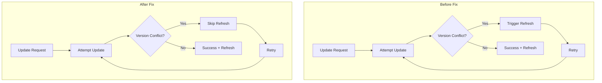

---
tags:
  - indexing
  - performance
---

# Index Refresh

## Summary

This release fixes a performance issue where unnecessary index refresh operations were triggered during update retry conflicts. When using the `_update` API with `retry_on_conflict` and `refresh=true`, OpenSearch was incorrectly triggering refresh operations for each failed retry attempt, causing significant performance degradation in high-conflict scenarios.

## Details

### What's New in v3.3.0

The fix ensures that refresh operations are only triggered when actual writes occur, not when update preparation fails due to version conflicts.

### Technical Changes

#### Problem Background

When using the `_update` API with:
- `retry_on_conflict > 0` (to handle concurrent updates)
- `refresh=true` or `refresh=wait_for` (to make changes immediately searchable)

Each retry attempt that failed due to a version conflict was triggering a refresh operation. In high-concurrency scenarios with many conflicts, this could result in thousands of unnecessary refreshes per minute, severely impacting indexing performance.

#### Architecture Changes



#### Implementation Details

The fix modifies `TransportShardBulkAction.java` to check if any actual writes occurred before triggering a refresh:

| Component | Change |
|-----------|--------|
| `TransportShardBulkAction` | Added logic to suppress refresh when `locationToSync` is null |
| `BulkShardRequest` | Creates modified request with `RefreshPolicy.NONE` when no writes occurred |

The key change is in the `finishRequest()` method:
- If `locationToSync` is null (no writes occurred), the refresh policy is changed to `NONE`
- The original refresh policy is preserved for successful operations
- Refresh still occurs once when the update eventually succeeds

### Usage Example

```json
// Update with retry_on_conflict - refresh now only happens on success
POST /my-index/_update/1?retry_on_conflict=5&refresh=true
{
  "doc": {
    "counter": 1
  }
}
```

### Migration Notes

No migration required. This is a transparent performance improvement that maintains the same API behavior while eliminating unnecessary refresh operations.

## Limitations

- The fix only applies to update operations with `retry_on_conflict`
- Refresh behavior for successful operations remains unchanged
- Does not affect bulk operations where some items succeed and others fail (refresh still occurs for successful items)

## References

### Documentation
- [Refresh Index API](https://docs.opensearch.org/3.0/api-reference/index-apis/refresh/): Official documentation

### Blog Posts
- [Optimize OpenSearch Refresh Interval](https://opensearch.org/blog/optimize-refresh-interval/): Blog post on refresh optimization

### Pull Requests
| PR | Description |
|----|-------------|
| [#18917](https://github.com/opensearch-project/OpenSearch/pull/18917) | Fix unnecessary refreshes during update retry conflicts |

### Issues (Design / RFC)
- [Issue #15261](https://github.com/opensearch-project/OpenSearch/issues/15261): Original bug report - TransportUpdateAction trigger refresh for every failed retry attempt

## Related Feature Report

- [Full feature documentation](../../../../features/opensearch/opensearch-index-refresh.md)
