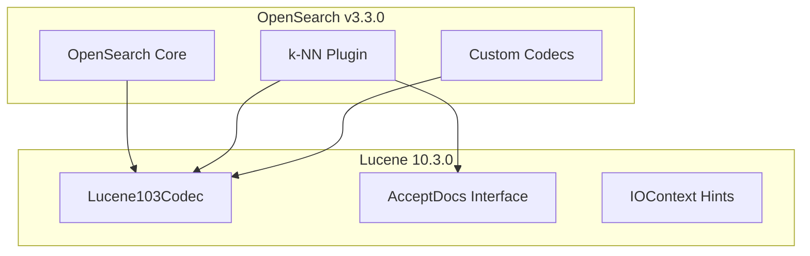

---
tags:
  - indexing
  - k-nn
  - performance
  - search
---

# Lucene 10.3 Update

## Summary

OpenSearch v3.3.0 upgrades Apache Lucene from 10.2.2 to 10.3.0. This update brings performance improvements, new features, and API changes that required coordinated updates across multiple OpenSearch repositories including core, k-NN, and custom-codecs plugins.

## Details

### What's New in v3.3.0

The Lucene 10.3.0 upgrade introduces several key changes:

1. **Core OpenSearch**: Version bump from Lucene 10.2.2 to 10.3.0 with updated JAR dependencies
2. **k-NN Plugin**: New KNN1030Codec for Lucene 10.3, API changes for `AcceptDocs` interface
3. **Custom Codecs Plugin**: New Lucene103 codec classes for ZSTD and QAT compression

### Technical Changes

#### Architecture Changes



#### New Components

| Component | Repository | Description |
|-----------|------------|-------------|
| KNN1030Codec | k-NN | New codec wrapping Lucene103Codec for k-NN vector indexing |
| Lucene103CustomCodec | custom-codecs | ZSTD compression codec for Lucene 10.3 |
| Lucene103QatCodec | custom-codecs | QAT hardware-accelerated compression codec for Lucene 10.3 |
| AcceptDocs | k-NN | New interface replacing `Bits` for accepted documents in vector search |

#### API Changes

| Change | Description |
|--------|-------------|
| `AcceptDocs` interface | Replaces `Bits` parameter in `KnnVectorsReader.search()` methods |
| `IOContext` hints | New `FileTypeHint`, `FileDataHint`, `DataAccessHint` for optimized file access |
| Backward codecs | Lucene101Codec moved to `backward_codecs` package |

### Usage Example

No user-facing configuration changes are required. The Lucene version is automatically bundled with OpenSearch.

Verify the Lucene version:
```bash
GET /_nodes?filter_path=nodes.*.version
```

### Migration Notes

- **Automatic**: The upgrade is transparent for most users
- **Plugin developers**: Update to new `AcceptDocs` interface if implementing custom `KnnVectorsReader`
- **Custom codec users**: Existing indices using Lucene 10.1/10.2 codecs remain readable via backward compatibility

## Limitations

- Indices created with Lucene 10.3 cannot be read by older OpenSearch versions
- Some deprecated Lucene APIs have been removed

## References

### Documentation
- [Lucene 10.3.0 Changelog](https://lucene.apache.org/core/10_3_0/changes/Changes.html): Official Lucene 10.3.0 release notes

### Pull Requests
| PR | Repository | Description |
|----|------------|-------------|
| [#19296](https://github.com/opensearch-project/OpenSearch/pull/19296) | OpenSearch | Bump Apache Lucene from 10.2.2 to 10.3.0 |
| [#2878](https://github.com/opensearch-project/k-NN/pull/2878) | k-NN | Fix KNN build due to Lucene 10.3 upgrade |
| [#277](https://github.com/opensearch-project/custom-codecs/pull/277) | custom-codecs | Update for Lucene 10.3 |

### Issues (Design / RFC)
- [Issue #18638](https://github.com/opensearch-project/OpenSearch/issues/18638): Feature request for Lucene 10.3 upgrade
- [Issue #2888](https://github.com/opensearch-project/k-NN/issues/2888): Fix KNN build after Lucene 10.3 upgrade
- [Issue #276](https://github.com/opensearch-project/custom-codecs/issues/276): Distribution build failed for custom-codecs-3.3.0

## Related Feature Report

- [Full feature documentation](../../../../features/opensearch/opensearch-lucene-upgrade.md)
