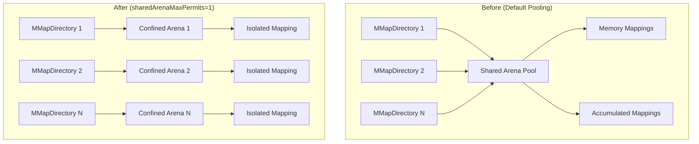

# Netty Arena Settings

## Summary

This release introduces a JVM configuration change that sets `sharedArenaMaxPermits` to 1 for Lucene's MMapDirectory. This change mitigates memory-mapped segment bloat issues that can occur when frequent stats calls cause repeated memory mapping of compound files, potentially exhausting virtual address space.

## Details

### What's New in v3.3.0

A new JVM option is added to the default `jvm.options` configuration file:

```
-Dorg.apache.lucene.store.MMapDirectory.sharedArenaMaxPermits=1
```

This setting effectively disables shared Arena pooling for MMapDirectory instances, using a confined Arena for each instance instead.

### Technical Changes

#### Background: The Problem

When using shared Arena pooling, Lucene groups index files together into a single shared Arena to reduce the costly operation of closing an Arena. However, in specific cases with high memory-mapped file counts, this pooling can cause:

- **Memory-mapped segment bloat**: Repeated entries (hundreds) for the same compound files in `/proc/<pid>/maps`
- **Virtual address space exhaustion**: VmSize growing to extreme values (e.g., 200 TB)
- **"Leaked" maps**: Memory mappings that persist longer than expected
- **Performance degradation**: Slowdowns due to Arena management overhead

The issue manifests when stats calls periodically trigger memory mapping of compound files (`.cfs`) using `IOContext.DEFAULT` in Lucene's CompoundReader.

#### The Solution

Setting `sharedArenaMaxPermits=1` forces each MMapDirectory instance to use a confined Arena rather than sharing Arenas across multiple files. This:

1. Prevents accumulation of duplicate memory mappings
2. Improves stability in environments with high memory-mapped file counts
3. Avoids performance issues associated with closing shared Arenas

#### Architecture Changes



#### New Configuration

| Setting | Description | Default |
|---------|-------------|---------|
| `-Dorg.apache.lucene.store.MMapDirectory.sharedArenaMaxPermits` | Maximum number of permits for shared Arena pooling. Value of 1 disables pooling. | `1` (new default in OpenSearch) |

### Usage Example

The setting is automatically applied via the default `jvm.options` file. No user action is required for new installations.

For existing installations upgrading to v3.3.0, the setting will be applied automatically if using the default JVM options.

To verify the setting is active:

```bash
# Check JVM arguments
ps aux | grep opensearch | grep sharedArenaMaxPermits
```

### Migration Notes

- **Automatic**: This change is applied automatically through the default `jvm.options` file
- **No action required**: Existing clusters will benefit from this fix upon upgrade
- **Override if needed**: Users can modify `jvm.options` to change the value if specific use cases require shared Arena pooling

## Limitations

- Setting `sharedArenaMaxPermits=1` may slightly increase the overhead of Arena creation/destruction for each MMapDirectory instance
- The trade-off favors stability over potential minor performance gains from Arena pooling
- This is a mitigation for the underlying issue; the root cause in Lucene's CompoundReader behavior remains

## References

### Documentation
- [Lucene MMapDirectory](https://lucene.apache.org/core/10_0_0/core/org/apache/lucene/store/MMapDirectory.html): Official Lucene documentation

### Blog Posts
- [Blog: Use Lucene's MMapDirectory on 64bit](https://blog.thetaphi.de/2012/07/use-lucenes-mmapdirectory-on-64bit.html): Background on MMapDirectory behavior

### Pull Requests
| PR | Description |
|----|-------------|
| [#19503](https://github.com/opensearch-project/OpenSearch/pull/19503) | Setting number of sharedArenaMaxPermits to 1 |

### Issues (Design / RFC)
- [Issue #19482](https://github.com/opensearch-project/OpenSearch/issues/19482): BUG - Frequent stats calls causing memory mapped segments to bloat up

## Related Feature Report

- [Full feature documentation](../../../../features/opensearch/netty-arena-settings.md)
