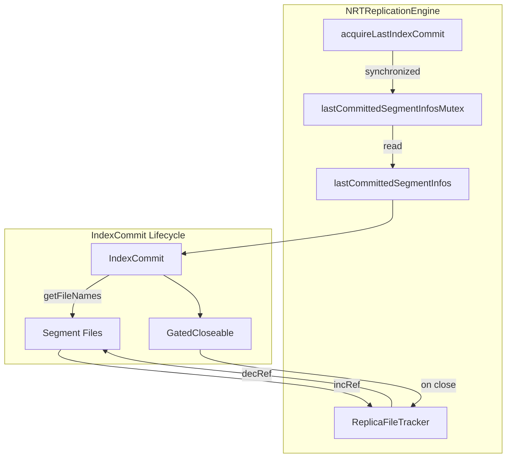

---
tags:
  - indexing
---

# NRT Replication Engine

## Summary

This release fixes a critical bug in `NRTReplicationEngine#acquireLastIndexCommit` where files contained in the returned `GatedCloseable<IndexCommit>` could be deleted before the commit was closed. The fix adds proper reference count control to prevent `NoSuchFileException` errors during segment replication operations.

## Details

### What's New in v3.3.0

This bug fix addresses a race condition in the NRT (Near Real-Time) Replication Engine that could cause replica shards to fail with `NoSuchFileException` when accessing segment files.

### Technical Changes

#### Problem

In production clusters with segment replication enabled, replica shards using `NRTReplicationEngine` could encounter `NoSuchFileException` when traversing files from `acquireLastIndexCommit`. This occurred because:

1. `NRTReplicationEngine#acquireLastIndexCommit` returned an `IndexCommit` without incrementing reference counts on the underlying segment files
2. Concurrent operations (like force merge) could delete these files before the `IndexCommit` was closed
3. Unlike `InternalEngine`, which uses `combinedDeletionPolicy` to protect files, `NRTReplicationEngine` had no such protection

#### Solution

The fix introduces proper reference counting in `NRTReplicationEngine`:

```java
// Before (vulnerable to file deletion)
final IndexCommit indexCommit = Lucene.getIndexCommit(lastCommittedSegmentInfos, store.directory());
return new GatedCloseable<>(indexCommit, () -> {});

// After (files protected until close)
synchronized (lastCommittedSegmentInfosMutex) {
    final IndexCommit indexCommit = Lucene.getIndexCommit(lastCommittedSegmentInfos, store.directory());
    final Collection<String> files = indexCommit.getFileNames();
    replicaFileTracker.incRef(files);
    return new GatedCloseable<>(indexCommit, () -> { replicaFileTracker.decRef(files); });
}
```

#### Architecture Changes



#### Key Changes

| Component | Change |
|-----------|--------|
| `NRTReplicationEngine` | Added `lastCommittedSegmentInfosMutex` for thread-safe access |
| `acquireLastIndexCommit` | Now increments reference count on segment files |
| `GatedCloseable` close handler | Now decrements reference count when closed |
| `commitSegmentInfos` | Synchronized access to `lastCommittedSegmentInfos` |

### Usage Example

The fix is transparent to users. Segment replication continues to work as before, but without the risk of `NoSuchFileException`:

```json
PUT /my-index
{
  "settings": {
    "index": {
      "replication.type": "SEGMENT",
      "number_of_replicas": 1
    }
  }
}
```

### Migration Notes

No migration required. The fix is automatically applied when upgrading to v3.3.0.

## Limitations

- This fix specifically addresses `NRTReplicationEngine` (used by replica shards in segment replication)
- Primary shards using `InternalEngine` were not affected by this bug

## References

### Documentation
- [Segment Replication Documentation](https://docs.opensearch.org/3.0/tuning-your-cluster/availability-and-recovery/segment-replication/index/): Official segment replication docs

### Pull Requests
| PR | Description |
|----|-------------|
| [#19214](https://github.com/opensearch-project/OpenSearch/pull/19214) | Add reference count control in NRTReplicationEngine#acquireLastIndexCommit |

### Issues (Design / RFC)
- [Issue #19213](https://github.com/opensearch-project/OpenSearch/issues/19213): Bug report - NoSuchFileException when traversing files from acquireLastIndexCommit

## Related Feature Report

- [Full feature documentation](../../../features/opensearch/segment-opensearch-replication.md)
