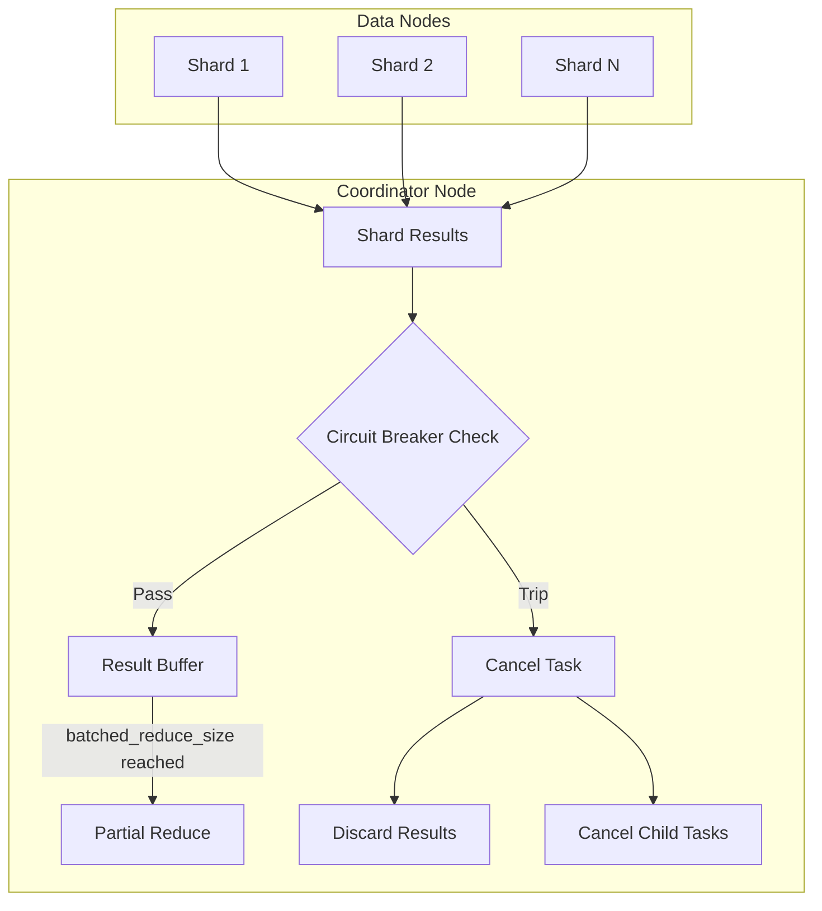

---
tags:
  - domain/core
  - component/server
  - indexing
  - search
---
# OOM Prevention

## Summary

This release adds circuit breaker protection for shard-level query results buffering on coordinator nodes. Previously, when searching across indexes with many shards, the coordinator node could run out of memory while buffering shard results before the batched reduce phase. The new implementation checks the circuit breaker on each shard result arrival and cancels the search task if memory limits are exceeded.

## Details

### What's New in v3.3.0

The `QueryPhaseResultConsumer` class now integrates with the request circuit breaker to prevent OOM conditions during the query phase. Key changes include:

1. **Circuit breaker check on each shard result**: Before buffering a new shard result, the system evaluates the circuit breaker to ensure memory limits are not exceeded
2. **Immediate task cancellation**: When the circuit breaker trips, the coordinator task and all child tasks are cancelled immediately
3. **Result discarding after cancellation**: New shard results are discarded after task cancellation, preventing further memory accumulation

### Technical Changes

#### Architecture Changes



#### Modified Components

| Component | Description |
|-----------|-------------|
| `QueryPhaseResultConsumer` | Added circuit breaker check in `consume()` method and task cancellation support |
| `SearchPhaseController` | Extended `newSearchPhaseResults()` to accept `isTaskCancelled` supplier |
| `TransportSearchAction` | Passes task cancellation status to the result consumer |
| `AbstractSearchAsyncAction` | Added exception handling for shard result consumption failures |

#### Key Code Changes

The `QueryPhaseResultConsumer.PendingMerges.consume()` method now includes:

```java
private void checkCircuitBreaker(Runnable next) throws CircuitBreakingException {
    try {
        // Force the CircuitBreaker eval to ensure during buffering 
        // we did not hit the circuit breaker limit
        addEstimateAndMaybeBreak(0);
    } catch (CircuitBreakingException e) {
        resetCircuitBreakerForCurrentRequest();
        if (!hasFailure()) {
            failure.set(e);
            onPartialMergeFailure.accept(e);
        }
    }
}
```

### Configuration

This feature uses the existing request circuit breaker settings:

| Setting | Description | Default |
|---------|-------------|---------|
| `indices.breaker.request.limit` | Memory limit for request circuit breaker | 60% of JVM heap |
| `indices.breaker.request.overhead` | Multiplier for request estimations | 1.0 |

### Usage Example

No configuration changes are required. The protection is automatically enabled. When the circuit breaker trips during a search:

```json
{
  "error": {
    "root_cause": [
      {
        "type": "circuit_breaking_exception",
        "reason": "[request] Data too large, data for [<reduce_aggs>] would be [...]"
      }
    ],
    "type": "search_phase_execution_exception",
    "reason": "all shards failed"
  },
  "status": 503
}
```

### Migration Notes

- No migration required - this is a transparent improvement
- Queries that previously caused OOM will now fail gracefully with a `CircuitBreakingException`
- Consider adjusting `batched_reduce_size` for queries spanning many shards if you encounter circuit breaker errors

## Limitations

- The circuit breaker check adds minimal overhead to each shard result processing
- Very large aggregation results may still trigger circuit breaker errors; consider using `batched_reduce_size` to control memory usage

## References

### Documentation
- [Circuit Breaker Settings](https://docs.opensearch.org/3.0/install-and-configure/configuring-opensearch/circuit-breaker/): Official documentation

### Pull Requests
| PR | Description |
|----|-------------|
| [#19066](https://github.com/opensearch-project/OpenSearch/pull/19066) | Add circuit breaking logic for shard level results |

### Issues (Design / RFC)
- [Issue #18999](https://github.com/opensearch-project/OpenSearch/issues/18999): Original bug report for OOM during large shard searches

## Related Feature Report

- [Full feature documentation](../../../../features/opensearch/opensearch-oom-prevention.md)
