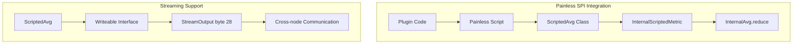

# Painless Scripting

## Summary

This release adds the `ScriptedAvg` class to the Painless SPI (Service Provider Interface) allowlist, enabling plugins to use this class in Painless scripts. This is a follow-up enhancement to the v3.2.0 changes that added scripted metric support for reducing aggregations, completing the integration by making `ScriptedAvg` accessible from external plugins.

## Details

### What's New in v3.3.0

The `ScriptedAvg` class has been added to the Painless SPI allowlist, allowing plugins to instantiate and use `ScriptedAvg` objects within Painless scripts. This enables plugins like index-management to properly use scripted metrics when searching across rollup and raw indices together.

### Technical Changes

#### Architecture Changes



#### New Components

| Component | Description |
|-----------|-------------|
| `ScriptedAvg` in Painless SPI | Allowlisted class for use in Painless scripts |
| `WriteableRegistry` entry | Registered `ScriptedAvg` with byte marker 28 for streaming |

#### Painless SPI Allowlist Addition

The following methods are now available in Painless scripts:

```java
class org.opensearch.search.aggregations.metrics.ScriptedAvg {
  (double, long)    // Constructor with sum and count
  double getSum()   // Get the sum value
  long getCount()   // Get the count value
}
```

#### Streaming Support

`ScriptedAvg` is now registered in `Streamables.java` with byte marker 28, enabling proper serialization/deserialization across cluster nodes:

```java
WriteableRegistry.registerWriter(ScriptedAvg.class, (o, v) -> {
    o.writeByte((byte) 28);
    ((ScriptedAvg) v).writeTo(o);
});
WriteableRegistry.registerReader(Byte.valueOf((byte) 28), ScriptedAvg::new);
```

### Usage Example

Plugins can now create `ScriptedAvg` objects in Painless scripts for use with rollup aggregations:

```painless
// In a combine script for rollup aggregations
def scriptedAvg = new ScriptedAvg(state.sum, state.count);
return scriptedAvg;
```

This enables the index-management plugin to properly handle average calculations when searching across rollup and raw indices:

```json
GET rollup_index,raw_index/_search
{
  "size": 0,
  "aggs": {
    "avg_value": {
      "avg": {
        "field": "numeric_field"
      }
    }
  }
}
```

### Migration Notes

No migration required. This is an additive change that enables new functionality for plugins using Painless scripts with scripted metric aggregations.

## Limitations

- `ScriptedAvg` is specifically designed for average calculations with sum and count values
- The class is intended for use with rollup aggregation scenarios
- Scripts using `ScriptedAvg` must ensure proper handling in the reduce phase

## Related PRs

| PR | Description |
|----|-------------|
| [#19006](https://github.com/opensearch-project/OpenSearch/pull/19006) | Adding ScriptedAvg class to painless spi to allowlist usage from plugins |
| [#18411](https://github.com/opensearch-project/OpenSearch/pull/18411) | Supporting Scripted Metric in InternalValueCount and InternalAvg (prerequisite) |

## References

- [PR #19006](https://github.com/opensearch-project/OpenSearch/pull/19006): Main implementation
- [PR #18411](https://github.com/opensearch-project/OpenSearch/pull/18411): Prerequisite PR for scripted metric support
- [Script APIs Documentation](https://docs.opensearch.org/3.0/api-reference/script-apis/index/): Painless scripting documentation
- [Scripted Metric Aggregation](https://docs.opensearch.org/3.0/aggregations/metric/scripted-metric/): Scripted metric aggregation documentation

## Related Feature Report

- [Full feature documentation](../../../features/opensearch/scripted-metric-aggregation.md)
