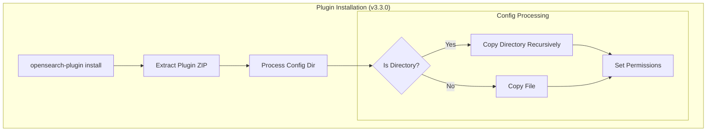

# Plugin Installation: Directory Support in Config

## Summary

OpenSearch v3.3.0 relaxes the plugin installation CLI to allow plugins to copy directories (not just files) to their config folder during installation. This enables plugins like security-analytics to maintain their existing folder structure for bundled resources such as sigma rules.

## Details

### What's New in v3.3.0

Previously, the `opensearch-plugin install` command only allowed plugins to copy individual files from `src/main/config` to their config folder (`config/{plugin-name}`). Directories were explicitly rejected with an error.

With this change:
- Plugins can now include subdirectories in their config folder
- Directory structures are recursively copied during installation
- Proper permissions are applied to both directories and files

### Technical Changes

#### Architecture Changes



#### Modified Components

| Component | Change |
|-----------|--------|
| `InstallPluginCommand.installConfig()` | Removed directory rejection; added recursive copy support |
| `InstallPluginCommand.copyWithPermissions()` | New helper method for copying with permissions |
| `InstallPluginCommand.copyDirectoryRecursively()` | New method for recursive directory copying |

#### Behavior Change

| Aspect | Before v3.3.0 | v3.3.0+ |
|--------|---------------|---------|
| Directories in config | Rejected with `UserException` | Recursively copied |
| Directory permissions | N/A | `CONFIG_DIR_PERMS` applied |
| File permissions | `CONFIG_FILES_PERMS` | `CONFIG_FILES_PERMS` (unchanged) |
| Ownership | Inherited from parent | Explicitly set from destination config dir |

### Usage Example

Plugin developers can now structure their config like this:

```
my-plugin/
├── src/main/config/
│   ├── settings.yml
│   └── rules/
│       ├── category1/
│       │   └── rule1.yml
│       └── category2/
│           └── rule2.yml
```

After installation, the config folder will be:

```
config/my-plugin/
├── settings.yml
└── rules/
    ├── category1/
    │   └── rule1.yml
    └── category2/
        └── rule2.yml
```

### Migration Notes

- No migration required for existing plugins
- Plugin developers can now move resources from JAR classpath to config folder
- Existing config files are not overwritten during reinstallation

## Limitations

- Config directories are only copied if they don't already exist at the destination
- Existing files/directories are preserved (not overwritten)

## References

### Documentation
- [Documentation](https://docs.opensearch.org/3.0/install-and-configure/plugins/): Installing plugins
- [PR #19343](https://github.com/opensearch-project/OpenSearch/pull/19343): Main implementation
- [security-analytics sigma rules](https://github.com/opensearch-project/security-analytics/tree/main/src/main/resources/rules): Motivation for this change

### Pull Requests
| PR | Description |
|----|-------------|
| [#19343](https://github.com/opensearch-project/OpenSearch/pull/19343) | Allow plugins to copy folders into their config dir during installation |

## Related Feature Report

- [Full feature documentation](../../../../features/opensearch/plugin-installation.md)
