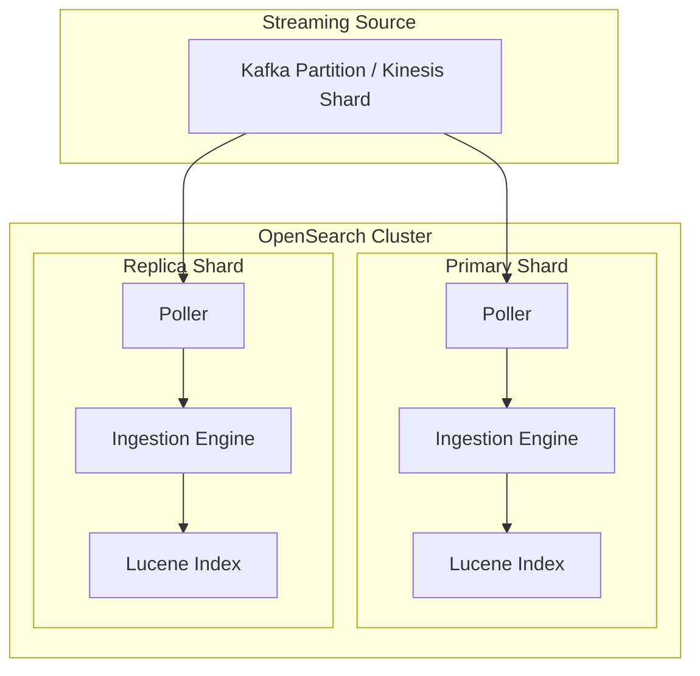

---
tags:
  - indexing
  - observability
---

# Pull-based Ingestion Enhancements

## Summary

OpenSearch v3.3.0 introduces the all-active ingestion mode for pull-based ingestion, enabling replica shards to independently ingest from streaming sources. This release also includes bug fixes for ingestion state serialization, lag metrics, and pause state initialization during replica promotion.

## Details

### What's New in v3.3.0

#### All-Active Ingestion Mode

The primary enhancement in v3.3.0 is the all-active ingestion mode, which provides a document replication equivalent for pull-based ingestion. Previously, pull-based ingestion only supported segment replication mode with remote store dependency. The all-active mode enables both primary and replica shards to consume from the same streaming source partition independently.



**Key characteristics:**
- Both primary and replica shards ingest from the same partition independently
- No coordination or replication between primary and replicas
- Removes segment replication and remote store dependency
- Better throughput compared to traditional document replication
- Better freshness as all replicas directly ingest from the source
- Replicas use peer recovery during shard reinitialization

#### Bug Fixes

| Fix | Description |
|-----|-------------|
| XContent Serialization | Added `ingestionStatus` field to `IndexMetadata.toXContent()` for remote cluster state compatibility |
| Lag Metric | Fixed lag calculation when streaming source is empty by setting lag to 0 |
| Pause State | Fixed ingestion pause state initialization during replica promotion |
| Replication Validation | Added validation for all-active ingestion to validate replication type |
| Fail Fast | Added fail-fast behavior for mapper/parsing errors to avoid unnecessary retries |

### Technical Changes

#### GetIngestionState API Enhancement

The `GetIngestionState` API response now includes additional fields to differentiate between primary and replica shards:

```json
{
  "ingestion_state": {
    "my-index": [
      {
        "shard": 0,
        "primary": true,
        "node_name": "node-1",
        "poller_state": "POLLING",
        "error_policy": "DROP",
        "poller_paused": false
      },
      {
        "shard": 0,
        "primary": false,
        "node_name": "node-2",
        "poller_state": "POLLING",
        "error_policy": "DROP",
        "poller_paused": false
      }
    ]
  }
}
```

#### Lag Metric Fix

Previously, lag was computed as the difference between system time and last processed message timestamp. When no messages were consumed for a long time, the lag kept increasing incorrectly. The fix:
- Sets lag to 0 when an empty batch is read from the streaming source
- Explicitly sets lag to 0 when the poller is paused

### Usage Example

All-active mode is automatically enabled when using pull-based ingestion without segment replication:

```json
PUT /my-index
{
  "settings": {
    "ingestion_source": {
      "type": "kafka",
      "pointer.init.reset": "earliest",
      "param": {
        "topic": "my-topic",
        "bootstrap_servers": "localhost:9092"
      }
    },
    "index.number_of_shards": 3,
    "index.number_of_replicas": 1
  }
}
```

## Limitations

- Primary and replicas can process events at different rates (no coordination)
- All-active mode requires document replication type (not segment replication)
- Recovery logic does not yet consider `batchStartPointer` for optimized recovery

## References

### Documentation
- [Documentation](https://docs.opensearch.org/3.0/api-reference/document-apis/pull-based-ingestion/): Pull-based ingestion
- [Documentation](https://docs.opensearch.org/3.0/api-reference/document-apis/pull-based-ingestion-management/): Pull-based ingestion management

### Pull Requests
| PR | Description |
|----|-------------|
| [#19316](https://github.com/opensearch-project/OpenSearch/pull/19316) | Support all-active mode in pull-based ingestion |
| [#19320](https://github.com/opensearch-project/OpenSearch/pull/19320) | Fix ingestion state XContent serialization and fail fast on parsing errors |
| [#19393](https://github.com/opensearch-project/OpenSearch/pull/19393) | Fix lag metric when streaming source is empty |
| [#19212](https://github.com/opensearch-project/OpenSearch/pull/19212) | Fix ingestion pause state initialization on replica promotion |
| [#19380](https://github.com/opensearch-project/OpenSearch/pull/19380) | Fix flaky test IngestFromKinesisIT.testAllActiveIngestion |

### Issues (Design / RFC)
- [Issue #19287](https://github.com/opensearch-project/OpenSearch/issues/19287): Feature request for all-active mode
- [Issue #19286](https://github.com/opensearch-project/OpenSearch/issues/19286): Bug report for XContent serialization
- [Issue #17077](https://github.com/opensearch-project/OpenSearch/issues/17077): Metrics for pull-based ingestion

## Related Feature Report

- [Full feature documentation](../../../../features/opensearch/opensearch-pull-based-ingestion.md)
