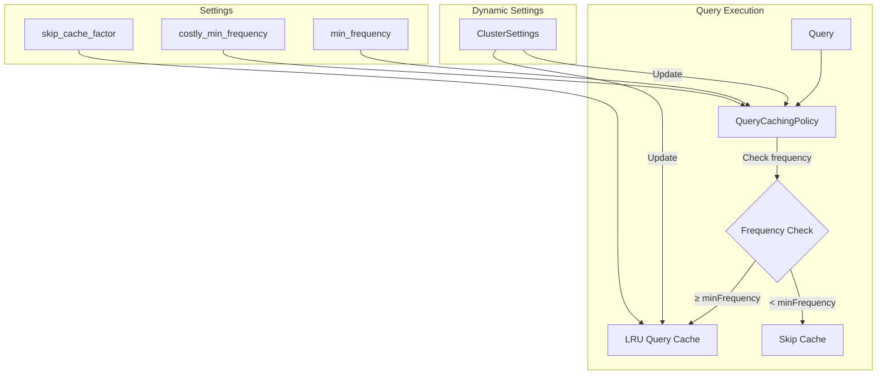

---
tags:
  - indexing
  - performance
  - search
---

# Query Cache Dynamic Settings

## Summary

This release adds dynamic cluster settings to control query cache behavior, allowing administrators to tune cache utilization at runtime without restarting nodes. Three new settings enable dynamic adjustment of the skip cache factor and minimum frequency thresholds for query caching.

## Details

### What's New in v3.3.0

OpenSearch v3.3.0 introduces dynamic cluster settings for the query cache (also known as the filter cache), which caches the results of filter queries to improve search performance. Previously, these settings were static and required a node restart to change. Now they can be modified at runtime.

### Technical Changes

#### Architecture Changes



#### New Components

| Component | Description |
|-----------|-------------|
| `OpenseachUsageTrackingQueryCachingPolicy` | Custom caching policy that extends Lucene's `UsageTrackingQueryCachingPolicy` with dynamic frequency thresholds |
| Dynamic settings consumers | Listeners that update cache behavior when cluster settings change |

#### New Configuration

| Setting | Description | Default |
|---------|-------------|---------|
| `indices.queries.cache.skip_cache_factor` | Controls when to skip caching based on segment size ratio. Higher values allow more caching. | `10` |
| `indices.queries.cache.min_frequency` | Minimum number of times a query must be seen before caching (for regular queries) | `5` |
| `indices.queries.cache.costly_min_frequency` | Minimum frequency for costly queries (MultiTermQuery, Point queries) | `2` |

All settings are:
- **Scope**: Node-level (cluster-wide)
- **Type**: Dynamic (can be changed at runtime)

### Usage Example

```json
// Update skip_cache_factor to increase cache utilization
PUT _cluster/settings
{
  "persistent": {
    "indices.queries.cache.skip_cache_factor": 20
  }
}

// Adjust minimum frequency thresholds
PUT _cluster/settings
{
  "persistent": {
    "indices.queries.cache.min_frequency": 3,
    "indices.queries.cache.costly_min_frequency": 1
  }
}
```

### Migration Notes

- Existing clusters will use the default values after upgrade
- No action required; settings can be tuned based on workload characteristics
- Higher `skip_cache_factor` values can improve cache hit rates for workloads with many repeated filter queries

## Limitations

- Settings apply cluster-wide; per-index configuration is not supported
- The query cache only caches filter context queries, not query context queries
- Segments with fewer than 10,000 documents are not cached regardless of settings

## References

### Documentation
- [Query and filter context](https://docs.opensearch.org/3.0/query-dsl/query-filter-context/): OpenSearch documentation on filter caching
- [Lucene PR #14412](https://github.com/apache/lucene/pull/14412): Upstream Lucene change enabling dynamic skip cache factor

### Pull Requests
| PR | Description |
|----|-------------|
| [#18351](https://github.com/opensearch-project/OpenSearch/pull/18351) | Add a dynamic setting to change skip_cache_factor and min_frequency for querycache |

### Issues (Design / RFC)
- [Issue #17736](https://github.com/opensearch-project/OpenSearch/issues/17736): Original feature request

## Related Feature Report

- [Full feature documentation](../../../../features/opensearch/opensearch-query-cache.md)
