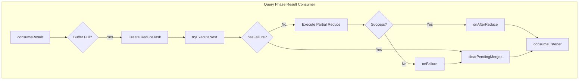

---
tags:
  - domain/core
  - component/server
  - indexing
  - search
---
# Query Phase Fixes

## Summary

This release fixes incomplete callback loops in `QueryPhaseResultConsumer`, addressing flaky test failures in `SearchPhaseControllerTests`. The fix ensures graceful handling of failures during shard-level query result consumption by properly clearing pending merge tasks and stopping partial reduces when failures or cancellations occur.

## Details

### What's New in v3.3.0

The `QueryPhaseResultConsumer` class handles incremental reduction of aggregation results as shard results are consumed during the query phase. Prior to this fix, callback loops could remain incomplete when errors occurred during partial reduce execution, leading to test flakiness and potential resource leaks.

### Technical Changes

#### Architecture Changes



#### Key Fixes

| Fix | Description |
|-----|-------------|
| Early failure check in `partialReduce` | Returns early if `pendingMerges.hasFailure()` is true, preventing unnecessary processing |
| Clear pending merges on failure | New `clearPendingMerges()` method properly cancels all queued and running tasks |
| Task cancellation in `onAfterReduce` | Cancels task and returns early when failure detected after merge completion |
| Failure check in `tryExecuteNext` | Clears pending merges and returns when failure detected before executing next task |
| Null buffer handling | Cancels task when `consumeBuffer()` returns null |

#### Code Changes

The fix modifies `QueryPhaseResultConsumer.java` with the following key changes:

1. **Early exit on failure in `partialReduce`**:
```java
if (pendingMerges.hasFailure()) {
    return lastMerge;
}
```

2. **New `clearPendingMerges` method** to properly clean up queued tasks:
```java
void clearPendingMerges(MergeTask task) {
    List<MergeTask> toCancels = new ArrayList<>();
    if (task != null) {
        toCancels.add(task);
    }
    toCancels.addAll(queue);
    queue.clear();
    for (MergeTask toCancel : toCancels) {
        toCancel.cancel();
    }
}
```

3. **Improved `onAfterMerge` handling**:
```java
private void onAfterMerge(MergeTask task, MergeResult newResult, long estimatedSize) {
    synchronized (this) {
        runningTask.compareAndSet(task, null);
        if (hasFailure()) {
            task.cancel();
            return;
        }
        // ... rest of processing
    }
}
```

4. **Enhanced `tryExecuteNext` with failure check**:
```java
if (hasFailure()) {
    clearPendingMerges(null);
    return;
}
```

### Usage Example

No user-facing API changes. The fix is internal to the search query phase execution.

### Migration Notes

No migration required. This is a bug fix that improves reliability of search operations.

## Limitations

- This fix addresses callback loop issues but does not change the fundamental architecture of incremental aggregation reduction
- The fix is specific to the `QueryPhaseResultConsumer` class and does not affect other search phase consumers

## References

### Documentation
- [Search API Documentation](https://docs.opensearch.org/3.0/api-reference/search-apis/search/): OpenSearch Search API reference

### Pull Requests
| PR | Description |
|----|-------------|
| [#19231](https://github.com/opensearch-project/OpenSearch/pull/19231) | Add graceful handling of failures in QueryPhaseResultConsumer |

### Issues (Design / RFC)
- [Issue #19094](https://github.com/opensearch-project/OpenSearch/issues/19094): Flaky Test Report for SearchPhaseControllerTests

## Related Feature Report

- [Full feature documentation](../../../features/opensearch/opensearch-query-phase-result-consumer.md)
