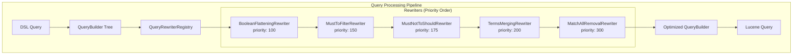

---
tags:
  - performance
  - search
---

# Query Rewriting Infrastructure

## Summary

OpenSearch v3.3.0 introduces a comprehensive query rewriting infrastructure that automatically optimizes query structure before execution. This feature achieves 60-70% reduction in query nodes for typical filtered queries by applying multiple optimization strategies including boolean flattening, terms merging, and must-to-filter clause conversion.

## Details

### What's New in v3.3.0

This release implements a pluggable query rewriting framework that transforms queries into more efficient forms while preserving exact query semantics and results. The infrastructure operates at the QueryBuilder level before conversion to Lucene queries.

### Technical Changes

#### Architecture Changes



#### New Components

| Component | Description |
|-----------|-------------|
| `QueryRewriter` | Interface for query rewriting implementations |
| `QueryRewriterRegistry` | Singleton registry managing rewriter chain execution |
| `BooleanFlatteningRewriter` | Flattens unnecessary nested boolean queries |
| `MustToFilterRewriter` | Moves scoring-irrelevant clauses from must to filter |
| `MustNotToShouldRewriter` | Transforms must_not to should for complement-aware queries |
| `TermsMergingRewriter` | Merges multiple term queries into single terms query |
| `MatchAllRemovalRewriter` | Removes redundant match_all queries |

#### New Configuration

| Setting | Description | Default |
|---------|-------------|---------|
| `search.query_rewriting.enabled` | Enable/disable query rewriting | `true` |
| `search.query_rewriting.terms_threshold` | Minimum terms to trigger merging | `16` |

### Usage Example

Query rewriting is enabled by default. The following query:

```json
{
  "bool": {
    "filter": [
      {"bool": {"filter": [{"term": {"status": "active"}}]}},
      {"term": {"category": "A"}},
      {"term": {"category": "B"}},
      {"term": {"category": "C"}},
      // ... 16+ category terms
      {"match_all": {}}
    ],
    "must": [
      {"range": {"price": {"gte": 100}}}
    ]
  }
}
```

Is automatically rewritten to:

```json
{
  "bool": {
    "filter": [
      {"term": {"status": "active"}},
      {"terms": {"category": ["A", "B", "C", ...]}},
      {"range": {"price": {"gte": 100}}}
    ]
  }
}
```

### Optimization Strategies

1. **Boolean Flattening**: Removes unnecessary nesting like `bool.filter[bool.filter[...]]`
2. **Must-to-Filter**: Moves range queries and numeric term queries from must to filter (no scoring impact)
3. **Must-Not-to-Should**: Converts must_not range queries to should clauses for single-valued numeric fields
4. **Terms Merging**: Combines 16+ term queries on same field into single terms query
5. **Match-All Removal**: Eliminates redundant match_all in filter/must contexts

### Migration Notes

- Query rewriting is enabled by default
- To disable: `PUT /_cluster/settings {"persistent": {"search.query_rewriting.enabled": false}}`
- Existing queries continue to work with potential performance improvements
- Query semantics and results are preserved exactly

## Limitations

- Terms merging only applies when 16+ terms target the same field (configurable)
- Must-not-to-should rewriting requires single-valued numeric fields with values in all documents
- Custom rewriters must be registered programmatically

## References

### Documentation
- [Documentation](https://docs.opensearch.org/3.0/search-plugins/search-relevance/query-rewriting/): Query rewriting overview

### Pull Requests
| PR | Description |
|----|-------------|
| [#19060](https://github.com/opensearch-project/OpenSearch/pull/19060) | Implement Query Rewriting Infrastructure |

### Issues (Design / RFC)
- [Issue #18906](https://github.com/opensearch-project/OpenSearch/issues/18906): RFC for Query Rewriting, Logical Planning, and Cost-Based Execution
- [Issue #12390](https://github.com/opensearch-project/OpenSearch/issues/12390): RFC for Query Planning and Rewriting

## Related Feature Report

- [Full feature documentation](../../../features/opensearch/query-rewriting.md)
