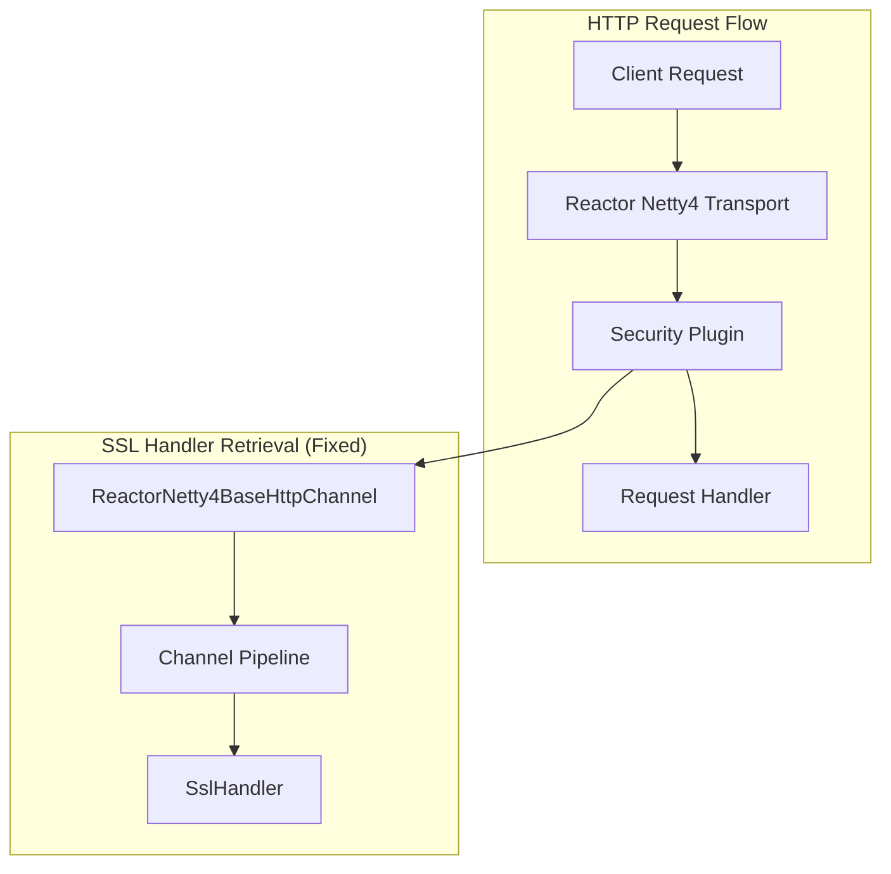

---
tags:
  - domain/core
  - component/server
  - security
---
# Reactor Netty Transport

## Summary

This release fixes a critical bug in the `transport-reactor-netty4` plugin that prevented the OpenSearch Security plugin from working correctly. When the reactor-netty4 transport was enabled, the `securityadmin.sh` tool failed with a 403 Forbidden error because the `SslHandler` could not be located due to different naming conventions used by Reactor Netty.

## Details

### What's New in v3.3.0

The fix implements proper `SslHandler` retrieval logic for the `transport-reactor-netty4` plugin, enabling compatibility with the OpenSearch Security plugin.

### Technical Changes

#### Problem Background

When `transport-reactor-netty4` plugin is activated with `http.type: reactor-netty4-secure`, the Security plugin's `securityadmin.sh` tool failed with:

```
ERR: An unexpected ResponseException occured: method [GET], host [https://localhost:9200], 
URI [/_plugins/_security/whoami], status line [HTTP/2.0 403 Forbidden]
```

The root cause was that the Security plugin tries to locate the `SslHandler` by name, but the `transport-reactor-netty4` plugin uses a different naming convention (`NettyPipeline.SslHandler` from Reactor Netty) compared to the standard Netty4 transport.

#### Architecture Changes



#### New Components

| Component | Description |
|-----------|-------------|
| `ReactorNetty4BaseHttpChannel` | New utility class providing SSL handler retrieval logic for Reactor Netty channels |

#### Implementation Details

The fix introduces a new `ReactorNetty4BaseHttpChannel` class that provides a `get()` method to retrieve channel attributes including:

- `channel` - The underlying Netty channel
- `ssl_http` - The SSL handler instance
- `ssl_engine` - The SSL engine for certificate access

The method handles the Reactor Netty pipeline structure where the SSL handler may be in the parent channel's pipeline rather than the current channel.

#### Modified Components

| Component | Change |
|-----------|--------|
| `ReactorNetty4NonStreamingHttpChannel` | Added `get()` method override using `ReactorNetty4BaseHttpChannel` |
| `ReactorNetty4StreamingHttpChannel` | Added `get()` method override using `ReactorNetty4BaseHttpChannel` |
| `ReactorNetty4HttpServerTransport` | Added `clientAuth` configuration support |

### Usage Example

After this fix, the standard setup works correctly:

```bash
# Install the plugin
./bin/opensearch-plugin install transport-reactor-netty4

# Configure opensearch.yml
http.type: reactor-netty4-secure

# Start OpenSearch
./bin/opensearch

# Security admin now works correctly
./plugins/opensearch-security/tools/securityadmin.sh \
  -cacert config/root-ca.pem \
  -cert config/admin.pem \
  -key config/admin-key.pem
```

### Migration Notes

Users who were affected by this bug and had to use workarounds (like starting the cluster without the reactor-netty4 transport and enabling it after security initialization) can now use the standard installation process.

## Limitations

- The `transport-reactor-netty4` plugin remains experimental
- Requires explicit installation: `./bin/opensearch-plugin install transport-reactor-netty4`

## References

### Documentation
- [Network Settings Documentation](https://docs.opensearch.org/3.0/install-and-configure/configuring-opensearch/network-settings/): Transport configuration
- [Forum Discussion](https://forum.opensearch.org/t/pods-not-coming-up-after-using-transport-reactor-netty4-plugin-for-mcp-server/26990): Original bug report
- [Security Plugin PR #5667](https://github.com/opensearch-project/security/pull/5667): Companion fix in Security plugin

### Pull Requests
| PR | Description |
|----|-------------|
| [#19458](https://github.com/opensearch-project/OpenSearch/pull/19458) | Implement SslHandler retrieval logic for transport-reactor-netty4 plugin |

## Related Feature Report

- Full feature documentation
