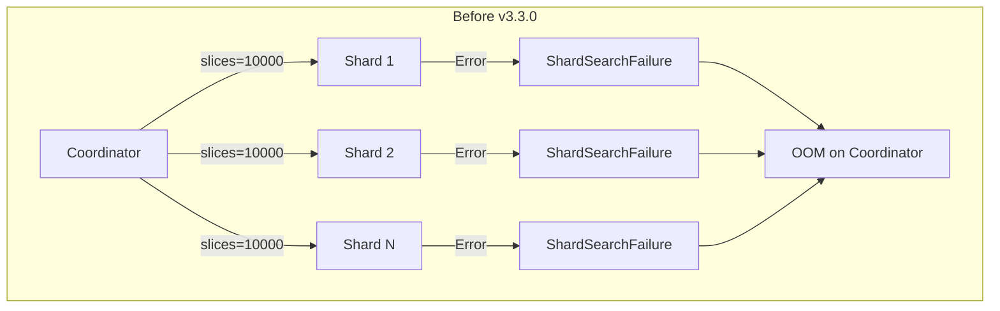
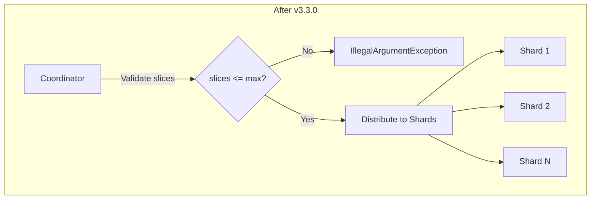

---
tags:
  - indexing
  - search
---

# Reindex API

## Summary

This release fixes a critical bug where using an excessively large `slices` parameter in reindex operations could cause JVM OutOfMemoryError on the coordinator node. The fix moves slice validation from individual shards to the coordinator node, preventing memory exhaustion from accumulated error responses.

## Details

### What's New in v3.3.0

The slice parameter validation for reindex, delete-by-query, and update-by-query operations is now performed on the coordinator node instead of on each shard.

### Technical Changes

#### Problem Background

Previously, when a user specified an excessively large `slices` value (e.g., 10000) in a reindex request, the validation against `index.max_slices_per_scroll` (default: 1024) occurred on each shard. This caused:

1. Each shard to throw an `IllegalArgumentException`
2. With many shards (e.g., 100), this created `slices × shards` error objects (1,000,000 `ShardSearchFailure` objects)
3. These accumulated on the coordinator, causing JVM OOM



#### Solution

The fix validates the slice count against `index.max_slices_per_scroll` on the coordinator node before distributing sub-requests to shards:



#### Modified Components

| Component | Description |
|-----------|-------------|
| `BulkByScrollParallelizationHelper` | Added early validation of slice count against `index.max_slices_per_scroll` |
| `Reindexer` | Passes cluster metadata to parallelization helper |
| `TransportDeleteByQueryAction` | Passes cluster metadata to parallelization helper |
| `TransportUpdateByQueryAction` | Passes cluster metadata to parallelization helper |

#### Configuration

| Setting | Description | Default |
|---------|-------------|---------|
| `index.max_slices_per_scroll` | Maximum number of slices allowed per scroll/reindex operation | 1024 |

### Usage Example

```json
// This will now fail fast on the coordinator with a clear error message
POST _reindex?slices=2000
{
   "source": {
      "index": "source_index"
   },
   "dest": {
      "index": "dest_index"
   }
}

// Error response (immediate, no OOM risk):
// "The number of slices [2000] is too large. It must be less than [1024]. 
//  This limit can be set by changing the [index.max_slices_per_scroll] index level setting."
```

### Migration Notes

No migration required. This is a bug fix that improves error handling without changing the API contract.

## Limitations

- The `index.max_slices_per_scroll` setting is per-index; when reindexing from multiple source indexes, the smallest limit applies
- The default limit of 1024 slices remains unchanged

## References

### Documentation
- [Reindex API Documentation](https://docs.opensearch.org/3.0/api-reference/document-apis/reindex/): Official reindex API documentation

### Pull Requests
| PR | Description |
|----|-------------|
| [#18964](https://github.com/opensearch-project/OpenSearch/pull/18964) | Fix Using an excessively large reindex slice can lead to a JVM OutOfMemoryError on coordinator |

### Issues (Design / RFC)
- [Issue #18963](https://github.com/opensearch-project/OpenSearch/issues/18963): Bug report - Using an excessively large reindex slice can lead to a JVM OutOfMemoryError on coordinator

## Related Feature Report

- [Full feature documentation](../../../../features/opensearch/opensearch-reindex-api.md)
