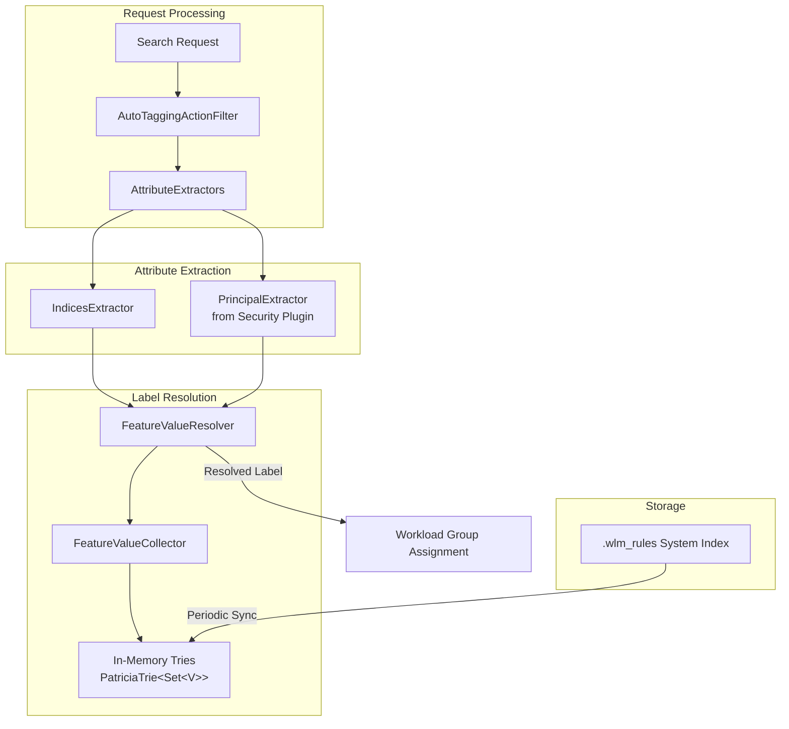

---
tags:
  - domain/core
  - component/server
  - indexing
  - search
  - security
---
# Rule-based Auto-tagging

## Summary

v3.3.0 enhances rule-based auto-tagging for Workload Management (WLM) with security attribute support (username and role), multi-attribute label resolving logic, improved in-memory trie structure, and comprehensive integration tests. These changes enable more granular and flexible automatic workload group assignment based on index patterns combined with user identity.

## Details

### What's New in v3.3.0

- **Security Attributes Support**: Rules can now match on `principal.username` and `principal.role` in addition to `index_pattern`
- **Multi-attribute Label Resolution**: New algorithm evaluates multiple attributes with priority-based scoring
- **In-memory Trie Restructure**: Trie values now stored as sets to support multiple labels per attribute key
- **Nested Attribute Filtering**: GET API supports filtering by nested attributes like `principal.username`
- **Integration Tests**: Comprehensive test coverage for auto-tagging scenarios
- **Bug Fixes**: Improved Update Rule API handling for multiple attributes

### Technical Changes

#### Architecture Changes



#### New Components

| Component | Description |
|-----------|-------------|
| `FeatureValueResolver` | Central class for evaluating candidate labels across multiple attributes with intersection logic |
| `MatchLabel<V>` | Represents a feature value along with a matching score |
| `AttributeExtractor.LogicalOperator` | Enum defining AND/OR combination style for multi-value attributes |
| `PrincipalExtractor` | Security plugin component extracting username/role from request context |
| `AttributeExtractorExtension` | SPI interface for plugins to provide custom attribute extractors |

#### Rule Schema Update

```json
{
  "_id": "rule-uuid",
  "description": "Production analytics rule",
  "index_pattern": ["logs-prod-*"],
  "principal": {
    "username": ["admin", "analyst"],
    "role": ["all_access"]
  },
  "workload_group": "production_workload_id",
  "updated_at": "2025-09-25T16:28:50Z"
}
```

### Usage Example

**Create Rule with Security Attributes:**
```json
PUT _rules/workload_group
{
  "description": "Admin analytics rule",
  "index_pattern": ["logs-*"],
  "principal": {
    "username": ["admin"],
    "role": ["all_access"]
  },
  "workload_group": "admin_workload_id"
}
```

**Filter Rules by Nested Attributes:**
```
GET _rules/workload_group?principal.username=admin&principal.role=all_access
```

### Label Resolution Algorithm

When multiple rules match a request, the system uses priority-based scoring:

1. Attributes are sorted by priority (defined in `FeatureType.getOrderedAttributes()`)
2. For each attribute, `findAttributeMatches()` returns `MatchLabel` objects with scores
3. Match score is calculated as `prefix_length / key_length` for prefix matches, 1.0 for exact matches
4. Candidate labels are intersected across attributes (AND logic between attributes)
5. If multiple candidates remain, tie-breaking uses highest score per attribute in priority order
6. Unspecified attributes in rules contribute score 0.0 (fixed in PR #19599)

### Migration Notes

- Existing rules using only `index_pattern` continue to work unchanged
- New `principal` attribute is optional for backward compatibility
- Rules with security attributes require the Security plugin for username/role extraction

## Limitations

- Security attributes require the OpenSearch Security plugin to be installed
- Maximum 10 values per attribute (e.g., 10 index patterns per rule)
- Index pattern values limited to 100 characters
- Principal attributes only available when security context is present

## References

### Documentation
- [Rule-based Auto-tagging Documentation](https://docs.opensearch.org/latest/tuning-your-cluster/availability-and-recovery/rule-based-autotagging/autotagging/)
- [Rules API Documentation](https://docs.opensearch.org/latest/tuning-your-cluster/availability-and-recovery/rule-based-autotagging/rule-lifecycle-api/)

### Pull Requests
| PR | Repository | Description |
|----|------------|-------------|
| [#19599](https://github.com/opensearch-project/OpenSearch/pull/19599) | OpenSearch | Fix auto tagging label resolving logic for principal attributes |
| [#19497](https://github.com/opensearch-project/OpenSearch/pull/19497) | OpenSearch | Bug fix on Update Rule API with multiple attributes |
| [#19486](https://github.com/opensearch-project/OpenSearch/pull/19486) | OpenSearch | Add autotagging label resolving logic for multiple attributes |
| [#19429](https://github.com/opensearch-project/OpenSearch/pull/19429) | OpenSearch | Modify get rule API to suit nested attributes |
| [#19344](https://github.com/opensearch-project/OpenSearch/pull/19344) | OpenSearch | Restructure in-memory trie to store values as a set |
| [#5606](https://github.com/opensearch-project/security/pull/5606) | security | Add logic to extract security attributes for rule-based autotagging |

### Issues (Design / RFC)
- [Issue #16797](https://github.com/opensearch-project/OpenSearch/issues/16797): RFC for automated labeling of search requests

## Related Feature Report

- [Full feature documentation](../../../features/opensearch/opensearch-workload-management.md)
