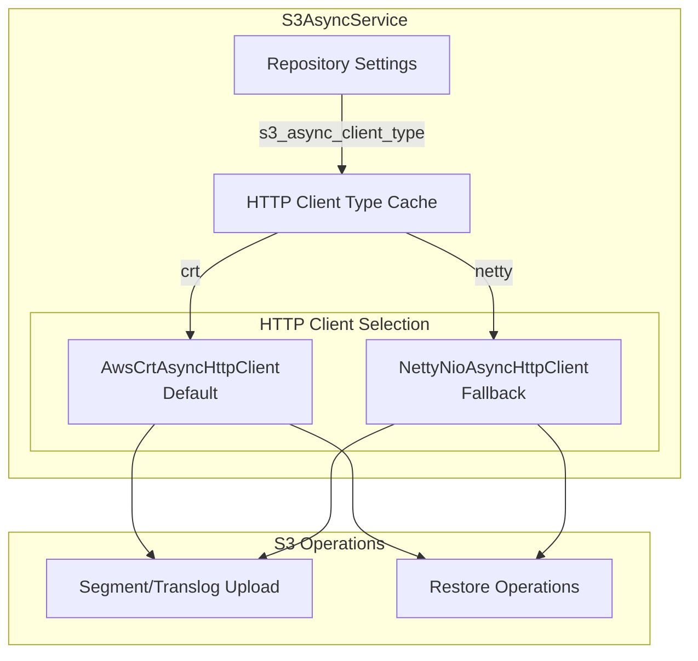
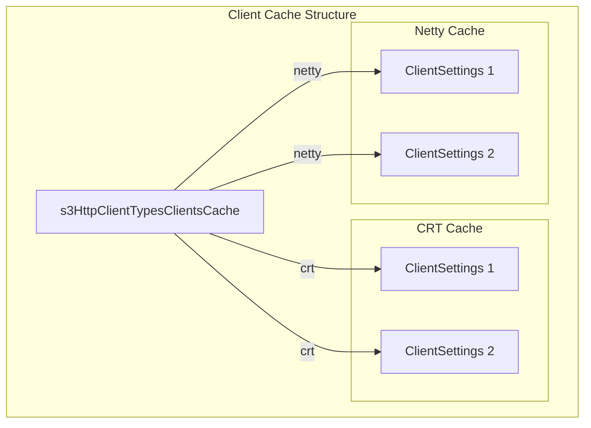

---
tags:
  - domain/core
  - component/server
  - indexing
  - performance
---
# S3 Performance

## Summary

OpenSearch v3.3.0 introduces AWS CRT (Common Runtime) async HTTP client as the default for S3 repository operations, replacing the previous Netty-based client. This change delivers approximately 5-7% throughput improvement for file uploads to S3, benefiting Remote Store and snapshot operations. The Netty client remains available as a configurable fallback option.

## Details

### What's New in v3.3.0

This release switches the default async HTTP client used by the S3 repository plugin from `NettyNioAsyncHttpClient` to `AwsCrtAsyncHttpClient`. The AWS CRT client is optimized for high-throughput S3 operations and provides better performance for uploading translog and segment files in Remote Store configurations.

### Technical Changes

#### Architecture Changes



#### New Components

| Component | Description |
|-----------|-------------|
| `AwsCrtAsyncHttpClient` | AWS CRT-based async HTTP client for improved S3 throughput |
| `EventLoopThreadFilter` | Thread filter for CRT event loop threads in tests |

#### New Configuration

| Setting | Description | Default |
|---------|-------------|---------|
| `s3_async_client_type` | Type of async HTTP client: `crt` or `netty` | `crt` |

#### Client Cache Changes

The `S3AsyncService` now maintains separate client caches for each HTTP client type:



### Usage Example

#### Using Default CRT Client (Recommended)

```json
PUT _snapshot/my-s3-repo
{
  "type": "s3",
  "settings": {
    "bucket": "my-opensearch-snapshots",
    "base_path": "snapshots"
  }
}
```

#### Using Netty Client (Fallback)

```json
PUT _snapshot/my-s3-repo
{
  "type": "s3",
  "settings": {
    "bucket": "my-opensearch-snapshots",
    "base_path": "snapshots",
    "s3_async_client_type": "netty"
  }
}
```

### Performance Impact

- **Upload Throughput**: ~5-7% improvement for Remote Store segment and translog uploads
- **Use Case**: Most beneficial for clusters with high write throughput using Remote Store

### Migration Notes

- No action required for existing repositories - they will automatically use the new CRT client
- To revert to the previous behavior, explicitly set `s3_async_client_type` to `netty`
- Both client types support the same proxy configuration options

## Limitations

- CRT client event loop threads may appear in thread dumps (filtered in tests)
- Known issue with CRT thread cleanup tracked in [aws-crt-java#905](https://github.com/awslabs/aws-crt-java/issues/905)

## References

### Documentation
- [AWS CRT HTTP Client Documentation](https://docs.aws.amazon.com/sdk-for-java/latest/developer-guide/http-configuration-crt.html): AWS SDK CRT client guide

### Pull Requests
| PR | Description |
|----|-------------|
| [#18800](https://github.com/opensearch-project/OpenSearch/pull/18800) | Move async HTTP client to CRT from Netty and add configurability |

### Issues (Design / RFC)
- [Issue #18535](https://github.com/opensearch-project/OpenSearch/issues/18535): Feature request for S3CrtClient support

## Related Feature Report

- [Full S3 Repository documentation](../../../../features/opensearch/opensearch-s3-repository.md)
