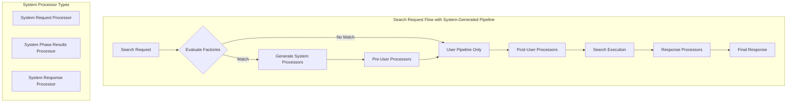

---
tags:
  - domain/core
  - component/server
  - observability
  - search
---
# System-Generated Search Pipeline

## Summary

OpenSearch 3.3 introduces system-generated search pipelines, a capability that allows OpenSearch to automatically generate and attach search processors at runtime based on request context. This eliminates the need for manual pipeline configuration for features like hybrid search with MMR (Maximal Marginal Relevance), enabling a smoother, more intelligent search experience out of the box.

## Details

### What's New in v3.3.0

System-generated search pipelines enable plugin developers to embed search-time processing logic directly into plugins without requiring users to manually create or configure search pipelines. OpenSearch automatically evaluates incoming search requests and generates appropriate processors based on registered system processor factories.

### Technical Changes

#### Architecture Changes



#### New Components

| Component | Description |
|-----------|-------------|
| `SystemGeneratedProcessor` | Interface for system-generated search processors |
| `SystemGeneratedFactory` | Factory interface to evaluate and create system processors |
| `SystemGeneratedPipelineHolder` | Holder for pre and post user-defined pipelines |
| `SystemGeneratedPipelineWithMetrics` | Pipeline implementation with metrics tracking |
| `ProcessorGenerationContext` | Context for factory evaluation with search request |
| `ProcessorConflictEvaluationContext` | Context for conflict detection between processors |
| `SystemGeneratedProcessorMetrics` | Metrics tracking for factory evaluation and processor execution |

#### New Configuration

| Setting | Description | Default |
|---------|-------------|---------|
| `cluster.search.enabled_system_generated_factories` | List of enabled system-generated factory types. Use `*` to enable all. | `[]` (empty, all disabled) |

#### API Changes

New plugin extension points in `SearchPipelinePlugin`:

| Method | Description |
|--------|-------------|
| `getSystemGeneratedRequestProcessors()` | Returns system-generated request processor factories |
| `getSystemGeneratedResponseProcessors()` | Returns system-generated response processor factories |
| `getSystemGeneratedSearchPhaseResultsProcessors()` | Returns system-generated phase results processor factories |

New stats in Search Pipeline Stats API (`GET /_nodes/stats/search_pipeline`):

```json
{
  "system_generated_processors": {
    "request_processors": [...],
    "response_processors": [...]
  },
  "system_generated_factories": {
    "request_processor_factories": [
      {
        "factory-type": {
          "type": "factory-type",
          "evaluation_stats": {
            "count": 37,
            "time_in_microseconds": 185,
            "failed": 0
          },
          "generation_stats": {
            "count": 13,
            "time_in_microseconds": 1,
            "failed": 0
          }
        }
      }
    ],
    "response_processor_factories": [...]
  }
}
```

### Usage Example

#### With System-Generated Processors (MMR Example)

When system-generated processors are enabled, features like MMR work automatically:

```json
POST /my-index/_search
{
  "query": {
    "neural": {
      "product_description": {
        "query_text": "Red apple"
      }
    }
  },
  "ext": {
    "mmr": {
      "candidates": 10,
      "diversity": 0.5
    }
  }
}
```

#### Without System-Generated Processors

Manual pipeline configuration is required:

```json
PUT /_search/pipeline/my_pipeline
{
  "request_processors": [
    { "mmr_over_sample_factory": {} }
  ],
  "response_processors": [
    { "mmr_rerank_factory": {} }
  ]
}
```

#### Enabling System-Generated Factories

```json
PUT /_cluster/settings
{
  "persistent": {
    "cluster.search.enabled_system_generated_factories": ["mmr-factory", "another-factory"]
  }
}
```

Or enable all:

```json
PUT /_cluster/settings
{
  "persistent": {
    "cluster.search.enabled_system_generated_factories": ["*"]
  }
}
```

#### Building Custom System-Generated Processor

1. Create a processor implementing `SystemGeneratedProcessor`:

```java
public class MyProcessor implements SearchRequestProcessor, SystemGeneratedProcessor {
    @Override
    public ExecutionStage getExecutionStage() {
        return ExecutionStage.POST_USER_DEFINED;
    }
    
    @Override
    public void evaluateConflicts(ProcessorConflictEvaluationContext context) {
        // Check for conflicts with user-defined processors
    }
}
```

2. Create a factory implementing `SystemGeneratedFactory`:

```java
public class MyFactory implements SystemGeneratedFactory<SearchRequestProcessor> {
    @Override
    public boolean shouldGenerate(ProcessorGenerationContext context) {
        // Evaluate if processor should be generated
        return context.searchRequest().source().size() < 5;
    }
    
    @Override
    public SearchRequestProcessor create(...) {
        return new MyProcessor();
    }
}
```

3. Register in plugin:

```java
@Override
public Map<String, SystemGeneratedFactory<SearchRequestProcessor>> 
    getSystemGeneratedRequestProcessors(Parameters parameters) {
    return Map.of("my-factory", new MyFactory());
}
```

### Migration Notes

- System-generated factories are disabled by default for backward compatibility
- Enable specific factories via `cluster.search.enabled_system_generated_factories` setting
- Only one system-generated processor per type and stage is allowed per request
- Conflict detection allows processors to validate compatibility with user-defined pipelines

## Limitations

- Only one system-generated processor per type (request/response/phase) and stage (pre/post) per request
- Factory evaluation runs on every search request - keep `shouldGenerate()` lightweight
- All system-generated factories are disabled by default and must be explicitly enabled
- Conflict detection is the processor's responsibility to implement

## References

### Documentation
- [Search Pipelines Documentation](https://docs.opensearch.org/3.0/search-plugins/search-pipelines/index/): Official documentation
- [Example Plugin](https://github.com/opensearch-project/OpenSearch/tree/main/plugins/examples/system-search-processor): Reference implementation

### Blog Posts
- [Blog: Making search smarter with system-generated search pipelines](https://opensearch.org/blog/making-search-smarter-with-system-generated-search-pipelines/): Detailed explanation and examples

### Pull Requests
| PR | Description |
|----|-------------|
| [#19128](https://github.com/opensearch-project/OpenSearch/pull/19128) | Support system generated search pipeline |

### Issues (Design / RFC)
- [Issue #18731](https://github.com/opensearch-project/OpenSearch/issues/18731): Feature request for system-generated search pipeline

## Related Feature Report

- [Full feature documentation](../../../features/opensearch/opensearch-search-pipeline.md)
