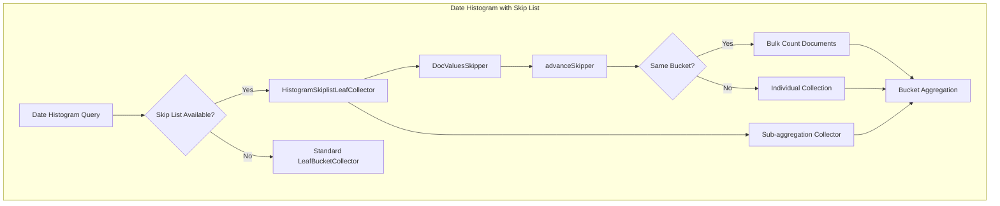

# Skip List

## Summary

OpenSearch v3.3.0 significantly expands the Skip List feature with support for date histogram aggregations, additional field types (date, scaled_float, token_count), sub-aggregation support, and automatic enablement for `@timestamp` fields and index sort fields. These enhancements dramatically improve aggregation performance for time-series and logging workloads.

## Details

### What's New in v3.3.0

1. **Date Histogram Aggregation Optimization**: Skip list-based collection for date histogram aggregations using `DocValuesSkipper` to efficiently skip document ranges
2. **Extended Field Type Support**: Added `skip_list` parameter to `date`, `date_nanos`, `scaled_float`, and `token_count` field types
3. **Sub-aggregation Support**: Skip list optimization now works with nested sub-aggregations
4. **Automatic Enablement**: Skip list is automatically enabled for `@timestamp` fields and fields used in index sort

### Technical Changes

#### Architecture Changes



#### New Components

| Component | Description |
|-----------|-------------|
| `HistogramSkiplistLeafCollector` | New collector class that uses `DocValuesSkipper` for efficient date histogram aggregation |
| `DateFieldMapper.skiplist` | New `skip_list` parameter for date and date_nanos field types |
| `ScaledFloatFieldMapper.skiplist` | New `skip_list` parameter for scaled_float field type |
| `TokenCountFieldMapper.skiplist` | New `skip_list` parameter for token_count field type |
| `isSkiplistDefaultEnabled()` | Method to auto-enable skip list for @timestamp and index sort fields |

#### New Configuration

| Setting | Description | Default |
|---------|-------------|---------|
| `skip_list` (date fields) | Enables skip list indexing for date/date_nanos doc values | `false` (auto-enabled for @timestamp and index sort fields) |
| `skip_list` (scaled_float) | Enables skip list indexing for scaled_float doc values | `false` |
| `skip_list` (token_count) | Enables skip list indexing for token_count doc values | `false` |

#### API Changes

The `skip_list` mapping parameter is now available for additional field types:

```json
PUT /logs
{
  "mappings": {
    "properties": {
      "@timestamp": {
        "type": "date"
      },
      "response_time": {
        "type": "scaled_float",
        "scaling_factor": 100,
        "skip_list": true
      },
      "word_count": {
        "type": "token_count",
        "analyzer": "standard",
        "skip_list": true
      }
    }
  }
}
```

### Usage Example

Date histogram aggregation with skip list optimization:

```json
GET /logs/_search
{
  "size": 0,
  "aggs": {
    "logs_over_time": {
      "date_histogram": {
        "field": "@timestamp",
        "calendar_interval": "day"
      },
      "aggs": {
        "max_response_time": {
          "max": {
            "field": "response_time"
          }
        }
      }
    }
  }
}
```

The skip list optimization automatically kicks in when:
- The field has skip list enabled (explicitly or auto-enabled)
- The field is single-valued
- The query is a top-level aggregation (no parent aggregation)
- No hard bounds are specified

### Migration Notes

- **Automatic enablement**: For new indices, `@timestamp` fields and index sort fields automatically use skip list without explicit configuration
- **Existing indices**: To benefit from skip list on existing date fields, either:
  - Reindex with `skip_list: true` in the mapping
  - Create new indices with the updated mapping
- **No breaking changes**: The default behavior remains backward compatible

## Limitations

- Skip list optimization for date histogram requires single-valued fields
- Hard bounds in date histogram disable skip list optimization
- Sub-aggregation support adds overhead compared to no-op sub-aggregations
- Requires `doc_values: true` (default)

## References

### Documentation
- [Date histogram aggregation](https://docs.opensearch.org/3.0/aggregations/bucket/date-histogram/)

### Pull Requests
| PR | Description |
|----|-------------|
| [#19130](https://github.com/opensearch-project/OpenSearch/pull/19130) | Adding logic for histogram aggregation using skiplist |
| [#19142](https://github.com/opensearch-project/OpenSearch/pull/19142) | Add skip_list param for date, scaled float and token count fields |
| [#19438](https://github.com/opensearch-project/OpenSearch/pull/19438) | Add sub aggregation support for histogram aggregation using skiplist |
| [#19480](https://github.com/opensearch-project/OpenSearch/pull/19480) | Enable skip_list for @timestamp field or index sort field by default |

### Issues (Design / RFC)
- [Issue #17965](https://github.com/opensearch-project/OpenSearch/issues/17965): [SparseIndex] Modify FieldMappers to enable SkipList
- [Issue #17283](https://github.com/opensearch-project/OpenSearch/issues/17283): Support for sub-aggregations
- [Issue #19123](https://github.com/opensearch-project/OpenSearch/issues/19123): Enable skip_list by default in 3.3
- [Documentation Issue #11166](https://github.com/opensearch-project/documentation-website/issues/11166): Public documentation for skip_list

## Related Feature Report

- [Full feature documentation](../../../features/opensearch/numeric-field-skip-list.md)
