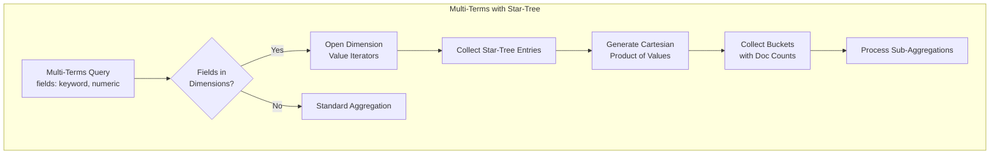

---
tags:
  - indexing
  - observability
  - performance
  - search
---

# Star Tree Index

## Summary

OpenSearch v3.3.0 enhances the star-tree index with two key improvements: support for multi-terms aggregations and new search failure statistics. Multi-terms aggregations allow grouping by multiple fields simultaneously using the star-tree index, delivering significant performance gains (up to 40x faster). The new failure metrics provide better observability for star-tree query operations.

## Details

### What's New in v3.3.0

#### Multi-Terms Aggregation Support

Star-tree index now supports multi-terms aggregations, enabling efficient grouping by multiple dimension fields in a single query. This feature generates the cartesian product of dimension values within star-tree entries to form composite keys.

**Performance Improvements** (based on ~12GB http_logs dataset):
- keyword × numeric field: ~6s → ~2s (3x faster)
- numeric × numeric field: ~6s → ~150ms (40x faster)

#### Search Query Failure Statistics

New metrics capture failure counts for search queries:
- `search.query_failed`: Total failed query phase operations
- `search.startree_query_failed`: Failed star-tree query operations

These metrics are available through:
- `/_nodes/stats/indices/search`
- `/_stats/search`
- `/_cat/shards`
- `/_cat/nodes`
- `/_cat/indices`

### Technical Changes

#### Multi-Terms Aggregation Implementation



#### New Components

| Component | Description |
|-----------|-------------|
| `MultiTermsAggregator.getStarTreeBucketCollector()` | Creates star-tree bucket collector for multi-terms |
| `StarTreeValuesIterator.entryValueCount()` | Returns value count for current star-tree entry |
| `StatsHolder.queryFailed` | Counter for failed query operations |
| `StatsHolder.starTreeQueryFailed` | Counter for failed star-tree query operations |

#### API Changes

New fields in search stats response:

```json
{
  "search": {
    "query_total": 1000,
    "query_time_in_millis": 5000,
    "query_current": 0,
    "query_failed": 5,
    "startree_query_total": 500,
    "startree_query_time_in_millis": 100,
    "startree_query_current": 0,
    "startree_query_failed": 1
  }
}
```

### Usage Example

```json
// Multi-terms aggregation using star-tree
POST /logs/_search
{
  "size": 0,
  "aggs": {
    "by_status_and_method": {
      "multi_terms": {
        "terms": [
          { "field": "status" },
          { "field": "method" }
        ]
      },
      "aggs": {
        "max_latency": {
          "max": { "field": "latency" }
        }
      }
    }
  }
}
```

### Requirements

For multi-terms aggregations to use star-tree:
1. All fields in `terms` must be part of star-tree `ordered_dimensions`
2. Sub-aggregation metrics must be configured in star-tree `metrics`
3. Index must have `index.composite_index: true` and `index.append_only.enabled: true`

## Limitations

- Multi-terms aggregation fields must all be star-tree dimensions
- Nested metric sub-aggregations (metric inside metric) not supported with star-tree
- Unsupported sub-aggregations fall back to standard aggregation path

## References

### Documentation
- [Documentation](https://docs.opensearch.org/3.0/search-plugins/star-tree-index/): Star-tree index documentation
- [Multi-terms Aggregation](https://docs.opensearch.org/3.0/aggregations/bucket/multi-terms/): Multi-terms aggregation reference

### Pull Requests
| PR | Description |
|----|-------------|
| [#19284](https://github.com/opensearch-project/OpenSearch/pull/19284) | Support for multi-terms aggregations using star-tree |
| [#19209](https://github.com/opensearch-project/OpenSearch/pull/19209) | Add search & star-tree search query failure count metrics |

### Issues (Design / RFC)
- [Issue #18398](https://github.com/opensearch-project/OpenSearch/issues/18398): Multi-terms aggregation feature request
- [Issue #19210](https://github.com/opensearch-project/OpenSearch/issues/19210): Query failure stats feature request

## Related Feature Report

- [Full feature documentation](../../../../features/opensearch/opensearch-star-tree-index.md)
