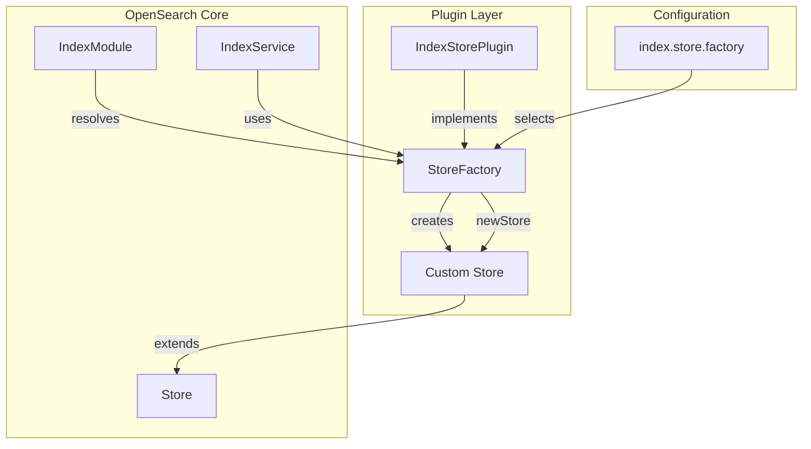

---
tags:
  - indexing
---

# Store Factory

## Summary

Store Factory introduces a plugin interface (`StoreFactory`) that enables plugins to provide custom `Store` implementations per index. This extensibility point allows plugins to customize how shard data is stored and managed, supporting use cases like handling files in subdirectories or implementing custom storage backends.

The feature adds a new index setting `index.store.factory` that selects which custom store factory to use, with fallback to the default Store when not specified.

## Details

### What's New in v3.3.0

This release introduces the `StoreFactory` plugin interface as part of the `IndexStorePlugin` extension point:

1. **New `StoreFactory` Interface**: A functional interface for creating custom Store instances per shard
2. **New Index Setting**: `index.store.factory` setting to select a custom store factory
3. **Public API Exposure**: `Store.LoadedMetadata` and `Store.OnClose` are now public APIs for plugin developers
4. **Plugin Integration**: Plugins can register store factories via `getStoreFactories()` method

### Technical Changes

#### Architecture Changes



#### New Components

| Component | Description |
|-----------|-------------|
| `IndexStorePlugin.StoreFactory` | Functional interface for creating custom Store instances |
| `IndexStorePlugin.getStoreFactories()` | Method to register store factories with unique keys |
| `INDEX_STORE_FACTORY_SETTING` | Index setting to select a custom store factory |

#### New Configuration

| Setting | Description | Default |
|---------|-------------|---------|
| `index.store.factory` | Selects a custom StoreFactory provided by plugins | `""` (empty, uses default Store) |

#### API Changes

The following classes are now public API for plugin developers:

| Class | Since | Description |
|-------|-------|-------------|
| `Store.MetadataSnapshot.LoadedMetadata` | v3.2.0 | Metadata container for store files |
| `Store.OnClose` | v3.2.0 | Callback interface for store close events |

### Usage Example

#### Implementing a Custom Store Factory

```java
public class MyStorePlugin extends Plugin implements IndexStorePlugin {
    
    @Override
    public Map<String, StoreFactory> getStoreFactories() {
        return Map.of("my_store", new MyStoreFactory());
    }
    
    static class MyStoreFactory implements StoreFactory {
        @Override
        public Store newStore(
            ShardId shardId,
            IndexSettings indexSettings,
            Directory directory,
            ShardLock shardLock,
            Store.OnClose onClose,
            ShardPath shardPath
        ) throws IOException {
            return new MyCustomStore(shardId, indexSettings, directory, 
                                     shardLock, onClose, shardPath);
        }
    }
}
```

#### Using a Custom Store Factory

```json
PUT /my-index
{
  "settings": {
    "index": {
      "store": {
        "factory": "my_store"
      }
    }
  }
}
```

### Migration Notes

- Existing indices continue to use the default Store
- To use a custom store factory, the plugin providing it must be installed
- The setting is applied at index creation time

## Limitations

- Store factory selection is immutable after index creation
- Custom stores must properly implement all Store methods for compatibility
- The `StoreFactory` interface is marked as `@ExperimentalApi`

## References

### Pull Requests
| PR | Description |
|----|-------------|
| [#19091](https://github.com/opensearch-project/OpenSearch/pull/19091) | Add StoreFactory plugin interface for custom Store implementations |
| [#19132](https://github.com/opensearch-project/OpenSearch/pull/19132) | Add subdirectory-aware store module with recovery support (first implementation) |

### Issues (Design / RFC)
- [Issue #19090](https://github.com/opensearch-project/OpenSearch/issues/19090): Feature request for custom Store implementations through plugin
- [Issue #19131](https://github.com/opensearch-project/OpenSearch/issues/19131): Store module/plugin to handle subdirectory copying during recovery

## Related Feature Report

- [Full feature documentation](../../../features/opensearch/store-factory.md)
