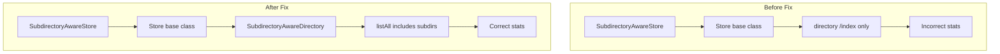

---
tags:
  - indexing
---

# Store Subdirectory Module - Stats API Fix

## Summary

This release fixes a bug in the `store-subdirectory` module where the stats API was not reporting correct store size values. The `SubdirectoryAwareStore` was initialized with a directory reference pointing only to the `/index` directory, causing incorrect size calculations. The fix refactors the store to pass the wrapped directory instance as a delegate to the base class, enabling accurate store size estimation.

## Details

### What's New in v3.3.0

The `SubdirectoryAwareStore` class has been refactored to fix the stats API reporting incorrect store sizes.

### Technical Changes

#### Architecture Changes

The key change is in how the `SubdirectoryAwareDirectory` is passed to the parent `Store` class:



#### Code Changes

| Change | Description |
|--------|-------------|
| Constructor refactoring | `SubdirectoryAwareDirectory` is now passed directly to the parent `Store` constructor |
| Removed `directory()` override | No longer needed since the wrapped directory is passed to parent |
| `listAll()` improvement | Uses `Files.walkFileTree()` instead of `Files.walk()` for better error handling |
| Error handling | Added `visitFileFailed()` handler to gracefully skip inaccessible files |

#### Before (Problematic)

```java
public SubdirectoryAwareStore(...) {
    super(shardId, indexSettings, directory, shardLock, onClose, shardPath);
    this.directory = new SubdirectoryAwareDirectory(super.directory(), shardPath);
}

@Override
public Directory directory() {
    return this.directory;
}
```

#### After (Fixed)

```java
public SubdirectoryAwareStore(...) {
    super(shardId, indexSettings, 
          new SubdirectoryAwareDirectory(directory, shardPath), 
          shardLock, onClose, shardPath);
}
// No directory() override needed
```

### Usage Example

The stats API now correctly reports store size including files in subdirectories:

```bash
GET /_nodes/stats/indices/store
```

Response now includes accurate size for indices using the subdirectory-aware store:

```json
{
  "indices": {
    "store": {
      "size_in_bytes": 12345678,
      "reserved_in_bytes": 0
    }
  }
}
```

### Migration Notes

No migration required. This is a bug fix that automatically takes effect when upgrading to v3.3.0.

## Limitations

- The fix applies only to indices using the `store-subdirectory` module
- Files that become inaccessible during size estimation are skipped with a debug log

## References

### Documentation
- [PR #19132](https://github.com/opensearch-project/OpenSearch/pull/19132): Original store-subdirectory module implementation

### Pull Requests
| PR | Description |
|----|-------------|
| [#19470](https://github.com/opensearch-project/OpenSearch/pull/19470) | Fix stats API of SubdirectoryAwareStore |

### Issues (Design / RFC)
- [Issue #19468](https://github.com/opensearch-project/OpenSearch/issues/19468): Bug report for incorrect stats API values

## Related Feature Report

- [Full feature documentation](../../../features/opensearch/store-subdirectory-module.md)
