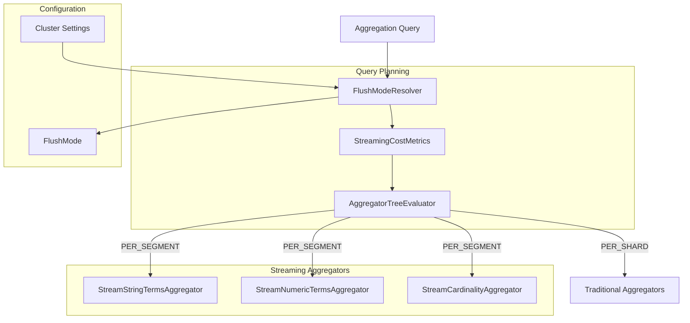

---
tags:
  - domain/core
  - component/server
  - indexing
  - performance
  - search
---
# Streaming Aggregation

## Summary

Streaming Aggregation in v3.3.0 extends the streaming aggregation framework with numeric terms aggregation, cardinality aggregation, intelligent query planning for flush mode determination, and request cache handling. These enhancements enable per-segment flushing of aggregation results for a broader range of aggregation types while automatically determining when streaming is beneficial.

## Details

### What's New in v3.3.0

This release significantly expands streaming aggregation capabilities:

1. **Numeric Terms Aggregation Streaming** - `StreamNumericTermsAggregator` supports long, double, and unsigned long term aggregations
2. **Cardinality Aggregation Streaming** - `StreamCardinalityAggregator` enables streaming for cardinality (distinct count) aggregations using HyperLogLog
3. **Query Planning for Flush Mode** - `FlushModeResolver` analyzes aggregator trees to determine optimal flush mode (per-segment vs per-shard)
4. **Cluster Setting Control** - Feature flag converted to dynamic cluster setting for runtime control without restart
5. **Request Cache Handling** - Streaming aggregation queries bypass request cache to ensure correct results

### Technical Changes

#### Architecture Changes



#### New Components

| Component | Description |
|-----------|-------------|
| `StreamNumericTermsAggregator` | Streaming aggregator for numeric (long, double, unsigned long) terms |
| `StreamCardinalityAggregator` | Streaming cardinality aggregator using ordinals collector with per-batch reset |
| `FlushModeResolver` | Analyzes collector trees to determine optimal flush mode |
| `StreamingCostMetrics` | Cost analysis metrics for streaming decision-making |
| `AggregatorTreeEvaluator` | Evaluates aggregator trees and recreates with optimal types |
| `Streamable` | Interface for collectors supporting streaming aggregation |
| `FlushMode` | Enum defining flush granularity (PER_SEGMENT, PER_SLICE, PER_SHARD) |

#### New Configuration

| Setting | Description | Default |
|---------|-------------|---------|
| `search.stream.enabled` | Dynamic cluster setting to enable/disable stream search | false |
| `search.aggregations.streaming.max_estimated_bucket_count` | Maximum estimated buckets for streaming eligibility | 100,000 |
| `search.aggregations.streaming.min_cardinality_ratio` | Minimum cardinality ratio (buckets/docs) for streaming | 0.01 |
| `search.aggregations.streaming.min_estimated_bucket_count` | Minimum estimated buckets for streaming eligibility | 1,000 |

### Usage Example

Enable streaming via cluster setting (no restart required):

```bash
PUT /_cluster/settings
{
  "persistent": {
    "search.stream.enabled": true
  }
}
```

Numeric terms aggregation with streaming:

```bash
GET /my-index/_search?stream=true
{
  "size": 0,
  "aggs": {
    "price_buckets": {
      "terms": {
        "field": "price"
      },
      "aggs": {
        "max_quantity": {
          "max": { "field": "quantity" }
        }
      }
    }
  }
}
```

Cardinality aggregation with streaming:

```bash
GET /my-index/_search?stream=true
{
  "size": 0,
  "aggs": {
    "unique_users": {
      "cardinality": {
        "field": "user_id.keyword",
        "precision_threshold": 1000
      }
    }
  }
}
```

### Migration Notes

- The feature flag `opensearch.experimental.feature.transport.stream.enabled` is replaced by dynamic cluster setting `search.stream.enabled`
- No cluster restart required to enable/disable streaming
- Request cache is automatically disabled for streaming queries

## Limitations

- Cardinality streaming only supports ordinal value sources (keyword fields)
- Query planning may fall back to per-shard mode for low-cardinality or very high-cardinality data
- Streaming is disabled when request cache would be used

## References

### Pull Requests
| PR | Description |
|----|-------------|
| [#19335](https://github.com/opensearch-project/OpenSearch/pull/19335) | Add `StreamNumericTermsAggregator` for numeric term aggregation streaming |
| [#19484](https://github.com/opensearch-project/OpenSearch/pull/19484) | Add streaming cardinality aggregator with ordinals collector |
| [#19488](https://github.com/opensearch-project/OpenSearch/pull/19488) | Query planning to determine flush mode for streaming aggregations |
| [#19506](https://github.com/opensearch-project/OpenSearch/pull/19506) | Convert stream search feature flag to dynamic cluster setting |
| [#19520](https://github.com/opensearch-project/OpenSearch/pull/19520) | Disable request cache for streaming aggregation queries |

### Issues (Design / RFC)
- [Issue #19515](https://github.com/opensearch-project/OpenSearch/issues/19515): Extending streaming aggregators to cardinality aggregator
- [Issue #19518](https://github.com/opensearch-project/OpenSearch/issues/19518): Streaming aggregation with request cache and other fixes
- [RFC #16774](https://github.com/opensearch-project/OpenSearch/issues/16774): Streaming Aggregation - A Memory-Efficient Approach

## Related Feature Report

- [Full feature documentation](../../../features/opensearch/opensearch-streaming-transport-aggregation.md)
