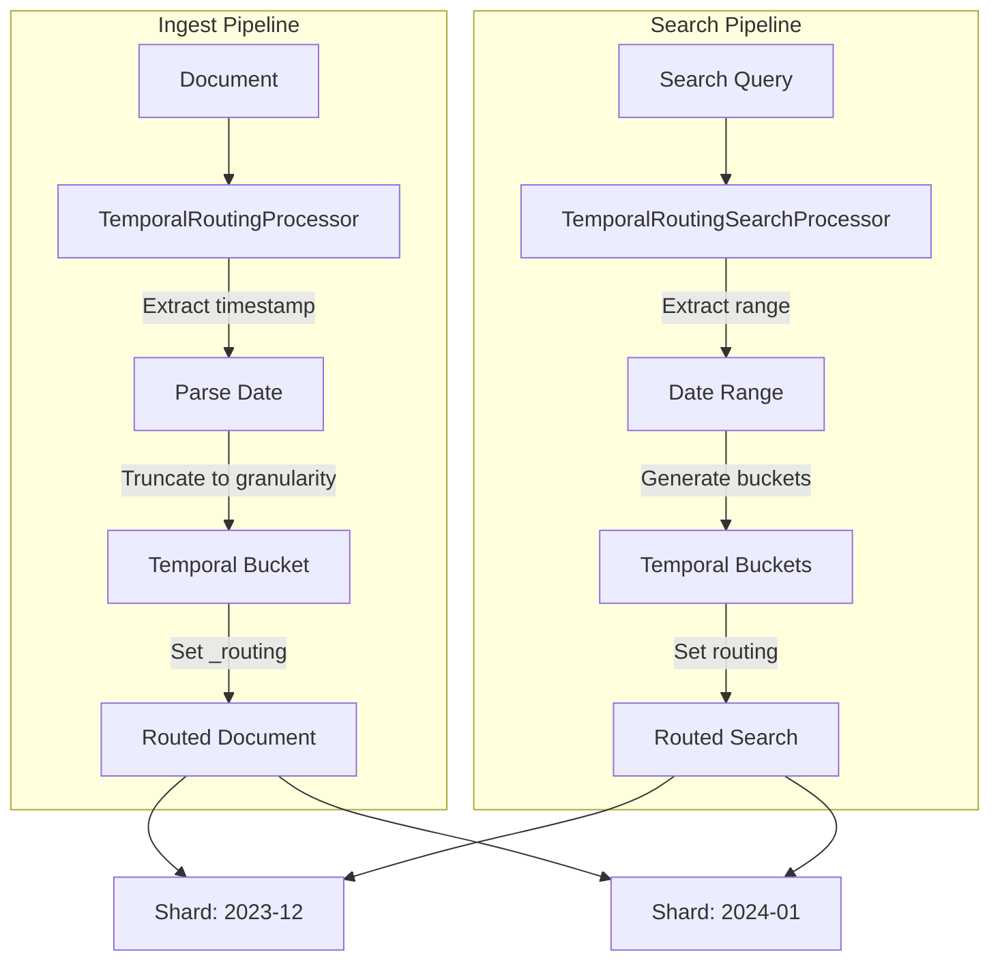

# Temporal Routing

## Summary

OpenSearch 3.3.0 introduces temporal routing processors that enable intelligent document co-location based on time-based patterns. This feature provides shard-level temporal locality for log, metrics, and time-series workloads without requiring client-side changes.

## Details

### What's New in v3.3.0

Two new processors enable time-based document routing:

1. **TemporalRoutingProcessor** (ingest pipeline) - Routes documents to shards based on timestamp fields
2. **TemporalRoutingSearchProcessor** (search pipeline) - Directs queries only to relevant time-range shards

### Technical Changes

#### Architecture Changes



#### New Components

| Component | Module | Description |
|-----------|--------|-------------|
| `TemporalRoutingProcessor` | ingest-common | Ingest processor for time-based document routing |
| `TemporalRoutingSearchProcessor` | search-pipeline-common | Search processor for time-based query routing |

#### New Configuration

**Ingest Processor Configuration:**

| Setting | Description | Default |
|---------|-------------|---------|
| `timestamp_field` | Field containing the date/time value | (required) |
| `granularity` | Temporal bucket size: `hour`, `day`, `week`, `month` | (required) |
| `format` | Date format pattern | `strict_date_optional_time` |
| `ignore_missing` | Skip if timestamp field is missing | `false` |
| `override_existing` | Overwrite existing `_routing` value | `true` |
| `hash_bucket` | Hash bucket string for distribution | `false` |

**Search Processor Configuration:**

| Setting | Description | Default |
|---------|-------------|---------|
| `timestamp_field` | Field to match in range queries | (required) |
| `granularity` | Temporal bucket size: `hour`, `day`, `week`, `month` | (required) |
| `format` | Date format pattern | `strict_date_optional_time` |
| `enable_auto_detection` | Auto-detect temporal ranges from queries | `true` |
| `hash_bucket` | Hash bucket string (must match ingest setting) | `false` |

### Usage Example

**Create ingest pipeline:**

```json
PUT _ingest/pipeline/temporal-routing
{
  "processors": [
    {
      "temporal_routing": {
        "timestamp_field": "@timestamp",
        "granularity": "day"
      }
    }
  ]
}
```

**Create search pipeline:**

```json
PUT _search/pipeline/temporal-routing-search
{
  "request_processors": [
    {
      "temporal_routing_search": {
        "timestamp_field": "@timestamp",
        "granularity": "day"
      }
    }
  ]
}
```

**Index documents:**

```json
POST logs/_doc?pipeline=temporal-routing
{
  "@timestamp": "2023-12-15T14:30:45.123Z",
  "message": "Application started"
}
```

The document receives `_routing = "2023-12-15"`.

**Search with automatic routing:**

```json
GET logs/_search?search_pipeline=temporal-routing-search
{
  "query": {
    "range": {
      "@timestamp": {
        "gte": "2023-12-15T00:00:00Z",
        "lte": "2023-12-15T23:59:59Z"
      }
    }
  }
}
```

The search is routed only to shards containing `2023-12-15` data.

### Migration Notes

- No client-side changes required - routing is handled transparently by pipelines
- Existing indices can adopt temporal routing by reindexing with the new pipeline
- The `hash_bucket` setting must be consistent between ingest and search processors

## Limitations

- Range queries spanning many temporal buckets may generate many routing values (limited to 100 buckets)
- Only `MUST` and `FILTER` clauses in boolean queries are considered for routing extraction
- `SHOULD` clauses are ignored as they don't guarantee document presence on specific shards

## References

### Documentation
- [Routing documentation](https://docs.opensearch.org/3.3/mappings/metadata-fields/routing/): OpenSearch routing concepts

### Pull Requests
| PR | Description |
|----|-------------|
| [#18966](https://github.com/opensearch-project/OpenSearch/pull/18966) | Add temporal routing processors for time-based document routing |

### Issues (Design / RFC)
- [Issue #18920](https://github.com/opensearch-project/OpenSearch/issues/18920): RFC for Temporal Routing Processors

## Related Feature Report

- [Full feature documentation](../../../../features/opensearch/temporal-routing.md)
