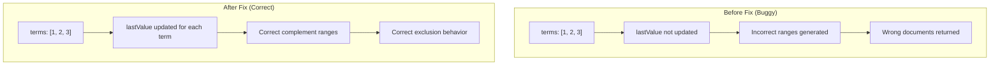

# Terms Query Rewriting

## Summary

This release fixes a bug in the terms query rewriting logic that caused incorrect results when using `must_not` with a `terms` query containing more than two consecutive whole numbers. The bug was introduced in OpenSearch 3.2.0 and caused documents to be incorrectly returned when they should have been excluded.

## Details

### What's New in v3.3.0

This fix corrects the complement calculation for terms queries with consecutive integer values. The issue occurred in the `ComplementHelperUtils.numberValuesToComplement()` method, which is used when rewriting `must_not` clauses containing `terms` queries.

### Technical Changes

#### Bug Description

When a `terms` query with consecutive whole numbers (e.g., `[0, 1, 2]`) was wrapped in a `must_not` clause, the query rewriter would incorrectly calculate the complement ranges. This happened because the `lastValue` variable was not being updated when consecutive values were skipped, causing subsequent range calculations to be incorrect.

#### The Fix

The fix adds a single line to update `lastValue` when consecutive whole numbers are detected:

```java
if (isWholeNumber && value.longValue() - lastValue.longValue() == 1) {
    lastValue = value;  // This line was added
    continue;
}
```

#### How Complement Calculation Works

The `ComplementHelperUtils` class converts a `terms` query into a set of range queries that match everything except the specified terms. For whole number fields, consecutive values are optimized by skipping intermediate ranges since no value can exist between them.



#### Expected Complement Ranges

For a `terms` query with values `[1, 2, 3]` on an integer field, the correct complement should be:

| Range | Description |
|-------|-------------|
| `(-∞, 1)` | All values less than 1 |
| `(3, +∞)` | All values greater than 3 |

The intermediate ranges `(1, 2)` and `(2, 3)` are correctly skipped because no integer values exist in those ranges.

### Usage Example

The bug manifested when using `must_not` with consecutive integer terms:

```json
// This query was returning incorrect results in v3.2.0
GET test/_search
{
  "query": {
    "bool": {
      "must_not": [
        {
          "terms": {
            "status": [0, 1, 2]
          }
        }
      ]
    }
  }
}
```

With the fix, this query now correctly returns no documents when all documents have status values of 0, 1, or 2.

### Migration Notes

No migration is required. This is a bug fix that restores the expected behavior from OpenSearch 3.1.0 and earlier versions.

## Limitations

- This fix specifically addresses the complement calculation for whole number fields
- The optimization for skipping consecutive values only applies to integer-type fields

## References

### Documentation
- [Terms Query Documentation](https://docs.opensearch.org/3.0/query-dsl/term/terms/): Official documentation for terms queries

### Pull Requests
| PR | Description |
|----|-------------|
| [#19587](https://github.com/opensearch-project/OpenSearch/pull/19587) | Fix rewriting terms query with consecutive whole numbers |

### Issues (Design / RFC)
- [Issue #19566](https://github.com/opensearch-project/OpenSearch/issues/19566): Bug report for must_not wrapping terms query

## Related Feature Report

- [Full feature documentation](../../../../features/opensearch/terms-query.md)
