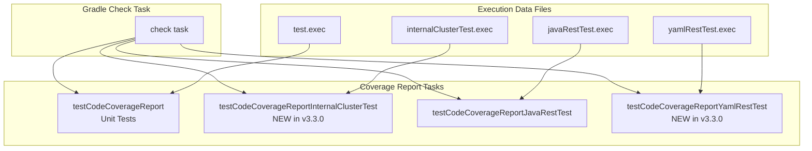

---
tags:
  - indexing
  - observability
  - security
---

# Test Infrastructure

## Summary

OpenSearch v3.3.0 enhances the test infrastructure with expanded code coverage reporting and improved security manager permissions for test clusters. These changes ensure more comprehensive test coverage metrics and enable plugins to properly access test cluster directories during integration tests.

## Details

### What's New in v3.3.0

1. **Expanded Code Coverage Reports**: The Gradle check task now includes coverage reports for `internalClusterTest` and `yamlRestTest` in addition to existing unit tests and `javaRestTest`.

2. **Test Clusters Directory Access**: Fixed security manager permissions to allow tests to read/write to the testclusters directory, resolving issues with cross-cluster replication and other plugin tests.

### Technical Changes

#### Architecture Changes



#### New Components

| Component | Description |
|-----------|-------------|
| `testCodeCoverageReportInternalClusterTest` | New JaCoCo report task for internal cluster tests |
| `testCodeCoverageReportYamlRestTest` | New JaCoCo report task for YAML REST tests |
| `testclusters.dir` permission | Security manager permission for test cluster directory access |

#### New Configuration

| Setting | Description | Default |
|---------|-------------|---------|
| `testclusters.dir` | System property specifying the test clusters directory path | `$buildDir/testclusters` |

### Code Changes

#### gradle/code-coverage.gradle

The coverage configuration now includes yamlRestTest source sets and execution data:

```groovy
// Added yamlRestTest support
if (tasks.findByName('yamlRestTest')) {
  executionDataFiles.add("$buildDir/jacoco/yamlRestTest.exec")
  sourceSetsList.add(sourceSets.yamlRestTest)
}

// New report tasks attached to check
project.getTasks().named(JavaBasePlugin.CHECK_TASK_NAME).configure {
  dependsOn(
    tasks.named('testCodeCoverageReport', JacocoReport),
    tasks.named('testCodeCoverageReportInternalClusterTest', JacocoReport),
    tasks.named('testCodeCoverageReportJavaRestTest', JacocoReport),
    tasks.named('testCodeCoverageReportYamlRestTest', JacocoReport)
  )
}
```

#### BootstrapForTesting.java

Added permission for testclusters directory:

```java
String testclustersDir = System.getProperty("testclusters.dir");
if (testclustersDir != null) {
    FilePermissionUtils.addDirectoryPath(
        perms,
        "testclusters.dir",
        PathUtils.get(testclustersDir),
        "read,readlink,write,delete",
        false
    );
}
```

### Usage Example

```bash
# Run all tests with coverage enabled (now includes internalClusterTest and yamlRestTest)
./gradlew check -Dtests.coverage=true

# For plugins using testclusters, add the system property
systemProperty 'testclusters.dir', project.layout.buildDirectory.get().file("testclusters").asFile.absolutePath
```

### Migration Notes

For plugins that copy files to test cluster config directories (like cross-cluster-replication), add the following to your `build.gradle`:

```groovy
integTest {
    systemProperty 'testclusters.dir', project.layout.buildDirectory.get().file("testclusters").asFile.absolutePath
}
```

## Limitations

- The `testclusters.dir` system property must be explicitly set for plugins that need to write to test cluster directories
- Coverage reports are only generated when `tests.coverage=true` is set

## References

### Documentation
- [PR #1571](https://github.com/opensearch-project/cross-cluster-replication/pull/1571): CCR issue that triggered testclusters fix

### Pull Requests
| PR | Description |
|----|-------------|
| [#19165](https://github.com/opensearch-project/OpenSearch/pull/19165) | Include internalClusterTests and yamlRestTest in code coverage report |
| [#19085](https://github.com/opensearch-project/OpenSearch/pull/19085) | Grant access to testclusters dir for tests |

### Issues (Design / RFC)
- [Issue #19140](https://github.com/opensearch-project/OpenSearch/issues/19140): Bug report - Code coverage report does not include internalClusterTests

## Related Feature Report

- [Full feature documentation](../../../../features/opensearch/code-coverage-gradle.md)
