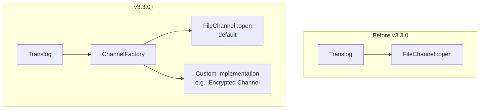

# Translog Channel Factory Parameter

## Summary

This release adds a new overload constructor to the Translog class that accepts a `ChannelFactory` parameter. Previously, the translog always used `FileChannel::open` as the default channel factory, which prevented customization of how file channels are opened. This enhancement enables plugins and extensions to provide their own channel factory implementations, supporting use cases like storage encryption.

## Details

### What's New in v3.3.0

The Translog class now accepts an optional `ChannelFactory` parameter in its constructor, allowing callers to customize how file channels are created for translog operations.

### Technical Changes

#### Architecture Changes



#### New Components

| Component | Description |
|-----------|-------------|
| `ChannelFactory` parameter | New constructor parameter in `Translog` class |
| Overload constructors | Secondary constructors for backward compatibility |

#### Constructor Changes

The main `Translog` constructor now accepts a `ChannelFactory` parameter:

```java
public Translog(
    final TranslogConfig config,
    final String translogUUID,
    TranslogDeletionPolicy deletionPolicy,
    final LongSupplier globalCheckpointSupplier,
    final LongSupplier primaryTermSupplier,
    final LongConsumer persistedSequenceNumberConsumer,
    final TranslogOperationHelper translogOperationHelper,
    final ChannelFactory channelFactory  // NEW PARAMETER
) throws IOException
```

When `channelFactory` is `null`, it defaults to `FileChannel::open`.

#### Affected Classes

| Class | Change |
|-------|--------|
| `Translog` | Added `channelFactory` field and constructor parameter |
| `LocalTranslog` | Updated to pass channel factory to parent |
| `RemoteFsTranslog` | Updated to pass channel factory to parent |
| `RemoteFsTimestampAwareTranslog` | Updated to pass channel factory |
| `InternalTranslogFactory` | Passes `null` for default behavior |
| `RemoteBlobStoreInternalTranslogFactory` | Passes `null` for default behavior |
| `TruncateTranslogAction` | Updated constructor call |

### Usage Example

```java
// Custom channel factory for encrypted storage
ChannelFactory encryptedChannelFactory = (path, options) -> {
    FileChannel channel = FileChannel.open(path, options);
    return new EncryptedFileChannel(channel, encryptionKey);
};

// Create translog with custom channel factory
Translog translog = new LocalTranslog(
    config,
    translogUUID,
    deletionPolicy,
    globalCheckpointSupplier,
    primaryTermSupplier,
    persistedSequenceNumberConsumer,
    TranslogOperationHelper.DEFAULT,
    encryptedChannelFactory  // Custom factory
);
```

### Migration Notes

- Existing code using the old constructors will continue to work without changes
- Secondary constructors without `ChannelFactory` parameter are provided for backward compatibility
- To use a custom channel factory, use the new constructor with the `ChannelFactory` parameter

## Limitations

- The channel factory is set at translog creation time and cannot be changed afterward
- Custom channel factories must be compatible with the translog's file operations (read, write, sync)

## References

### Documentation
- [Translog Documentation](https://docs.opensearch.org/3.0/getting-started/intro/#translog): Official translog documentation
- [opensearch-storage-encryption#39](https://github.com/opensearch-project/opensearch-storage-encryption/pull/39): Related storage encryption PR

### Pull Requests
| PR | Description |
|----|-------------|
| [#18918](https://github.com/opensearch-project/OpenSearch/pull/18918) | Add Channel Factory parameter to Translog |

## Related Feature Report

- [Full feature documentation](../../../../features/opensearch/translog.md)
