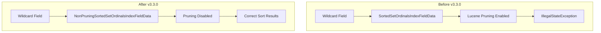

---
tags:
  - performance
---

# Wildcard Field Mapper

## Summary

OpenSearch v3.3.0 fixes a critical sorting bug in the wildcard field type when `doc_values` is enabled. Previously, sorting on wildcard fields with doc values would throw an `IllegalStateException` when the result size was less than the total document count. This fix disables Lucene's dynamic pruning optimization for wildcard fields, ensuring correct sorting behavior.

## Details

### What's New in v3.3.0

This release resolves a bug where sorting on wildcard fields with `doc_values: true` would fail with an `IllegalStateException`. The issue occurred because Lucene's dynamic pruning optimization expected the term dictionary to contain the same values as doc values, but wildcard fields use n-gram tokenization for terms while storing full values in doc values.

### Technical Changes

#### Architecture Changes



#### New Components

| Component | Description |
|-----------|-------------|
| `NonPruningSortedSetOrdinalsIndexFieldData` | Wrapper for `SortedSetOrdinalsIndexFieldData` that disables pruning optimization |
| `NonPruningSortField` | Custom `SortField` implementation that explicitly sets `Pruning.NONE` |
| `FilteredSortField` | Abstract base class for delegating sort field operations |

#### Root Cause

The wildcard field type uses `SortedSetDocValues` for doc values, which triggers Lucene's dynamic pruning during sorting. Lucene's `TermOrdValComparator` expects the term dictionary to contain the same values as doc values. However, wildcard fields:

- **Term dictionary**: Contains n-gram tokens (e.g., `tes`, `est` for "test")
- **Doc values**: Contains full original values (e.g., "test")

This mismatch caused `IllegalStateException` when pruning tried to look up doc values in the term dictionary.

### Usage Example

Sorting on wildcard fields now works correctly:

```json
PUT test
{
  "mappings": {
    "properties": {
      "my_field": {
        "type": "wildcard",
        "fields": {
          "doc_values": {
            "type": "wildcard",
            "doc_values": true
          }
        }
      }
    }
  }
}

POST test/_bulk
{"index": {"_id": "1"}}
{"my_field": "zebra"}
{"index": {"_id": "2"}}
{"my_field": "apple"}
{"index": {"_id": "3"}}
{"my_field": "banana"}

GET test/_search
{
  "query": {
    "wildcard": {
      "my_field": "*"
    }
  },
  "sort": [
    { "my_field.doc_values": { "order": "asc" } }
  ],
  "size": 2
}
```

Before v3.3.0, this query would fail. Now it correctly returns documents sorted alphabetically.

### Migration Notes

No migration is required. The fix is transparent and automatically applies to all wildcard fields with doc values enabled.

## Limitations

- Sorting performance on wildcard fields may be slightly slower than keyword fields due to disabled pruning optimization
- This is a necessary trade-off to ensure correctness given the n-gram indexing strategy

## References

### Documentation
- [Wildcard Field Documentation](https://docs.opensearch.org/3.0/field-types/supported-field-types/wildcard/): Official documentation
- [Lucene TermOrdValComparator](https://github.com/apache/lucene/blob/485141dd34ea866ad9dc59843770969d1b0c8fa2/lucene/core/src/java/org/apache/lucene/search/comparators/TermOrdValComparator.java#L569-L572): Source of the pruning logic

### Pull Requests
| PR | Description |
|----|-------------|
| [#18568](https://github.com/opensearch-project/OpenSearch/pull/18568) | Disable pruning for `doc_values` for the wildcard field mapper |

### Issues (Design / RFC)
- [Issue #18461](https://github.com/opensearch-project/OpenSearch/issues/18461): Bug report for wildcard sort error

## Related Feature Report

- [Full feature documentation](../../../features/opensearch/opensearch-wildcard-field.md)
