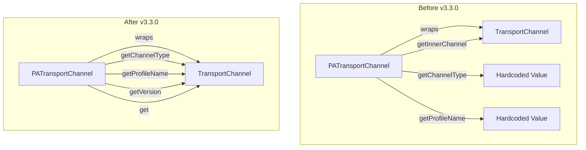

# Performance Analyzer Enhancements

## Summary

This release improves the Performance Analyzer's transport channel wrapper classes to properly delegate method calls to the underlying wrapped channel, enhancing compatibility with the security plugin.

## Details

### What's New in v3.3.0

The Performance Analyzer transport channel wrappers (`PerformanceAnalyzerTransportChannel` and `RTFPerformanceAnalyzerTransportChannel`) have been updated to delegate method calls to the wrapped channel instead of returning hardcoded values. This change improves interoperability with the security plugin.

### Technical Changes

#### Architecture Changes



#### Key Changes

| Method | Before | After |
|--------|--------|-------|
| `getProfileName()` | Returns hardcoded `"PerformanceAnalyzerTransportChannelProfile"` | Delegates to `original.getProfileName()` |
| `getChannelType()` | Returns hardcoded `"PerformanceAnalyzerTransportChannelType"` | Delegates to `original.getChannelType()` |
| `getVersion()` | Not implemented | Delegates to `original.getVersion()` |
| `get(name, clazz)` | Not implemented | Delegates to `original.get(name, clazz)` |
| `getInnerChannel()` | Returns wrapped channel | Removed (no longer needed) |

#### New Method Implementations

```java
@Override
public String getProfileName() {
    return this.original == null ? null : this.original.getProfileName();
}

@Override
public String getChannelType() {
    return this.original == null ? null : this.original.getChannelType();
}

@Override
public <T> Optional<T> get(String name, Class<T> clazz) {
    return this.original == null ? Optional.empty() : this.original.get(name, clazz);
}

@Override
public Version getVersion() {
    return this.original == null ? null : this.original.getVersion();
}
```

### Migration Notes

- The `getInnerChannel()` method has been removed from both `PerformanceAnalyzerTransportChannel` and `RTFPerformanceAnalyzerTransportChannel`
- Security plugin integration now uses standard `TransportChannel` interface methods instead of reflection-based access
- No configuration changes required

## Limitations

- None specific to this release

## References

### Documentation
- [Performance Analyzer Documentation](https://docs.opensearch.org/3.0/monitoring-your-cluster/pa/index/): Official docs
- [PR #609](https://github.com/opensearch-project/performance-analyzer/pull/609): Earlier attempt to fix PATransportChannel delegation

### Pull Requests
| PR | Description |
|----|-------------|
| [#845](https://github.com/opensearch-project/performance-analyzer/pull/845) | Use Subclass method for Version and Channel type which is understood by security plugin |
| [#846](https://github.com/opensearch-project/performance-analyzer/pull/846) | Increment to 3.3.0.0 and update SHA files |

### Issues (Design / RFC)
- [Issue #606](https://github.com/opensearch-project/performance-analyzer/issues/606): Related issue for transport channel delegation

## Related Feature Report

- [Full feature documentation](../../../features/performance-analyzer/performance-analyzer.md)
