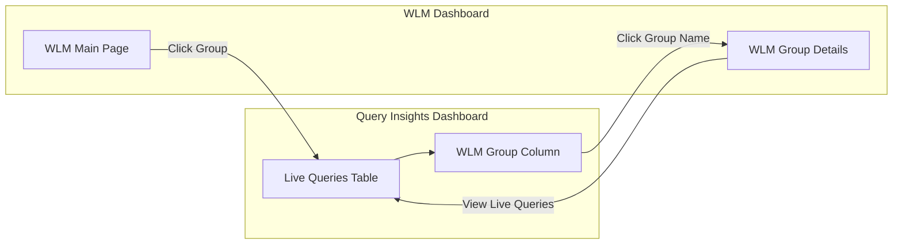

---
tags:
  - domain/observability
  - component/dashboards
  - dashboards
  - search
---
# Workload Management (WLM) Dashboard Enhancements

## Summary

OpenSearch v3.3.0 introduces significant enhancements to the Workload Management (WLM) dashboard in the Query Insights Dashboards plugin. These improvements include bi-directional navigation between WLM and Live Queries dashboards, WLM group filtering for the Live Queries API, Multi-Data Source (MDS) support, feature flags, version decoupling, and a backend fix to prevent workload group deletion when associated rules exist.

## Details

### What's New in v3.3.0

#### Bi-Directional Navigation Between WLM and Live Queries

Users can now seamlessly navigate between the WLM dashboard and Query Insights Live Queries view:

- **From Live Queries → WLM Group Details**: A new "WLM Group" column in the Live Queries table shows clickable links that navigate to the corresponding WLM Group Details page
- **From WLM Main Page → Live Queries**: Clicking on a WLM group filters the Live Queries view to show only queries for that specific workload group

#### Plugin Availability Handling

The dashboard gracefully handles scenarios where plugins are not installed:

| Scenario | Behavior |
|----------|----------|
| WLM plugin not installed | WLM Group displays as "Default Workload Group" (plain text, not clickable) |
| Query Insights not installed | Live Query column is hidden in WLM dashboard |

#### Multi-Data Source (MDS) Support

The WLM dashboard now supports changing data sources from the main page, enabling users to monitor workload groups across different OpenSearch clusters.

#### Feature Flag for WLM

A feature flag has been added to control WLM dashboard visibility, allowing administrators to enable or disable the feature as needed.

#### Version Decoupling

The WLM dashboard now supports version decoupling, requiring the data source to be OpenSearch version 3.1 or higher. This ensures compatibility while allowing the dashboard plugin to evolve independently.

### Technical Changes

#### New Components

| Component | Description |
|-----------|-------------|
| WLM Group Column | New column in Live Queries table showing workload group assignment |
| Navigation Links | Clickable links enabling bi-directional navigation |
| MDS Selector | Data source selector on WLM main page |
| Feature Flag | Configuration option to enable/disable WLM dashboard |
| Version Check | Validation ensuring data source is >= v3.1 |

#### Backend Enhancement

A critical backend fix prevents workload group deletion when associated rules exist. Previously, deleting a WLM group with attached auto-tagging rules would cause the `_rules` API to throw a `ValidationException`. Now, the system throws an exception to stop the deletion, protecting data integrity.

### Usage Example

**Navigate from Live Queries to WLM Group:**
1. Open Query Insights → Live Queries
2. Locate the "WLM Group" column
3. Click on a group name to view its details

**Filter Live Queries by WLM Group:**
1. Open WLM Dashboard
2. Click on a workload group
3. View filtered Live Queries for that group

### Migration Notes

- Ensure OpenSearch backend is version 3.1.0 or higher for full WLM dashboard functionality
- The WLM feature flag must be enabled to access the dashboard
- Existing workload groups with associated rules cannot be deleted until rules are removed first

## Limitations

- WLM Group column shows "Default Workload Group" as plain text when WLM plugin is not installed
- Live Query column is hidden when Query Insights plugin is not installed
- Requires data source version >= 3.1 for version decoupling support

## References

### Documentation
- [Workload Management Documentation](https://docs.opensearch.org/3.0/tuning-your-cluster/availability-and-recovery/workload-management/wlm-feature-overview/)

### Pull Requests
| PR | Repository | Description |
|----|------------|-------------|
| [#299](https://github.com/opensearch-project/query-insights-dashboards/pull/299) | query-insights-dashboards | Bi-directional navigation between WLM and Live Queries |
| [#330](https://github.com/opensearch-project/query-insights-dashboards/pull/330) | query-insights-dashboards | Add navigation for Query Insights and WLM dashboards |
| [#336](https://github.com/opensearch-project/query-insights-dashboards/pull/336) | query-insights-dashboards | Enable WLM mode in pipeline |
| [#348](https://github.com/opensearch-project/query-insights-dashboards/pull/348) | query-insights-dashboards | Add feature flag for WLM |
| [#352](https://github.com/opensearch-project/query-insights-dashboards/pull/352) | query-insights-dashboards | MDS support for WLM |
| [#361](https://github.com/opensearch-project/query-insights-dashboards/pull/361) | query-insights-dashboards | Version decoupling for WLM dashboard |
| [#363](https://github.com/opensearch-project/query-insights-dashboards/pull/363) | query-insights-dashboards | Version decouple unit tests |
| [#19502](https://github.com/opensearch-project/OpenSearch/pull/19502) | OpenSearch | Add check to stop workload group deletion with associated rules |

### Issues (Design / RFC)
- [Issue #153](https://github.com/opensearch-project/query-insights-dashboards/issues/153): Feature request for bi-directional navigation
- [Issue #19388](https://github.com/opensearch-project/OpenSearch/issues/19388): Bug report for WLM _rules API ValidationException

## Related Feature Report

- [Full Workload Management documentation](../../../features/opensearch/opensearch-workload-management.md)
- [Query Insights documentation](../../../features/query-insights/query-insights.md)
