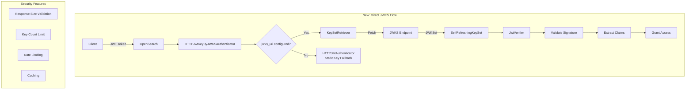

---
tags:
  - security
---

# JWT Authentication - Direct JWKS Support

## Summary

OpenSearch v3.3.0 adds direct JWKS (JSON Web Key Set) endpoint support to the JWT authentication backend. This enhancement allows JWT authentication with JWKS endpoints without requiring OpenID Connect (OIDC) infrastructure, simplifying configuration for environments that have JWKS endpoints but don't use full OIDC discovery.

## Details

### What's New in v3.3.0

This release introduces a new `HTTPJwtKeyByJWKSAuthenticator` class that enables direct JWKS endpoint access within the JWT authentication backend. Previously, JWKS support was only available through the OIDC authenticator (`HTTPJwtKeyByOpenIdConnectAuthenticator`), which required an `openid_connect_url` for OIDC discovery.

### Technical Changes

#### Architecture Changes



#### New Components

| Component | Description |
|-----------|-------------|
| `HTTPJwtKeyByJWKSAuthenticator` | New authenticator extending `AbstractHTTPJwtAuthenticator` for direct JWKS support |
| `KeySetRetriever.createForJwksUri()` | Factory method for creating secure JWKS retrievers with validation |
| `MockJwksServer` | Test utility for JWKS endpoint testing |

#### New Configuration

| Setting | Description | Default |
|---------|-------------|---------|
| `jwks_uri` | Direct JWKS endpoint URL | `null` |
| `cache_jwks_endpoint` | Enable caching for JWKS responses | `true` |
| `jwks_request_timeout_ms` | HTTP request timeout for JWKS endpoint | `5000` |
| `jwks_queued_thread_timeout_ms` | Queued thread timeout | `2500` |
| `refresh_rate_limit_time_window_ms` | Rate limit window for key refresh | `10000` |
| `refresh_rate_limit_count` | Max refresh attempts per window | `10` |
| `max_jwks_keys` | Maximum allowed keys in JWKS (hard limit) | `-1` (unlimited) |
| `max_jwks_response_size_bytes` | Maximum HTTP response size | `1048576` (1MB) |

### Usage Example

**Direct JWKS Configuration (New in v3.3.0):**
```yaml
jwt_auth_domain:
  http_enabled: true
  transport_enabled: true
  order: 0
  http_authenticator:
    type: jwt
    challenge: false
    config:
      jwks_uri: 'https://your-jwks-endpoint.com/.well-known/jwks.json'
      jwt_header: "Authorization"
      subject_key: "preferred_username"
      roles_key: "roles"
      cache_jwks_endpoint: true
      jwks_request_timeout_ms: 5000
      max_jwks_keys: 10
  authentication_backend:
    type: noop
```

**Backward Compatible - Static Key (Still Supported):**
```yaml
jwt_auth_domain:
  http_enabled: true
  http_authenticator:
    type: jwt
    config:
      signing_key: "base64 encoded HMAC key or PEM public key"
      jwt_header: "Authorization"
  authentication_backend:
    type: noop
```

### Migration Notes

- **No breaking changes**: Existing configurations using `signing_key` continue to work
- **Automatic fallback**: If `jwks_uri` is not configured, the authenticator falls back to static key authentication
- **OIDC still supported**: The `openid` type with `openid_connect_url` remains available for full OIDC discovery

### Security Features

The new JWKS implementation includes built-in security protections:

1. **Response Size Validation**: Prevents memory exhaustion from oversized JWKS responses
2. **Key Count Limit**: Rejects JWKS with excessive keys (configurable hard limit)
3. **Rate Limiting**: Prevents excessive refresh attempts
4. **Caching**: Reduces network calls with configurable HTTP caching

## Limitations

- The `jwks_uri` must return a valid JWKS JSON response
- SSL/TLS configuration for JWKS endpoints uses the `jwks` prefix in settings
- Key rotation requires the JWKS endpoint to be accessible

## References

### Documentation
- [JWT Authentication Documentation](https://docs.opensearch.org/3.0/security/authentication-backends/jwt/): Official docs
- [JSON Web Key (JWK) Specification](https://datatracker.ietf.org/doc/html/rfc7517): RFC 7517

### Pull Requests
| PR | Description |
|----|-------------|
| [#5578](https://github.com/opensearch-project/security/pull/5578) | Direct JWKS (JSON Web Key Set) support in the JWT authentication backend |

### Issues (Design / RFC)
- [Issue #4974](https://github.com/opensearch-project/security/issues/4974): Feature request for JWKS with JWT without OIDC

## Related Feature Report

- [Full feature documentation](../../../features/security/jwt-authentication.md)
