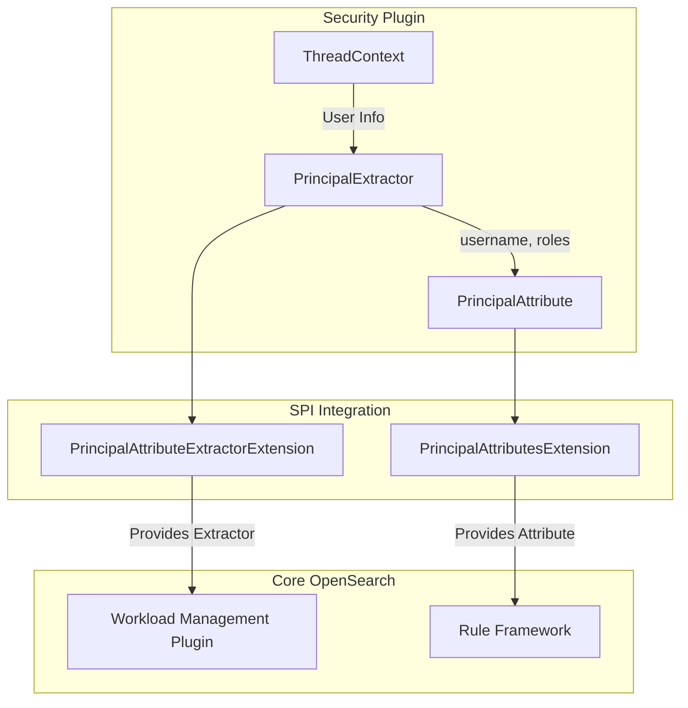

---
tags:
  - indexing
  - search
  - security
---

# Rule-based Autotagging

## Summary

v3.3.0 adds security attribute extraction support to the rule-based autotagging feature in the Security plugin. This enables automatic workload group assignment based on user identity (username and roles) in addition to index patterns, providing more granular control over query categorization and resource management.

## Details

### What's New in v3.3.0

- **Principal Attribute**: New `PrincipalAttribute` enum implementing the `Attribute` interface for security-based rule matching
- **Principal Extractor**: `PrincipalExtractor` class that extracts username and roles from the security context
- **SPI Extensions**: Two extension points for integration with OpenSearch core's autotagging framework
- **Weighted Subfields**: Username and role subfields with configurable weights for match scoring

### Technical Changes

#### Architecture Changes



#### New Components

| Component | Description |
|-----------|-------------|
| `PrincipalAttribute` | Enum implementing `Attribute` interface with `PRINCIPAL` value containing `username` and `role` subfields |
| `PrincipalExtractor` | Implements `AttributeExtractor<String>` to extract user identity from `ThreadContext` |
| `PrincipalAttributesExtension` | SPI extension providing `PrincipalAttribute` to the rule framework |
| `PrincipalAttributeExtractorExtension` | SPI extension providing `PrincipalExtractor` to workload management |
| `UserPrincipalInfo` | Inner class holding parsed username and roles |

#### Principal Attribute Schema

The `PrincipalAttribute` supports nested subfields with weighted scoring:

```json
{
  "principal": {
    "username": ["alice", "bob"],
    "role": ["admin", "analyst"]
  }
}
```

| Subfield | Weight | Description |
|----------|--------|-------------|
| `username` | 1.0 | Exact username match (highest priority) |
| `role` | 0.09 | Role-based match (lower priority) |

#### Internal Value Format

Values are stored internally as pipe-delimited strings:
- `username|alice` - Username match
- `role|admin` - Role match

### Usage Example

**Create Rule with Security Attributes:**
```json
PUT _rules/workload_group
{
  "description": "Admin analytics workload",
  "index_pattern": ["logs-*"],
  "principal": {
    "username": ["admin"],
    "role": ["all_access"]
  },
  "workload_group": "admin_workload_id"
}
```

**How Extraction Works:**

1. Security plugin stores user info in `ThreadContext` as: `user_name|backendrole1,backendrole2|role1,role2|tenant|...`
2. `PrincipalExtractor.extract()` parses this string
3. Returns iterable of formatted values: `["username|alice", "role|all_access", "role|analyst"]`
4. Rule framework matches these against stored rules

### Configuration

The Security plugin extends the core plugin with optional dependencies:

```gradle
extendedPlugins = ['workload-management;optional=true', 'rule-framework']
```

New compile dependencies:
- `org.opensearch.plugin:workload-management-wlm-spi`
- `org.opensearch.plugin:autotagging-commons-spi`

### Migration Notes

- No migration required - this is a new capability
- Existing rules without `principal` attribute continue to work
- Security plugin must be installed for principal-based rules to function
- If security plugin is not installed, principal attributes are ignored during rule evaluation

## Limitations

- Principal extraction only works when Security plugin is installed and enabled
- User info must be present in `ThreadContext` (authenticated requests only)
- Backend roles are not currently exposed (only frontend roles)
- Escaped pipe characters in usernames are handled but may cause parsing edge cases

## References

### Documentation
- [Rule-based Auto-tagging Documentation](https://docs.opensearch.org/latest/tuning-your-cluster/availability-and-recovery/rule-based-autotagging/autotagging/)
- [Rule Lifecycle API](https://docs.opensearch.org/3.0/tuning-your-cluster/availability-and-recovery/rule-based-autotagging/rule-lifecycle-api/)
- [OpenSearch Core Auto-tagging PRs](https://github.com/opensearch-project/OpenSearch/pull/19486)

### Pull Requests
| PR | Description |
|----|-------------|
| [#5606](https://github.com/opensearch-project/security/pull/5606) | Add logic to extract security attributes for rule-based autotagging |

## Related Feature Report

- [Workload Management](../../../features/opensearch/opensearch-workload-management.md)
