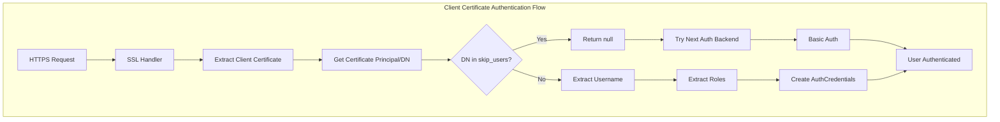

---
tags:
  - domain/security
  - component/server
  - dashboards
  - security
---
# Security Client Certificate Authentication

## Summary

This bugfix adds a new `skip_users` configuration option to the client certificate authenticator, allowing specific users to bypass certificate-based authentication and fall back to other authentication backends. This resolves an issue where OpenSearch Dashboards with basic authentication could not work properly when client certificate authentication was set to required mode.

## Details

### What's New in v3.3.0

The `skip_users` option enables administrators to specify a list of Distinguished Names (DNs) that should skip client certificate authentication. When a user's certificate DN matches an entry in the `skip_users` list, the client certificate authenticator returns `null`, allowing the authentication chain to continue to the next authentication backend (e.g., basic authentication).

### Technical Changes

#### Architecture Changes



#### New Configuration

| Setting | Description | Default |
|---------|-------------|---------|
| `skip_users` | List of certificate DNs to skip client cert authentication | `[]` |

The `skip_users` setting supports wildcard matching using the `WildcardMatcher` class, allowing patterns like `*dashboard*` to match multiple DNs.

### Usage Example

```yaml
# config.yml - Security plugin configuration
config:
  dynamic:
    authc:
      basic_internal_auth_domain:
        authentication_backend:
          type: intern
        description: Authenticate via HTTP Basic against internal users database
        http_authenticator:
          challenge: true
          type: basic
        http_enabled: true
        order: 4
        transport_enabled: true
      
      clientcert_auth_domain:
        authentication_backend:
          type: noop
        description: Authenticate via SSL client certificates
        http_authenticator:
          challenge: false
          type: clientcert
          config:
            username_attribute: cn
            # Skip certificate authentication for dashboard server
            skip_users:
              - "DC=de,L=test,O=users,OU=bridge,CN=dashboard"
        http_enabled: true
        order: 2
        transport_enabled: false
```

### Migration Notes

If you have OpenSearch Dashboards configured with `alwaysPresentCertificate: true` and want to use basic authentication for dashboard users while requiring client certificates for other clients:

1. Add the dashboard server's certificate DN to the `skip_users` list
2. Ensure basic authentication domain has a higher order number (lower priority) than the client certificate domain
3. The dashboard server will fall back to basic authentication while other clients must present valid certificates

## Limitations

- The `skip_users` list matches against the full certificate DN (Distinguished Name)
- Wildcard patterns are supported but regex patterns are not
- Users in the `skip_users` list must have valid credentials for another authentication backend

## References

### Documentation
- [Client Certificate Authentication Documentation](https://docs.opensearch.org/3.0/security/authentication-backends/client-auth/): Official documentation
- [PR #5278](https://github.com/opensearch-project/security/pull/5278): Initial implementation attempt (closed)

### Pull Requests
| PR | Description |
|----|-------------|
| [#5525](https://github.com/opensearch-project/security/pull/5525) | Added new option skip_users to client cert authenticator |

### Issues (Design / RFC)
- [Issue #4378](https://github.com/opensearch-project/security/issues/4378): Client certificate setting bypasses password requirements

## Related Feature Report

- Full feature documentation
