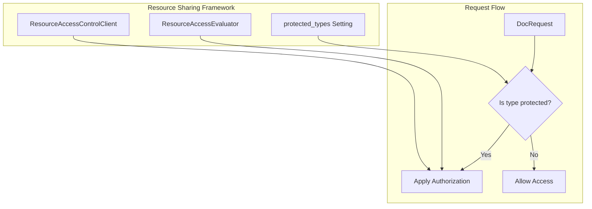

---
tags:
  - domain/security
  - component/server
  - security
---
# Security Configuration Enhancements

## Summary

OpenSearch v3.3.0 introduces two configuration enhancements to the Security plugin: a new setting to explicitly specify which resource types should be protected by the resource sharing framework, and making the user attribute serialization setting dynamically configurable without requiring a cluster restart.

## Details

### What's New in v3.3.0

#### 1. Protected Resource Types Setting

A new list setting allows cluster administrators to explicitly specify which resource types should be protected by the resource sharing framework:

```yaml
plugins.security.experimental.resource_sharing.protected_types: [sample-resource]
```

**Key behaviors:**
- Default value: `[]` (empty list - no resources protected by default)
- Only resource types listed in this setting will have resource-level authorization applied
- Resources not in the list behave as if the resource sharing feature is disabled for them
- Provides granular control over which plugin resources receive access protection

#### 2. Dynamic User Attribute Serialization Setting

The `plugins.security.user_attribute_serialization.enabled` setting is now dynamic and can be updated at runtime:

```bash
PUT _cluster/settings
{
  "persistent": {
    "plugins.security.user_attribute_serialization.enabled": true
  }
}
```

**Previous behavior:** Required static configuration in `opensearch.yml` and cluster restart.

**New behavior:** Can be dynamically updated via the Cluster Settings API.

### Technical Changes

#### Architecture Changes



#### New Configuration

| Setting | Description | Default | Dynamic |
|---------|-------------|---------|---------|
| `plugins.security.experimental.resource_sharing.protected_types` | List of resource types to protect | `[]` | No |
| `plugins.security.user_attribute_serialization.enabled` | Enable user attribute serialization | `false` | Yes |

#### Settings Filter Updates

The settings filter was updated to be more granular, explicitly listing security setting prefixes instead of using a broad `plugins.security.*` pattern. This allows the user attribute serialization setting to be visible in cluster settings responses while keeping sensitive settings filtered.

### Usage Example

```yaml
# opensearch.yml - Enable resource sharing with specific protected types
plugins.security.experimental.resource_sharing.enabled: true
plugins.security.experimental.resource_sharing.protected_types:
  - sample-resource
  - anomaly-detector
```

```bash
# Dynamically enable user attribute serialization
PUT _cluster/settings
{
  "persistent": {
    "plugins.security.user_attribute_serialization.enabled": true
  }
}
```

### Migration Notes

- Existing clusters using resource sharing should add their resource types to `protected_types` to maintain current behavior
- The user attribute serialization setting can now be changed without cluster restart

## Limitations

- The `protected_types` setting is static and requires a cluster restart to change
- Resource types must be explicitly listed; there is no wildcard support

## References

### Documentation
- [Documentation: Security Settings](https://docs.opensearch.org/3.0/install-and-configure/configuring-opensearch/security-settings/)
- [PR #5657](https://github.com/opensearch-project/security/pull/5657): Original PR for dynamic user attribute serialization (superseded by #5673)

### Pull Requests
| PR | Description |
|----|-------------|
| [#5671](https://github.com/opensearch-project/security/pull/5671) | Adds a list setting to explicitly specify resources to be protected |
| [#5673](https://github.com/opensearch-project/security/pull/5673) | Make user attribute serialization property dynamic |

## Related Feature Report

- Security Configuration
