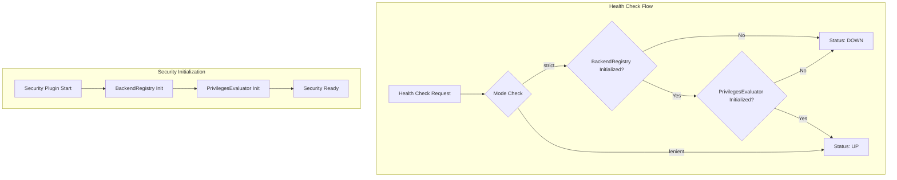

---
tags:
  - domain/security
  - component/server
  - security
---
# Security Plugin Health Check

## Summary

This enhancement improves the Security plugin's health check API to include Authorization (AuthZ) initialization status. Previously, the health check only verified Authentication (AuthN) initialization via BackendRegistry. Now it also verifies that PrivilegesEvaluator is initialized, providing a more accurate health status for the Security plugin.

## Details

### What's New in v3.3.0

The health check API (`GET _plugins/_security/health`) now validates both authentication and authorization subsystems are fully initialized before reporting `UP` status.

### Technical Changes

#### Architecture Changes



#### Modified Components

| Component | Description |
|-----------|-------------|
| `SecurityHealthAction` | Now accepts `PrivilegesEvaluator` in constructor and checks its initialization status |
| `OpenSearchSecurityPlugin` | Updated to pass `PrivilegesEvaluator` to `SecurityHealthAction` |

#### Behavior Change

| Scenario | Old Behavior | New Behavior |
|----------|--------------|--------------|
| BackendRegistry initialized, PrivilegesEvaluator not initialized | `UP` | `DOWN` |
| Both BackendRegistry and PrivilegesEvaluator initialized | `UP` | `UP` |
| BackendRegistry not initialized | `DOWN` | `DOWN` |

### Usage Example

```bash
# Health check request
curl -XGET "https://localhost:9200/_plugins/_security/health"

# Response when fully initialized
{
  "message": null,
  "mode": "strict",
  "status": "UP",
  "settings": {
    "plugins.security.cache.ttl_minutes": 60
  }
}

# Response when not fully initialized
{
  "message": "Not initialized",
  "mode": "strict",
  "status": "DOWN",
  "settings": {
    "plugins.security.cache.ttl_minutes": 60
  }
}
```

### Migration Notes

- No configuration changes required
- Load balancers using the health check endpoint will now correctly detect partial initialization states
- Applications relying on the health check should expect `DOWN` status during the brief period between AuthN and AuthZ initialization

## Limitations

- The health check only validates initialization status, not ongoing operational health
- In `lenient` mode, the initialization checks are bypassed

## References

### Documentation
- [Security API Documentation](https://docs.opensearch.org/3.0/security/access-control/api/): Official Security plugin API docs

### Pull Requests
| PR | Description |
|----|-------------|
| [#5626](https://github.com/opensearch-project/security/pull/5626) | Add AuthZ initialization completion check in health check API |

### Issues (Design / RFC)
- [Issue #5603](https://github.com/opensearch-project/security/issues/5603): Security Initialization Issues (bug report)

## Related Feature Report

- [Full feature documentation](../../../../features/security/security-plugin-health-check.md)
