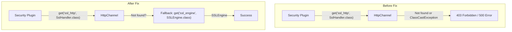

# Security SSL/TLS

## Summary

This bugfix resolves SSL/TLS compatibility issues between the Security plugin and the `transport-reactor-netty4` plugin. When using the reactor-netty4 transport (required for MCP server support and HTTP/2), the Security plugin failed to retrieve SSL information due to different naming conventions and classloader conflicts. The fix adds fallback logic to use the `ssl_engine` attribute directly when the `ssl_handler` attribute is unavailable or incompatible.

## Details

### What's New in v3.3.0

The fix addresses two related issues that occurred when using the `transport-reactor-netty4` plugin:

1. **SslHandler naming mismatch**: The reactor-netty4 plugin uses a different naming convention for the SSL handler in the Netty pipeline, causing the Security plugin to fail when looking up `ssl_http`
2. **ClassCastException due to classloader isolation**: Even when the SslHandler was found, classloader differences between plugins caused `ClassCastException` errors

### Technical Changes

#### Problem Scenario



#### Security Plugin Changes

The `OpenSearchRequest.java` was modified to add fallback logic:

```java
final HttpChannel httpChannel = underlyingRequest.getHttpChannel();
return httpChannel.get("ssl_http", SslHandler.class)
    .map(SslHandler::engine)
    .or(() -> httpChannel.get("ssl_engine", SSLEngine.class))
    .orElse(null);
```

#### Transport Plugin Changes

A new `ReactorNetty4BaseHttpChannel` class was added to properly expose SSL attributes:

| Attribute | Type | Description |
|-----------|------|-------------|
| `ssl_http` | `SslHandler` | Standard SSL handler (if compatible) |
| `ssl_engine` | `SSLEngine` | Direct SSLEngine access (fallback) |
| `channel` | `Channel` | Netty channel reference |

### Error Messages Before Fix

Users encountered these errors when using `securityadmin.sh` or REST API calls:

```
ERR: An unexpected ResponseException occured: method [GET], host [https://localhost:9200], 
URI [/_plugins/_security/whoami], status line [HTTP/2.0 403 Forbidden]
```

Or classloader conflicts:

```
class io.netty.handler.ssl.SslHandler cannot be cast to class io.netty.handler.ssl.SslHandler 
(io.netty.handler.ssl.SslHandler is in unnamed module of loader java.net.URLClassLoader @58164e9a; 
io.netty.handler.ssl.SslHandler is in unnamed module of loader java.net.URLClassLoader @2d74cbbd)
```

### Usage Example

After the fix, the reactor-netty4 transport works correctly with the Security plugin:

```yaml
# opensearch.yml
http.type: reactor-netty4-secure

# Security plugin configuration remains unchanged
plugins.security.ssl.http.enabled: true
plugins.security.ssl.http.pemcert_filepath: node.pem
plugins.security.ssl.http.pemkey_filepath: node-key.pem
plugins.security.ssl.http.pemtrustedcas_filepath: root-ca.pem
```

### Migration Notes

No migration required. Users who previously had to work around this issue by:
1. Starting the cluster without `http.type` configuration
2. Initializing the security index
3. Adding the `http.type` setting and restarting

Can now use the standard installation process with `http.type: reactor-netty4-secure` from the start.

## Limitations

- The fix is specific to the `transport-reactor-netty4` plugin; other custom transport implementations may need similar updates
- Client authentication mode must be properly configured in `opensearch.yml`

## Related PRs

| PR | Repository | Description |
|----|------------|-------------|
| [#5667](https://github.com/opensearch-project/security/pull/5667) | security | Add fallback logic to use 'ssl_engine' if 'ssl_handler' attribute is not available/compatible |
| [#19458](https://github.com/opensearch-project/OpenSearch/pull/19458) | OpenSearch | Implement SslHandler retrieval logic for transport-reactor-netty4 plugin |

## References

- [Forum Discussion](https://forum.opensearch.org/t/pods-not-coming-up-after-using-transport-reactor-netty4-plugin-for-mcp-server/26990): Original issue report
- [TLS Configuration Documentation](https://docs.opensearch.org/3.0/security/configuration/tls/): Official TLS configuration guide

## Related Feature Report

- [Full feature documentation](../../../features/security/ssl-tls-compatibility.md)
