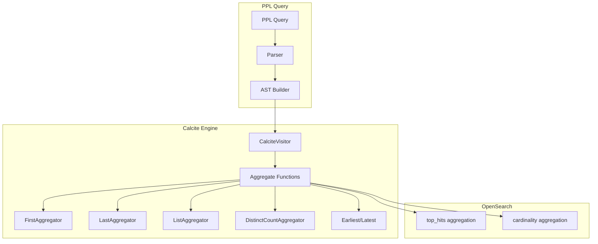

---
tags:
  - search
  - sql
---

# PPL Aggregate Functions

## Summary

OpenSearch v3.3.0 expands PPL (Piped Processing Language) aggregate function capabilities with new functions for the `stats` and `eventstats` commands. This release adds `first()`, `last()`, `list()`, `earliest()`, `latest()`, and `distinct_count()`/`dc()` support for `eventstats`, enabling more powerful data analysis and aggregation workflows.

## Details

### What's New in v3.3.0

This release introduces several new aggregate functions and extends existing functions to work with the `eventstats` command:

| Function | Command Support | Description |
|----------|-----------------|-------------|
| `first(field)` | `stats` | Returns the first value in natural document order |
| `last(field)` | `stats` | Returns the last value in natural document order |
| `list(field)` | `stats` | Collects all values into an array (preserves duplicates) |
| `earliest(field)` | `eventstats` | Returns the earliest value based on time |
| `latest(field)` | `eventstats` | Returns the latest value based on time |
| `distinct_count(field)` / `dc(field)` | `eventstats` | Counts distinct values as a window function |

### Technical Changes

#### Architecture Changes



#### New Components

| Component | Description |
|-----------|-------------|
| `FIRST` | Aggregate function returning first value in document order |
| `LAST` | Aggregate function returning last value in reverse document order |
| `LIST` | Multi-value aggregate collecting values into arrays |
| `EARLIEST` | Time-based aggregate for eventstats |
| `LATEST` | Time-based aggregate for eventstats |
| `distinct_count`/`dc` | Distinct count support for eventstats window functions |

#### Function Specifications

**FIRST Function**
- Syntax: `FIRST(field)`
- Returns: First value of the field in natural document order
- Return Type: Same as input field type (nullable)
- Behavior: Uses `top_hits` with `size: 1` for OpenSearch pushdown

**LAST Function**
- Syntax: `LAST(field)`
- Returns: Last value of the field in reverse document order
- Return Type: Same as input field type (nullable)
- Behavior: Uses `top_hits` with `size: 1` and reverse sort

**LIST Function**
- Syntax: `list(field)`
- Returns: Array of all values (preserves duplicates and order)
- Return Type: `ARRAY<T>` where T is the input field type
- Behavior: Collects up to 100 values by default

**DISTINCT_COUNT/DC for eventstats**
- Syntax: `distinct_count(field)` or `dc(field)`
- Returns: Count of distinct values
- Translation: `APPROX_DISTINCT_COUNT(field) OVER (PARTITION BY ...)`

### Usage Examples

**First/Last aggregate functions:**
```ppl
# Basic usage
source=logs | stats first(message), last(status) by host

# Combined with other aggregations
source=metrics | stats first(cpu_usage), last(memory_usage), count(), avg(response_time) by server

# Sequential processing after sorting
source=events | sort timestamp | stats first(event_type), last(event_data) by session_id
```

**List function:**
```ppl
# Collect all user IDs for each status
source=access_logs | stats list(user_id) as all_users by response_status

# Combined with other statistics
source=ecommerce | stats count(*) as total_orders, list(product_id) as all_products by customer_segment
```

**Distinct count in eventstats:**
```ppl
# Basic distinct count
source=accounts | eventstats dc(state) as distinct_states

# With partitioning
source=accounts | eventstats dc(state) as state_count by gender
```

**Earliest/Latest in eventstats:**
```ppl
# Get earliest and latest values
source=transactions | eventstats earliest(amount), latest(amount) by account_id
```

### Migration Notes

- The `first()` and `last()` functions use natural document order, not time-based ordering
- For time-based ordering, use `earliest()` and `latest()` with eventstats
- The `list()` function has a default limit of 100 values per group

## Limitations

- `first()` and `last()` return NULL if no records exist or if the field is NULL
- `list()` returns a maximum of 100 values by default
- `distinct_count()`/`dc()` in eventstats uses approximate counting via `APPROX_DISTINCT_COUNT`
- Window function argument validation was added for eventstats commands

## References

### Documentation
- [PPL Commands Documentation](https://docs.opensearch.org/3.0/search-plugins/sql/ppl/functions/)

### Pull Requests
| PR | Description |
|----|-------------|
| [#4223](https://github.com/opensearch-project/sql/pull/4223) | Support first/last aggregate functions for PPL |
| [#4161](https://github.com/opensearch-project/sql/pull/4161) | Add support for `list()` multi-value stats function |
| [#4084](https://github.com/opensearch-project/sql/pull/4084) | Support distinct_count/dc in eventstats |
| [#4212](https://github.com/opensearch-project/sql/pull/4212) | Add earliest/latest aggregate function for eventstats PPL command |

### Issues (Design / RFC)
- [Issue #4203](https://github.com/opensearch-project/sql/issues/4203): PPL first/last aggregate function request
- [Issue #4026](https://github.com/opensearch-project/sql/issues/4026): Multivalue Statistics Functions for PPL Calcite Engine
- [Issue #4052](https://github.com/opensearch-project/sql/issues/4052): PPL distinct_count/dc function support for eventstats
- [Issue #4047](https://github.com/opensearch-project/sql/issues/4047): PPL eventstats command enhancement

## Related Feature Report

- [Full feature documentation](../../../features/sql/ppl-aggregate-functions.md)
