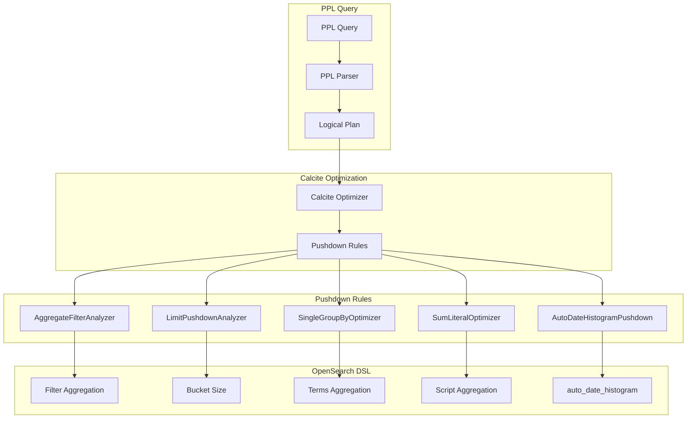

---
tags:
  - performance
  - search
  - sql
---

# SQL/PPL Aggregation Pushdown

## Summary

OpenSearch v3.3.0 introduces significant performance improvements to PPL (Piped Processing Language) aggregation queries through enhanced pushdown optimizations. These changes translate PPL aggregation operations directly into efficient OpenSearch DSL queries, achieving up to 100x performance improvements for certain query patterns.

## Details

### What's New in v3.3.0

This release adds multiple aggregation pushdown optimizations:

1. **Single group-by optimization**: Replaces expensive composite aggregations with faster terms aggregations for single group-by expressions
2. **Filtered aggregation pushdown**: Translates `count(eval(...))` expressions into OpenSearch filter aggregations
3. **Limit pushdown to aggregation bucket size**: Pushes LIMIT operators into aggregation bucket sizes
4. **SUM with literal optimization**: Optimizes `SUM(field + literal)` to `SUM(field) + literal * COUNT()`
5. **Earliest/Latest function pushdown**: Pushes `earliest`/`latest` aggregate functions to `top_hits` aggregation
6. **Auto date histogram support**: Pushes `stats` with `bins` on time fields into `auto_date_histogram`

### Technical Changes

#### Architecture Changes



#### New Components

| Component | Description |
|-----------|-------------|
| `AggregateFilterAnalyzer` | Analyzes and pushes filtered aggregations to OpenSearch filter aggregations |
| `LimitPushdownRule` | Pushes LIMIT operators into aggregation bucket sizes |
| `SingleGroupByOptimizer` | Optimizes single group-by queries to use terms aggregation instead of composite |
| `SumLiteralOptimizer` | Rewrites `SUM(field + literal)` to `SUM(field) + literal * COUNT()` |
| `AutoDateHistogramBuilder` | Builds `auto_date_histogram` aggregations for time-based binning |

#### New Configuration

| Setting | Description | Default |
|---------|-------------|---------|
| `plugins.ppl.syntax.legacy.preferred` | Controls default PPL behavior for backward compatibility | `true` |
| `bucket_nullable` | Controls whether null buckets are included in group-by results | `true` (legacy) / `false` (new) |

### Usage Examples

#### Filtered Aggregation Pushdown

```ppl
# Before: Executed on coordination node
source=accounts | stats count(eval(age = 31)) as cnt

# After: Pushed down to OpenSearch DSL
# Generates filter aggregation with term query
```

Generated DSL:
```json
{
  "aggregations": {
    "cnt": {
      "filter": {
        "term": { "age": { "value": 31 } }
      },
      "aggregations": {
        "cnt": { "value_count": { "field": "_index" } }
      }
    }
  }
}
```

#### Single Group-By Optimization

```ppl
# Before: Uses composite aggregation (slow)
source=logs | stats count() by span(@timestamp, 12h)

# After: Uses date_histogram aggregation (100x faster)
```

#### Limit Pushdown

```ppl
# LIMIT is pushed into aggregation bucket size
source=accounts | stats avg(age) by state, city | head 100
```

#### Auto Date Histogram

```ppl
# Uses auto_date_histogram for dynamic bucket sizing
source=logs | stats count() by bins(@timestamp, 20)
```

### Migration Notes

- Set `plugins.ppl.syntax.legacy.preferred=false` to enable new optimizations by default
- The `bucket_nullable` argument in `stats` command controls null bucket handling
- Existing queries continue to work with legacy behavior when `plugins.ppl.syntax.legacy.preferred=true`

## Limitations

- Single group-by optimization only applies when there is exactly one group-by expression
- Filtered aggregation pushdown requires Calcite engine (`plugins.calcite.enabled=true`)
- Auto date histogram pushdown only works with time/date fields
- Some complex expressions may not be pushed down and will execute on the coordination node

## References

### Documentation
- [PPL Commands Documentation](https://docs.opensearch.org/3.0/search-plugins/sql/ppl/functions/)

### Pull Requests
| PR | Description |
|----|-------------|
| [#3550](https://github.com/opensearch-project/sql/pull/3550) | Speed up aggregation pushdown for single group-by expression |
| [#3971](https://github.com/opensearch-project/sql/pull/3971) | SUM aggregation enhancement on operations with literal |
| [#4166](https://github.com/opensearch-project/sql/pull/4166) | Pushdown earliest/latest aggregate functions |
| [#4213](https://github.com/opensearch-project/sql/pull/4213) | Enable pushdown optimization for filtered aggregation |
| [#4228](https://github.com/opensearch-project/sql/pull/4228) | Push down limit operator into aggregation bucket size |
| [#4329](https://github.com/opensearch-project/sql/pull/4329) | Push down stats with bins on time field into auto_date_histogram |

### Issues (Design / RFC)
- [Issue #3528](https://github.com/opensearch-project/sql/issues/3528): Span query in PPL is slower than date histogram aggregation
- [Issue #3949](https://github.com/opensearch-project/sql/issues/3949): Support eval-style expressions inside stats command
- [Issue #3961](https://github.com/opensearch-project/sql/issues/3961): Support Limit pushdown through aggregation
- [Issue #3967](https://github.com/opensearch-project/sql/issues/3967): Aggregation enhancement for SUM on FIELD + NUMBER
- [Issue #3639](https://github.com/opensearch-project/sql/issues/3639): PPL earliest/latest aggregation function support
- [Issue #4210](https://github.com/opensearch-project/sql/issues/4210): Span()/bin should support auto_date_histogram aggregation

## Related Feature Report

- [Full feature documentation](../../../../features/sql/ppl-aggregation-pushdown.md)
